## 必备工具

  Git ,Github 

## 从Github 开始

  Github 是代码分享平台,使用Github 能够找到很多开源项目,关于Github 不多做介绍了,下面分享些使用Github 读代码的操作

## Github commits

  Github commits 的功能是用来记录每一次Git 提交代码的信息,里面包含了修改代码的原因,还有修改了哪些代码.Github commits 的功能在这里

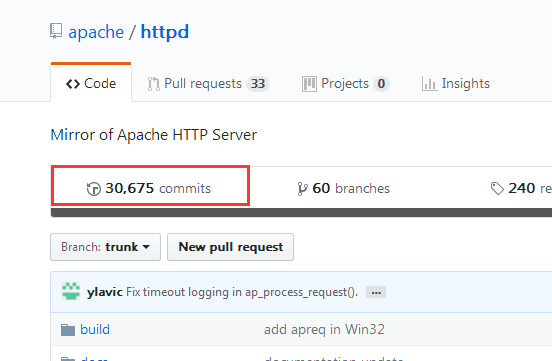

  点击之后,可以看到很多Git 提交代码的记录

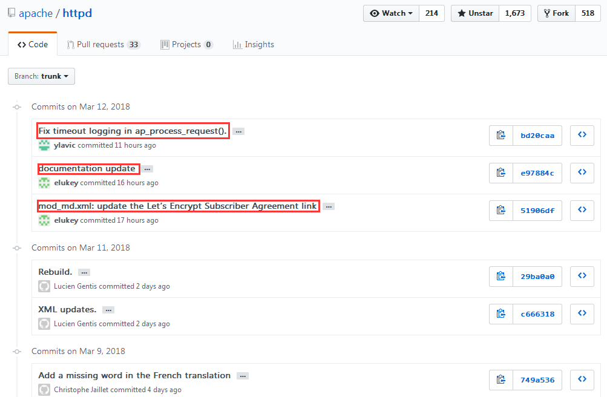

  随意点开一条记录,可以看到很多关于这条Commit 的信息

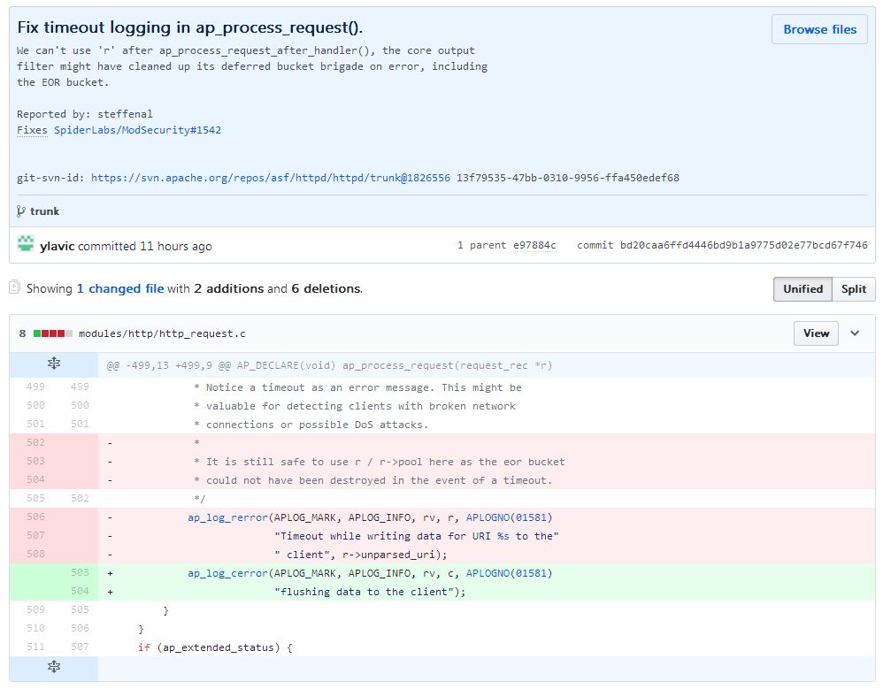

  使用Github commits 有一个操作就是:**一般来说,部分安全告警或者存在特别严重漏洞的开源项目向外发出通知的时候,往往只是提醒漏洞是影响了哪些版本,什么时候修复,要更新到最新的版本.关于漏洞的详情是很少提及的,甚至PoC 也没有.那么这个时候要怎么去研究漏洞呢?答案是追踪Commit 提交记录**

  以CVE-2018-1305 为例子,关于绿盟的对外的通告如下(其他通告都大同小异):

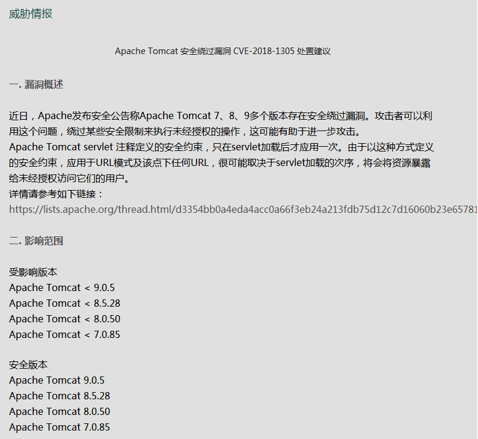

  里面只有一个邮件通信记录,我们进去看看有什么(https://lists.apache.org/thread.html/d3354bb0a4eda4acc0a66f3eb24a213fdb75d12c7d16060b23e65781@%3Cannounce.tomcat.apache.org%3E)

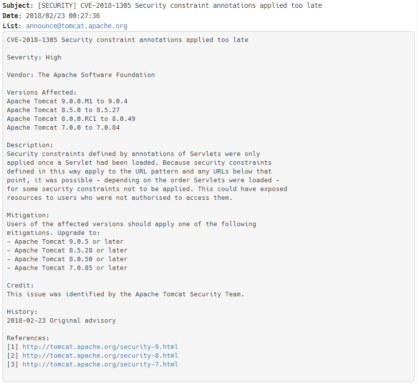

  邮件最低下面有个References ,翻译为中文是引用的意思,在这里多插一句话:文章里面的引用一般是拓展阅读或者理论/数据的来源依据,如果读者需要进一步去深入这个文章,引用来源就是最好的入手点**.我们挑其中一个引用的URL 来看看(http://tomcat.apache.org/security-9.html),下面是我挑出的重点信息

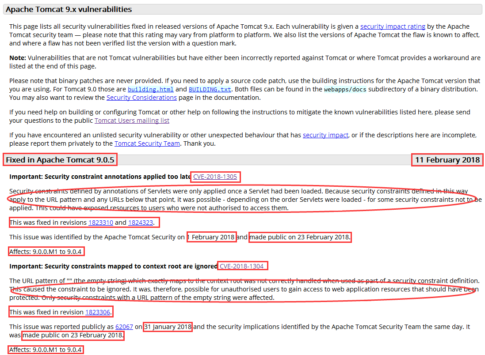

  圆圈里的意思是漏洞的描述,方框里标明的是其他有用的信息:影响的版本(Affects: 9.0.0.M1 to 9.0.4),最新修复的版本号(Fixed in Apache Tomcat 9.0.5),公开漏洞的时间(11 February 2018),Commit ID (This was fixed in revisions 1823310 and 1824323.).

  找到Commit ID ,点进去看看,这个时候就跳转到了Apache 的SVN Commit 记录里边了(http://svn.apache.org/viewvc?view=revision&revision=1823310).[PS:SVN 和Git 都是版本管理工具]

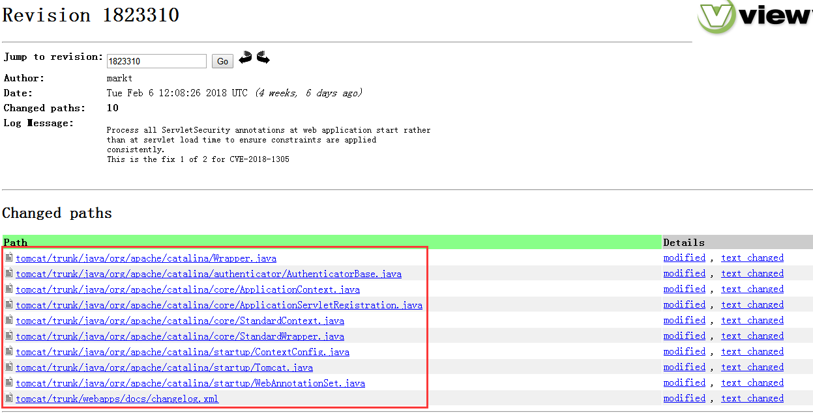

  我们可以看到这次修复漏洞修改了哪些代码.但是点进去代码里看,也没有diff ,所以现在回到Git commits 里继续找修复代码的Commit .那么要怎么去找Commit 呢?这个时候,漏洞修复时间就派上用场了.

  SVN 的Commit 里面有一个Commit 时间(如果没有找到对应的Commit ,就在漏洞报告时间(2018/2/1)到漏洞公开时间(2018/2/23)搜索Commit )

  然后去找Commit ,发现没有找到

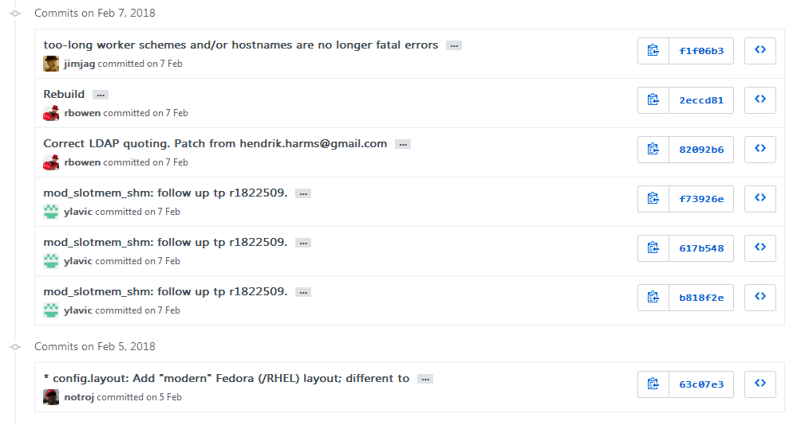

  这就很迷了,为啥会找不到呢.读者们回到主页,点击这里

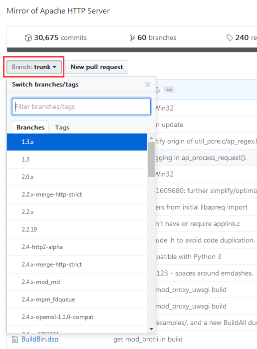

  这个时候,漏洞影响版本号就派上用场了,嘿嘿嘿

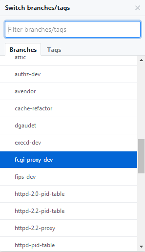

  ...这里找了个遍都没有找到这个版本,太神奇了,咱们再细细看看漏洞信息哈

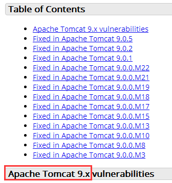

  ??? 难道tomcat 和apache 是不同的?那我去搜索一下tomcat [PS:Github 搜索有很多很有趣的使用套路,待会和大家分享一个学习漏洞原理的骚操作]

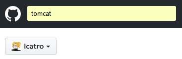

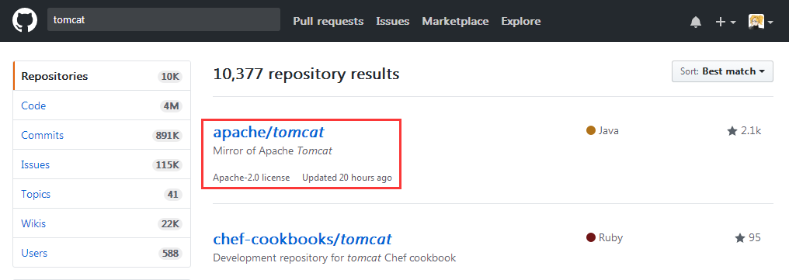

  看来找错了开源项目,那就先看看版本分支吧

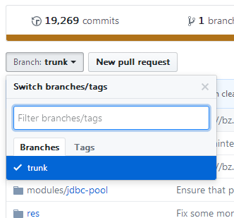

  有些开源项目是有设置不同的版本分支管理的,没有也没关系,那就来找Commit 吧

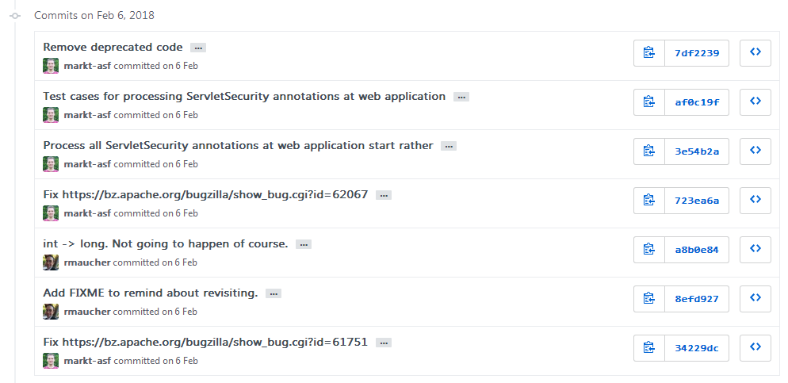

  现在已经定位到了2018/2/6 号的Commit 信息,这里有几个Commit ,一个一个慢慢看吧,搜素的过程就不多说了,最后定位到这两个Commit

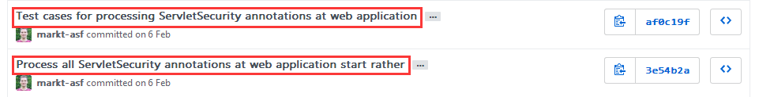

  修复代码:https://github.com/apache/tomcat/commit/3e54b2a6314eda11617ff7a7b899c251e222b1a1
  测试用例:https://github.com/apache/tomcat/commit/af0c19ffdbe525ad690da4fd7e988c7788d00141

  在Git 的Commit 里还能看到Diff ,很容易就知道到底哪些代码被修改过(包括代码注释)

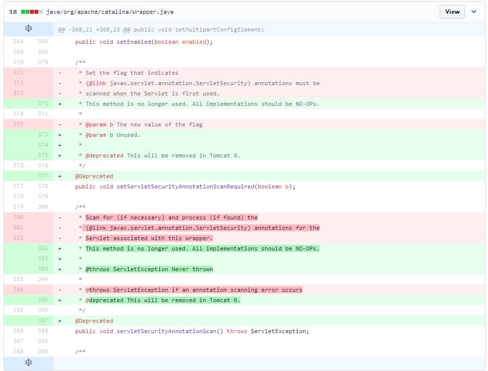

  在测试用例里面就可以直接找到PoC 了

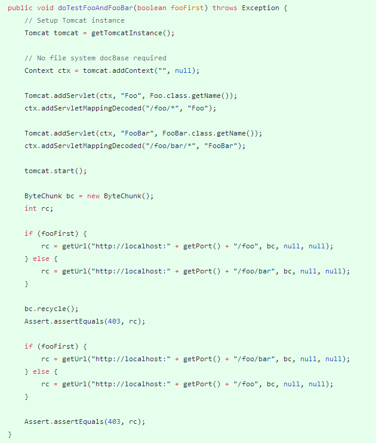

## Github Search

  前面已经说到了如何使用Commit 了,相信读者也已经去秀了一波操作,找到更多关于漏洞修复的细节,上一节有提到,关于Github Search 有一个学习代码的骚操作,当年我就是用这一招弄明白了JavaScript 这种脚本解析引擎的漏洞应该要怎么挖,是不是很想知道到底是啥套路.

  在搜索框里输入`CVE` ,记住,要想挖哪个开源项目就去那个开源项目的Github 上搜素CVE 三个字

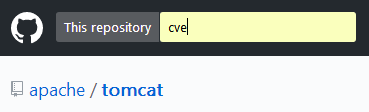

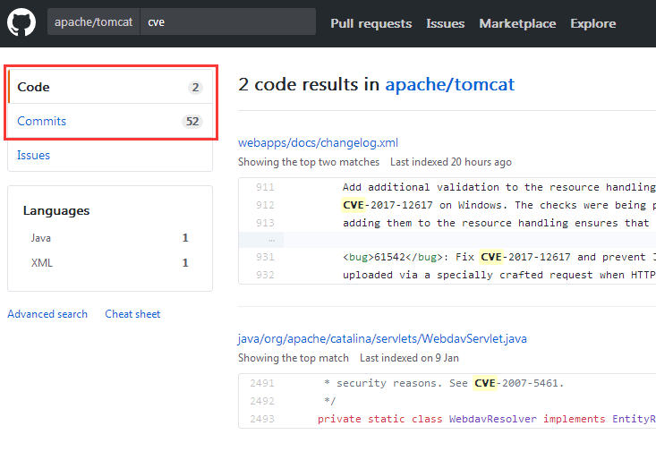

  结果如上,这个是Code 搜素,搜素出来的结果比较少,咱们切换到Commits 来看看

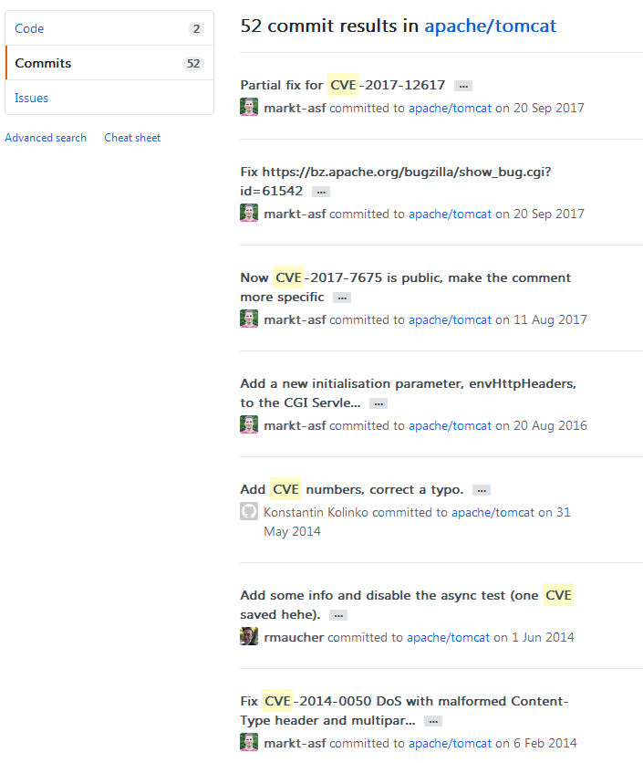

  是不是发现了新世界 :)

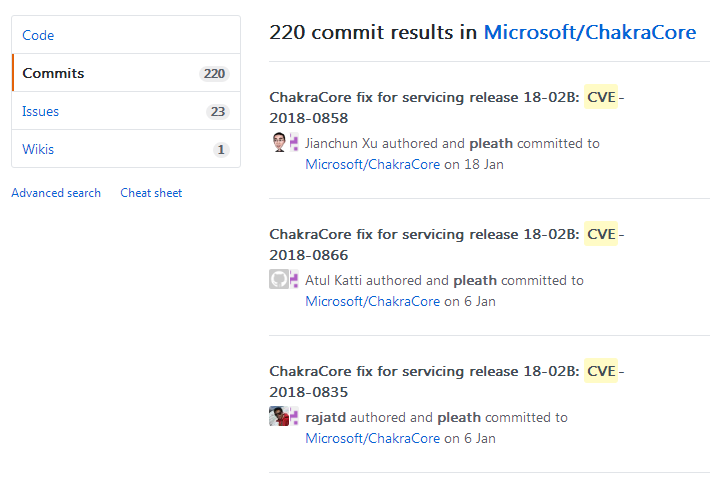

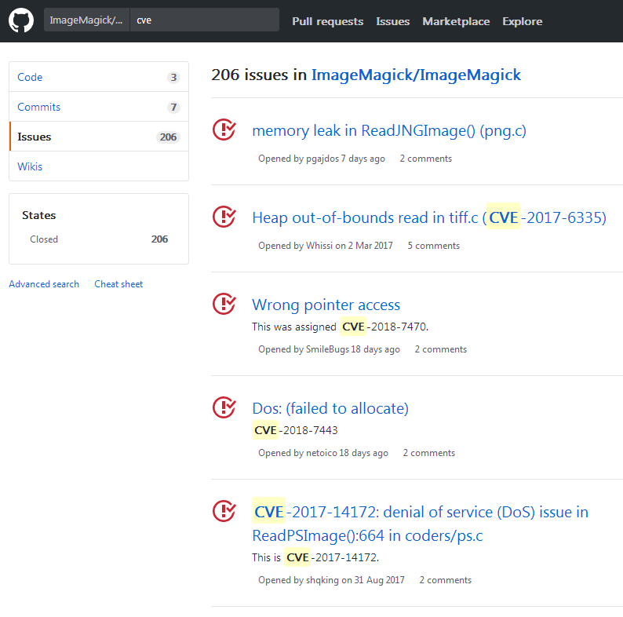

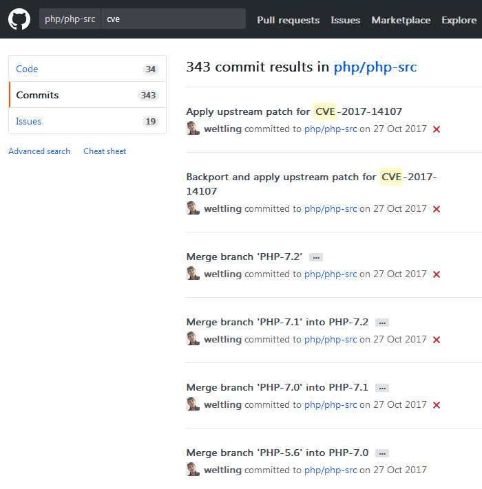

  洞海无涯苦作舟,用这种方法可以从issus 和Commit 里面学到很多,但是要看懂整个Commit 不只是要看Diff ,还要下载代码到本地一步一步分析漏洞成因

## Github Issus

  Issus 可以看到很多漏洞挖掘的操作,特别是AFL 和libFuzzer 的怎么样使用的,同时在这些提交漏洞的Issus 里还能收集到很多样本,可以直接拿下来到其他的开源项目里继续使用,举个例子,ImageMagick 的Issus :https://github.com/ImageMagick/ImageMagick/issues

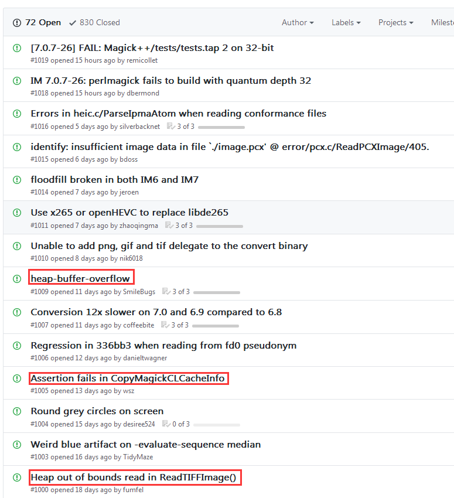

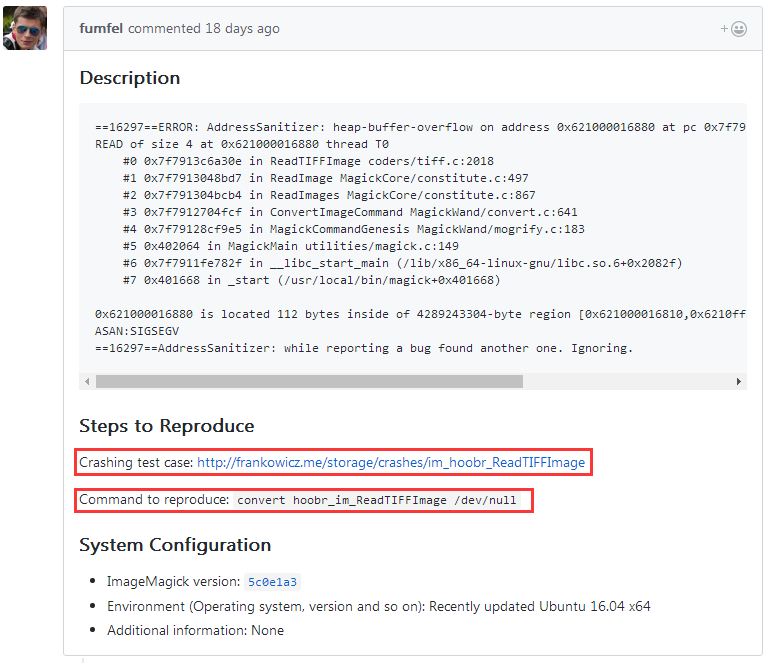

  这里告诉大家样本在哪儿可以下载,重点是触发的命令是什么,有了这个触发命令之后,我们也可以去照猫画虎拿到AFL 里去跑Fuzzing 啦,美滋滋

## 在Github 上读代码

  一般我都是先在Github 上阅读代码,然后再下载代码到本地Source Insight 继续读.我们有两种方式在Github 上开始阅读

### 根据文件夹来阅读

  简单地来说:**关注文件/文件夹的名字**
  
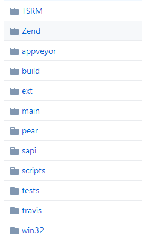

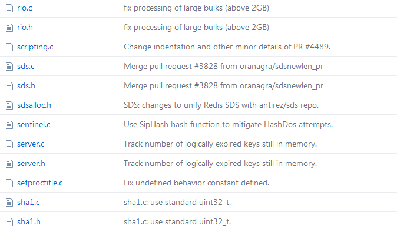

  多翻一下目录和文件,总会遇到你感兴趣的一个地方来读

### 根据敏感函数来阅读

  善用Github 的搜索功能,它能够帮你搜索代码或者其他信息

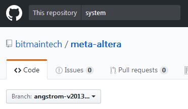

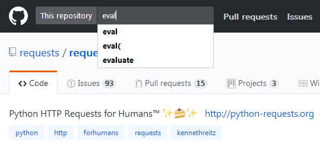

  
  找到了一个感兴趣的地方开始阅读代码之后,Github 的搜素功能可以帮助你向上回溯代码

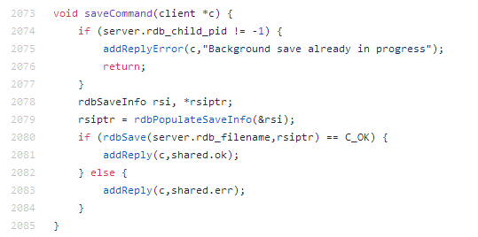

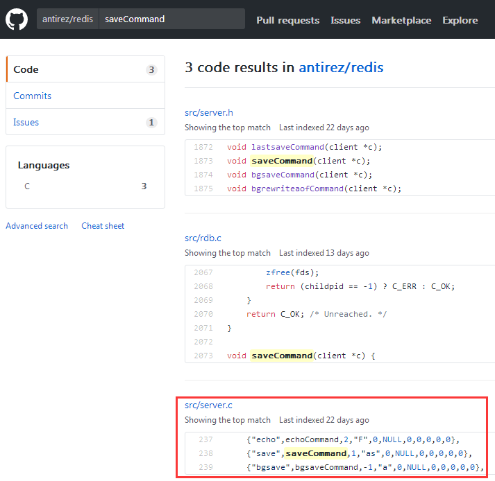

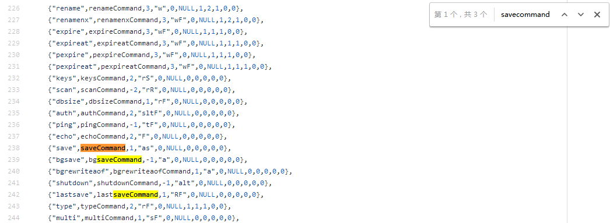

  在网页和普通编辑器阅读源码记得要多使用`Ctrl + F` ,它能够帮你快速定位当前代码文件的函数定位

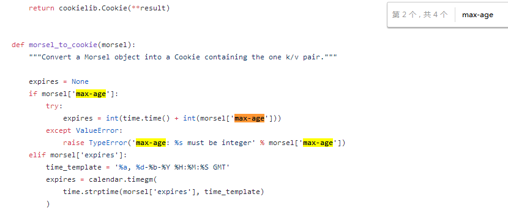

## Git Clone

  这个就不多介绍了,下载代码到本地

## Example

  去年挖到一个蚂蚁矿机的远程代码执行漏洞,发现这个问题是直接在Github 上读代码的找到的,附上源码分析.

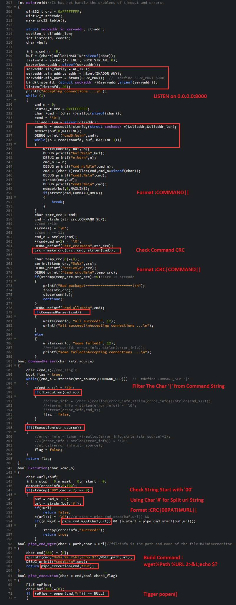

