## 漏洞特征码筛选


#### 漏洞代码特征对比


NLP 算法普遍运用在恶意代码识别分类,最核心的一点还是通过黑白代码样本进行分类(参考https://xz.aliyun.com/t/5666 ,https://xz.aliyun.com/t/5848 ).NLP 算法对数据分类来说是很友好的,因为它能够通过给定的分类样本和特征来对数据进行识别,但是要使用这些算法应用到漏洞挖掘,除了分类识别还需要一步就是要对漏洞进行校验(符号执行在从入口点开始递归路径时,因为条件分支和求解速度的问题往往会导致性能非常慢,那么能不能通过事先筛选一些可以的特征然后来探索可执行的路径再检验漏洞呢?).接下来分别探讨这两个步骤的一些细节.


#### BasicBlock 剪枝


我们用第五章里的一个示例来研究,因为Condition 条件判断的引入,代码结构其实是二维的.


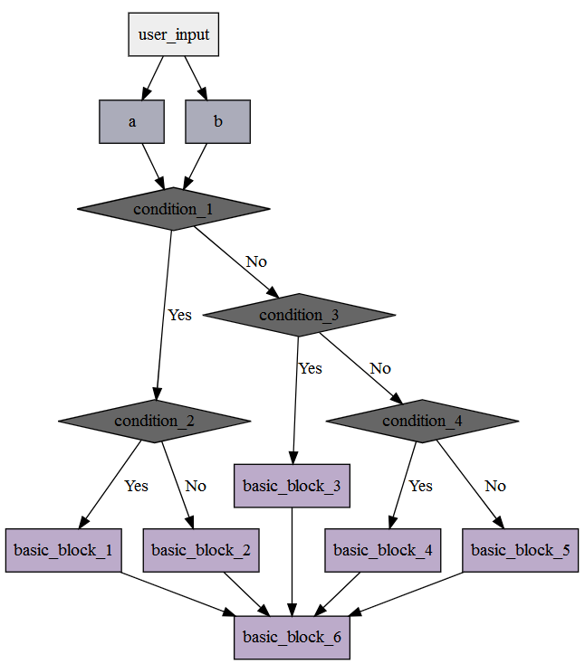


如果需要使用NLP 的方式来对代码进行识别,那么就需要把二维的代码结构转化为一维,这样代码序列看起来才会和文章的内容一样(转化成为一段英文语句),所以就需要对函数内的BasicBlock 进行剪枝,修剪之后的结构如下.


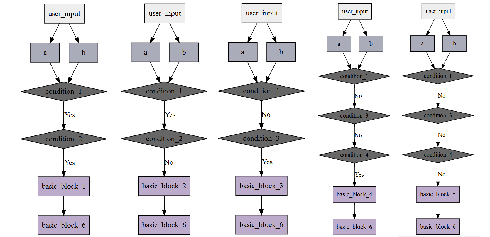


代码实现不难,主要是通过if /switch 等语句进行处理,for /while 语句可以忽略不处理.


```python
def basic_block_preprocess(code_ast_subnode) :  # BasicBlock 剪枝
    flatten_basic_block_list = []
    root_basic_block = []

    for root_ast_node_index in code_ast_subnode :
        ast_node_type = get_type(root_ast_node_index)  #  获取AST 节点类型

        if 'CIfStatement' == ast_node_type :  #  目前只筛选if 语句
            if_ast_node = root_ast_node_index.body  #  获取if AST 的内容
            if_ast_node_type = get_type(if_ast_node)

            if 'CBody' == if_ast_node_type :  #  对应的是if (???) {xxx} 的写法
                sub_basic_block_list = basic_block_preprocess(if_ast_node.contentlist)  #  递归遍历if 语句

                for sub_basic_block_index in sub_basic_block_list :
                    flatten_basic_block_list.append( root_basic_block + sub_basic_block_index)  #  合并剪枝之后的代码序列
            else :  #  对应的是if (???) xxx; 的写法
                if_basic_block_ast_node = root_ast_node_index.body  #  if 里面语句代码块的内容
                if_basic_block_ast_node_type = get_type(if_basic_block_ast_node)  #  获取这个语句的类型

                flatten_basic_block_list.append(root_basic_block + [ (if_basic_block_ast_node_type,if_basic_block_ast_node) ])  #  合并代码序列

            if root_ast_node_index.elsePart :  #  如果这个if 语句还存在else if 或else ..
                if_else_ast_node_type = get_type(root_ast_node_index.elsePart.body)

                if 'CBody' == if_else_ast_node_type :
                    if_else_ast_node = root_ast_node_index.elsePart.body
                else :
                    if_else_ast_node = root_ast_node_index.elsePart.body.body

                sub_basic_block_list = basic_block_preprocess(if_else_ast_node.contentlist)  #  继续递归它的body 代码

                for sub_basic_block_index in sub_basic_block_list :
                    flatten_basic_block_list.append( root_basic_block + sub_basic_block_index)  #  合并剪枝之后的代码序列

            continue
                    
        root_basic_block.append((ast_node_type,root_ast_node_index))  #  这是当前层的代码序列

    flatten_basic_block_list.append(root_basic_block)

    return flatten_basic_block_list
```


#### AST 特征序列化


AST 结构树并不合适直接使用NLP 算法来对它进行识别,我们需要对它进行预处理,变成合适由NLP 算法处理的格式.


```python
def reduce_ast_node_list(code_ast_list) :  #  AST 预处理
    def get_var_type(var_type) :  #  获取变量类型
        var_type_string = ''

        for var_type_index in var_type :
            if 'unsigned' == var_type_index :  #  unsigned int ,unsigned char .drop the keyword unsigned
                continue

            var_type_string += var_type_index + '.'

        if var_type_string :
            var_type_string = var_type_string[ : -1 ]

        return var_type_string

    result_list = []

    for code_ast_index in code_ast_list :
        code_ast_node_type = code_ast_index[0]  #  AST 节点类型
        code_ast_node_data = code_ast_index[1]  #  AST 节点数据

        if 'CVarDecl' == code_ast_node_type :  #  变量声明
            is_type = get_type(code_ast_node_data.type)  #  变量类型

            if 'CArrayType' == is_type :  #  数组
                var_type = get_var_type(code_ast_node_data.type.arrayOf.builtinType)

                result_list.append('variable_define_array:%s' % (var_type))
            elif 'CBuiltinType' == is_type :  #  普通变量
                var_type = get_var_type(code_ast_node_data.type.builtinType)

                result_list.append('variable_define:%s' % (var_type))
            elif 'CPointerType' == is_type :  #  指针变量
                var_type = get_var_type(code_ast_node_data.type.pointerOf.builtinType)

                result_list.append('variable_define_point:%s' % (var_type))
                
        elif 'CStatement' == code_ast_node_type :  #  赋值
            assigment_data = code_ast_node_data._leftexpr
            sub_ast_node_type = get_type(assigment_data)

            if 'CFuncCall' == sub_ast_node_type :  #  函数调用
                function_name = assigment_data.base.name

                result_list.append('function_call:%s' % (function_name))
            elif 'CArrayIndexRef' == sub_ast_node_type :  #  数组引用
                access_type = assigment_data.base.type

                if 'CArrayType' == access_type :      #  buffer[10] = ???;
                    result_list.append('assigment_array_index')
                elif 'CPointerType' == access_type :  # *buffer[10] = ???;
                    result_list.append('assigment_point_index')
            elif 'CStatement' == sub_ast_node_type :  #  变量数据值
                assigment_data = assigment_data._rightexpr._leftexpr
                assigment_type = assigment_data.type

                if 'CArrayType' == assigment_type :      #  buffer[10] = ???;
                    result_list.append('assigment_array_index')
                elif 'CPointerType' == assigment_type :  # *buffer[10] = ???;
                    result_list.append('assigment_point_index')
                #.pointerOf.builtinType
                
        else :
            result_list.append(code_ast_node_type)

    return result_list
```


#### Doc2Vec 算法与特征对比


Doc2Vec 算法用来对一段文本进行识别,判断这段文本属于哪一类型.我们假设了一系列的黑白样本:


```python
code_sample_memcpy_check_1 = '''
void main() {
    char* buffer = (char*)malloc(20);
    char* command_buffer = (char*)malloc(10);
    
    memcpy(&command_buffer,&buffer,20);
}
'''
code_sample_memcpy_check_2 = '''
void main() {
    char buffer[20] = {0};
    char command_buffer[10] = {0};
    
    memcpy(&command_buffer,&buffer,20);
}
'''
code_sample_buffer_check_1 = '''
void main() {
    char buffer[10] = {0};

    buffer[10] = '\0';
}
'''
code_sample_buffer_check_2 = '''
void main() {
    char* buffer = (char*)malloc(10);

    buffer[20] = '\0';
}
'''
code_sample_arbitrarily_write_check_1 = '''
void main(char* point) {
    char* buffer = point;

    *buffer = 0x1;
}
'''
code_sample_arbitrarily_write_check_2 = '''
void main(char* offset) {
    char buffer[10] = {0};

    *(buffer + offset) = 0x1;
}
'''
code_sample_arbitrarily_read_check_1 = '''
void main(char* point) {
    char* buffer = point;
    char  data = *buffer;
}
'''
code_sample_arbitrarily_read_check_2 = '''
void main(char* offset) {
    char buffer[10] = {0};
    char  data = *(buffer + offset);
}
'''

code_sample_white_call_1 = '''
void main() {
    printf("123123");
}
'''
code_sample_white_return_1 = '''
int main() {
    int result = 1;

    return result;
}
'''
code_sample_white_add_1 = '''
void main() {
    int a = 1;
    int b = 2;
    int result = 0;

    result = a + b;
}
'''

tranning_sample_code = {
    'memcpy' : [
        # ...
    ] ,
    'overflow' : [ 
        # ...
    ] ,
    'null_access' : [ 
        # ...
    ] ,
    'arbitrarily_write' : [ 
        # ...
    ] ,
    'arbitrarily_read' : [ 
        # ...
    ] ,
    'white_code' : [ 
        # ...
    ] ,
}
```


经过之前的预处理之后,返回的代码序列如下(演示的Demo 对AST 处理比较粗糙,是导致后面分类出现误差的主要原因):


```text
[['variable_define_point:char', 'variable_define_point:char', 'function_call:memcpy']]
[['variable_define_array:char', 'variable_define_array:char', 'function_call:memcpy']]
[['variable_define_point:char', 'variable_define_array:char', 'function_call:memcpy']]
[['variable_define_array:char', 'variable_define_point:char', 'function_call:memcpy']]
[['variable_define_point:char', 'variable_define_point:char', 'function_call:memset', 'function_call:memcpy']]
[['variable_define_array:char', 'variable_define_array:char', 'function_call:memset', 'function_call:memcpy']]
[['variable_define_point:char', 'variable_define_array:char', 'function_call:memset', 'function_call:memcpy']]
[['variable_define_array:char', 'variable_define_point:char', 'function_call:memset', 'function_call:memcpy']]
[['variable_define_array:char']]
[['variable_define_point:char']]
[['variable_define_point:char']]
[['variable_define_point:char']]
[['variable_define_array:char']]
[['variable_define_point:char']]
[['variable_define_point:char', 'variable_define:char']]
[['variable_define_array:char', 'variable_define:char']]
[['variable_define_point:char', 'variable_define:char']]
[['function_call:printf']]
[['function_call:printf', 'function_call:printf', 'function_call:printf', 'function_call:printf', 'function_call:printf']]
[['variable_define:int', 'function_call:printf']]
[['variable_define_array:char', 'function_call:memset', 'function_call:printf']]
[['variable_define_point:char', 'function_call:printf']]
[['variable_define:int', 'CReturnStatement']]
[['variable_define_point:char', 'CReturnStatement']]
[['variable_define_array:char', 'CReturnStatement']]
[['variable_define:int', 'variable_define:int', 'variable_define:int', 'assigment_value:int']]
[['variable_define:int', 'variable_define:int', 'function_call:printf'], ['variable_define:int', 'variable_define:int', 'function_call:printf'], ['variable_defi
ne:int', 'variable_define:int']]
[['variable_define:int', 'function_call:printf']]
```


接下来使用Gensim Doc2ver 对样本进行训练,代码如下:


```python
TaggededDocument = gensim.models.doc2vec.TaggedDocument

model_tranning_sample_list = []

for tranning_sample_code_type,tranning_sample_code_data_list in tranning_sample_code.items() :
    for tranning_sample_code_data in tranning_sample_code_data_list :
        model_tranning_sample_list.append(TaggededDocument(tranning_sample_code_data, tags = [ tranning_sample_code_type ]))

model = gensim.models.Doc2Vec(model_tranning_sample_list,min_count = 1,window = 3,vector_size = 200,workers = 4)

model.train(model_tranning_sample_list, total_examples = model.corpus_count, epochs=70)
```


我们构造一些测试代码,然后使用样本进行识别:


```python
code_test_1 = '''
int main(const unsigned char* buffer) {
    unsigned char buffer_l[10] = {0};
    unsigned char buffer_length = buffer[0];
    
    if (2 <= buffer_length)
        return 0;
    
    if (MessageType_Hello == buffer[1]) {
        printf("Hello\n");
    } else if (MessageType_Execute == buffer[1]) {
        unsigned char* command_buffer = (unsigned char*)malloc(buffer_length - 1);
        
        memset(&command_buffer,0,buffer_length);
        memcpy(&command_buffer,&buffer[2],buffer_length - 2);
        
        execute_command(command_buffer);
    } else if (MessageType_Data == buffer[1]) {
        decrypt_data(&buffer[2],buffer_length - 2);
    }
    
    return 1;
}
'''
# ... Sample code so more that we leave out it .

test_code = [ 
    make_code(test_sample_code.code_test_1) ,
    # ....
]

for test_code_index in test_code :
    print ' ---- '

    for test_code_flatten_index in test_code_index :
        inferred_vector = model.infer_vector(test_code_flatten_index)

        output.valid_state_output(str(test_code_flatten_index),str(model.docvecs.most_similar([inferred_vector], topn=10)))
```


训练样本再分类的效果如下:


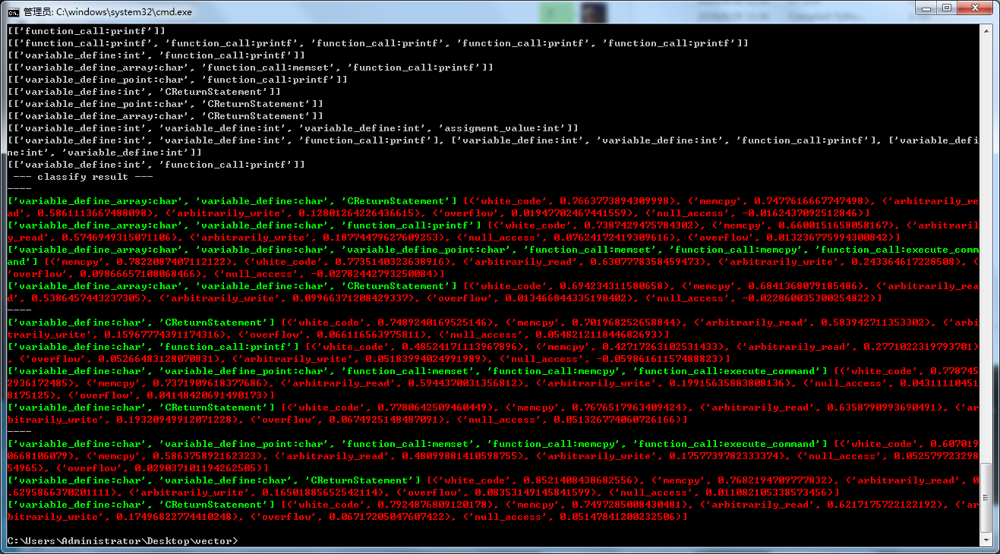


第一部分特征识别的整体难度不大,最困难的一步是要在代码序列中做好预处理,保证特征容易被算法识别而且又不能从AST 精简转化特征的过程中丢掉太多的细节,最后让Doc2Vec 来更准确地对代码序列进行识别.


定位出了可以的代码序列之后,下一步就是要对漏洞进行验证,到这一步骤一定是要使用符号执行来对变量进行取值范围的构建,然后再引入漏洞判断的条件组合起来交由求解器来实现,但是这样就不够"AI" 了.**符号执行的步骤是不能够缺少的,如果没有符号执行,那就无法知道某个特定变量的变化函数与取值范围**.我们常说深度学习的算法都是由样本来拟合出一条回归函数,让回归函数和算法来对数据进行分类计算,那么能不能拟合出这么样的一条曲线呢?漏洞判断的条件能不能推断出一条回归函数呢?下面就绕过符号执行技术直接来探讨这个问题.


----


## 漏洞验证阶段


#### Example 1 -- 单变量与常数值判断


```c
int calcu(int a) {
    int number = a * a;  // pow(a,2);
    
    if (number > 100)
        return 1;
    
    return 0;
}
```


calcu() 函数输入输出关系


我们知道,calcu() 函数是由if 判断来控制不同的return 返回的,那么calcu() 函数的输出因果关系如下(注意,C_100 特指if 判断表达式的右侧常数值100 ;Symblo(x) 则是指if 表达式的左则number 变量的符号表达式number = a*a):


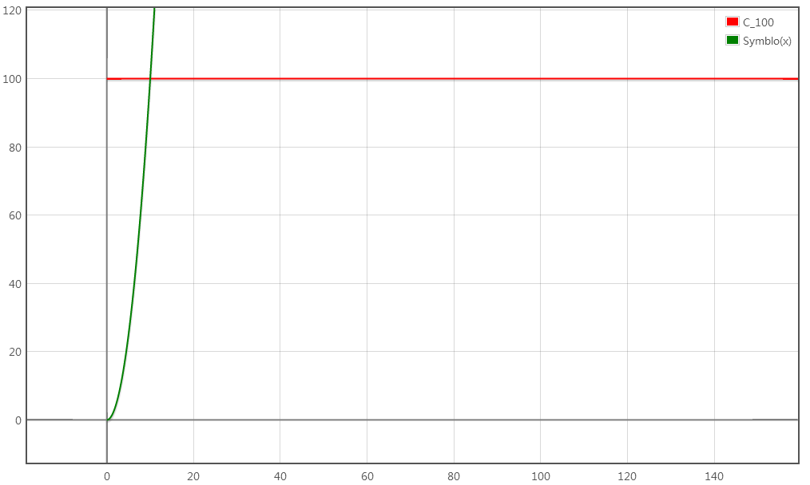


以(10,100)为交点,左侧黄色虚线勾画的区域是Zero (此时C_100 > Symblo(x)),右侧灰色区域是One (此时Symblo(x) > C_100).Zero 代表函数返回0 ,One 代表函数返回1 .


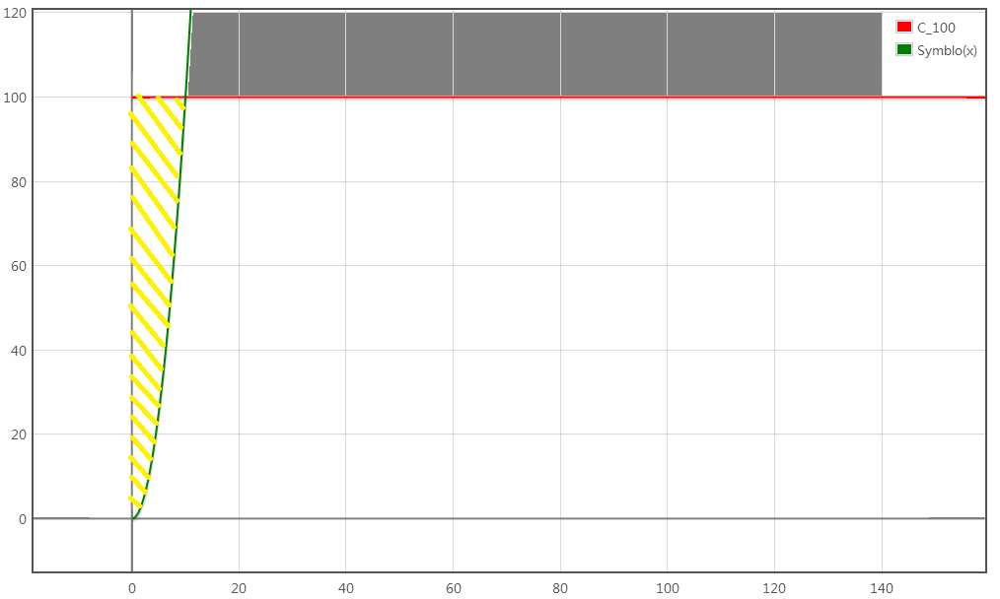


所以,函数返回值是0/1 取决于函数Symblo(x) 和直线C_100 的关系.我们回过头来详细分析上述例子if 判断.


```c
if (number > 100)
    return 1;
    
return 0;
//  number = Symblo(x)  ;  C_100 = 100
```


那么可知,**当if 要执行到return 1 时,必须要number > 100,就是Symblo(x) > C_100;反之则是number <= 100,也就是Symblo(x) <= C_100)**.基于这个原理,总结如下:


```text
Condition_True  => Symblo(x) Condition_Flag C_?  => Symblo(x) - C_? Condition_Flag 0
Condition_False => Symblo(x) !Condition_Flag C_? => Symblo(x) - C_? Condition_Flag 0

Symblo(x) 指的是number ,Condition_Flag 是指逻辑运算符,C_? 指常数值

例子:

1.if (number == 10086)
Condition_True  => Symblo(number) == 10086 => Symblo(number) - 10086 = 0
Condition_False => Symblo(number) != 10086 => Symblo(number) - 10086 != 0

2.if (number <= 72)
Condition_True  => Symblo(number) <= 72 => Symblo(number) - 72 <= 0
Condition_False => Symblo(number) > 72  => Symblo(number) - 72 > 0

```


#### Example 2 -- 单变量与单变量判断


```c
int valid_key(int number) {
    int a = cos(number);
    int b = sin(number);
    
    if (a / b > number)
        return 1;
    
    return 1;
}
```


calcu() 函数输入输出关系


calcu() 函数的输出因果关系


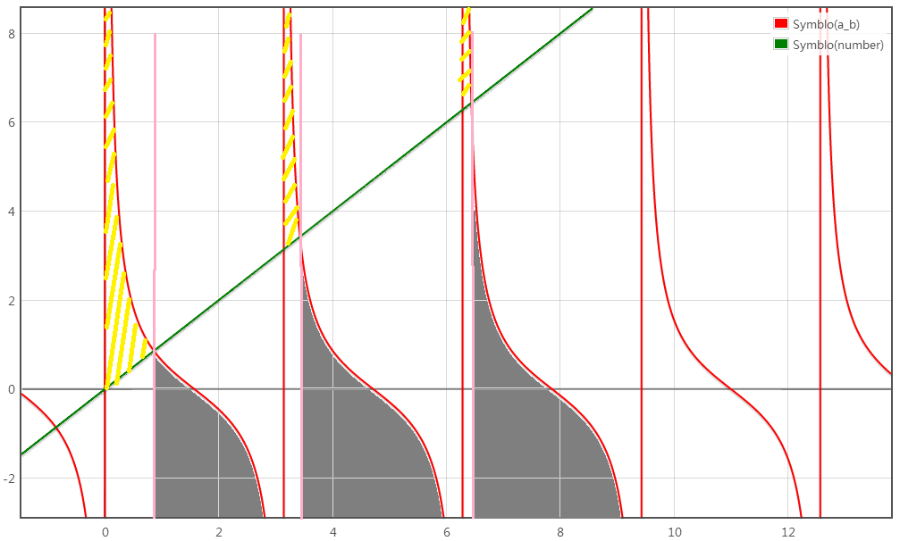


在if 判断这里,我们可知Symblo(a_b) = cos(x)/sin(x) ,Symblo(number) = x .那么这个坐标系的横坐标就是x ,纵坐标就是y (**y = Symblo(x) ,意思是变量经过一系列的运算然后得出的结果,因为是对单个变量进行操作,所以就很容易知道这个变量经过很多次操作之后的具体函数.比如当前示例的calcu() ,有一个传递进来的参数number ,然后我们遍历到分支判断if 时,发现当前if 表达式的左值和右值都是对calcu() 函数的参数number 的值进行引用对比,那么通过符号执行可以推测出if 表达式左值:Symblo(a_b) = a / b = cos(number) / sin(number),右值:Symblo(number) = number**).黄色虚线区域代表Condition True ,灰色代表Condition False .使用上一个示例的总结,我们可以知道:


```text
Conditon_True  => Symblo(a_b) >  Symblo(number) => cos(number) / sin(number) >  number => cot(number) >  number => cot(number) - number >  0
Conditon_False => Symblo(a_b) <= Symblo(number) => cos(number) / sin(number) <= number => cot(number) <= number => cot(number) - number <= 0
```


事实上,我们所列出的Condition_True 和Condition_False ,实际上指的是一个取值范围(Value_Range),**当变量值出现在某个区域时,我们就认为它属于True / False** .所以,也可以说是Condition_True_Range ,Condition_False_Range .


#### Example 3 -- 单变量与常数值多次判断


```c
int calcu(int number) {
    int result = pow(number,2);
    
    if (result > 100)
        return 2;
    else if (result > 25)
        return 1;
    
    return 0;
}
```


calcu() 函数输入输出关系


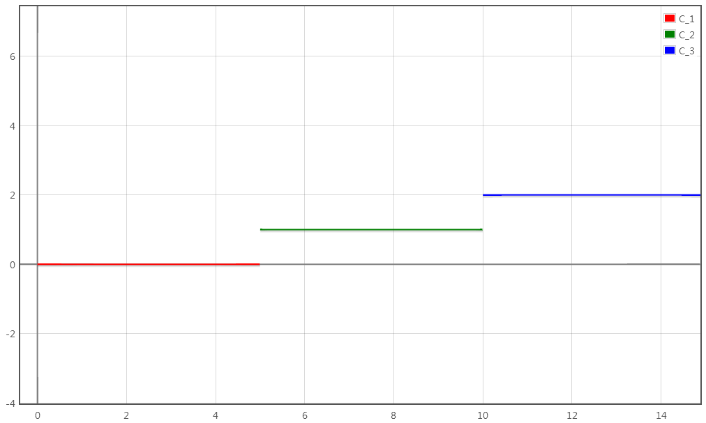


calcu() 函数的输出因果关系


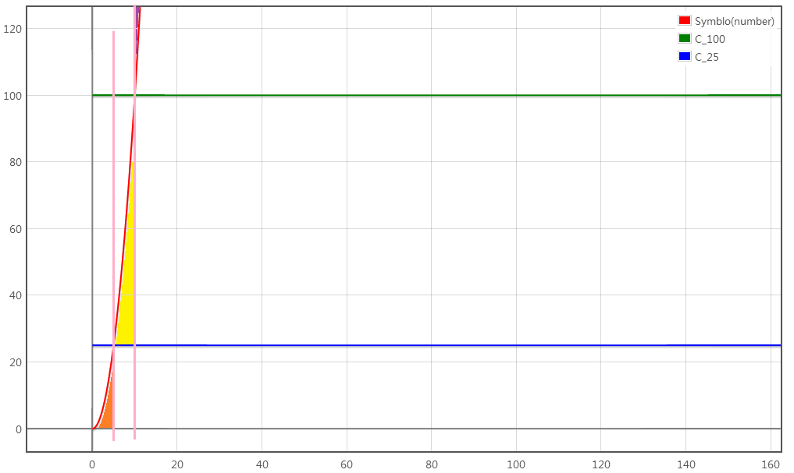


我们分析上述两个if 判断.判断1: result > 100 ,满足符合条件的区域为Symblo(number) > 100 ,对应上图紫色区域;判断2: result > 25 && result <=100 (注意,**result <= 100 是隐含条件,在这个else if 前面还有一个先决条件,所以不能忽略这个result <=100 这个表达式**),满足符合条件的区域为**Symblo(number) <= 100 ∩ Symblo(number) > 25  <=>  x^2 <= 100 ∩ x^2 > 25 **,对应上图黄色区域;最后的return 0 对应上述的两个先决条件:1.result<=100 ;2.result<=25 ,合并起来就是**result <= 100 && result <= 25  <=>  Symblo(number) <= 25 && Symblo(number) <= 100  <=>  Symblo(number) <= 25 **,对应上图橙色区域.总结如下:


```text
Condition_Express_1 && Condition_Express_2 => Condition_True_Range_1 ∩ Condition_True_Range_2 (&& 是逻辑And )
Condition_Express_1 || Condition_Express_2 => Condition_True_Range_1 ∪ Condition_True_Range_2 (|| 是逻辑Or )
```


**变量经过多次赋值和运算,那么它的值一定能够可以通过一条函数表达式来计算的(参考符号执行原理,通过变量间的赋值与计算关系推导出结果).那么if 判断的实质就是要限制变量的取值范围,所以Symblo(x) 是变量结果的计算函数,Condition_Range 则是变量的取值范围**


#### Example 4 -- 多变量引用与单次判断


```c
int calcu(int a,int b) {
    if (a > b)
    	return 1;
    
    return 0;
}
```


calcu() 函数的输出因果关系


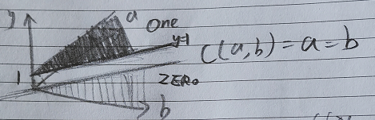


首先,calcu() 函数引入了两个变量,在if 判断这里引用两个变量a 和b ,因为a 与b 的值关系最终决定了y (返回值)的值,所以这就需要构造三维坐标系.于是Condition_True_Range <=> Symblo(a) > Symblo(b) .当a = b 相等时,我们可以在a b 的二维平面上勾画出一条直线,f(b) =  b .那么当a > b 时,也就是在One 区域;当b < a 时,那就在Zero 区域.


#### Example 5 -- 数组引用


```c
void access(int index) {
    char buffer[10] = {0};
    
    buffer[index] = 'A';
}
```


现在我们要研究的是index 与buffer 变量的关系.我们在写白盒审计工具时,如果要对代码`buffer[index] = 'A';` 漏洞校验时,如果index >= sizeof(buffer) 那就认为这行代码存在越界漏洞,我们把index 变量的关系和buffer 这么来处理.先来看看index 变量与buffer 索引之间的关系函数.


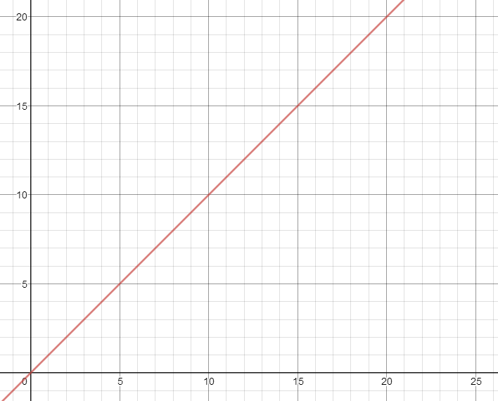


可以知道,这是一个`buffer_index = Symblo(index) = index`,横坐标是index 变量,纵坐标是buffer_index .再看看看其它例子:


```c
void access(int index) {
    char buffer[10] = {0};
    
    buffer[index + 2] = 'A';
}
```


此时index 变量与buffer 索引之间的关系函数为`buffer_index = Symblo(index) = index + 2`.


```c
void access(int index) {
    char buffer[10] = {0};
    
    buffer[index & 8] = 'A';
}
```


此时index 变量与buffer 索引之间的关系函数为`buffer_index = Symblo(index) = index & 8`.因为引入了逻辑运算,其实上也可以通过坐标系画出Symblo(index) 的函数曲线的,图像如下.


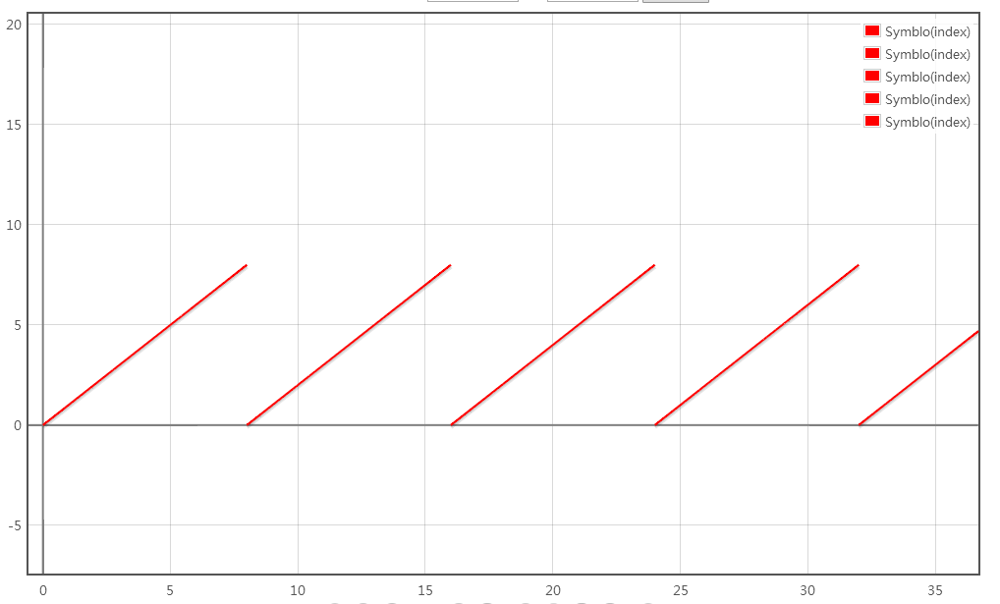


回过头来继续深入数组访问的第一个示例程序,我们把buffer_size (由`char buffer[10]={0}` 可知buffer_size = (x = 10))也引入到坐标系中,得到下图:


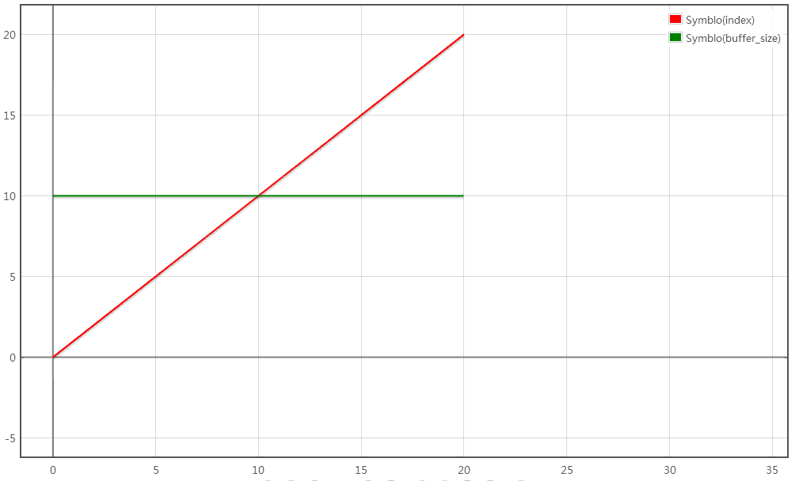


在此我们分为两条函数:Symblo(buffer_size) 和Symblo(index) ,两条函数相交于(10,10) .那么有:**1.Symblo(buffer_size) > Symblo(index) 意味着对这个数组的访问是正常的; 2.Symblo(buffer_size) < Symblo(index) 意味着访问这个数组是异常的(越界访问)** .所以我们就需要对**变量index 的取值范围进行限制**,示例代码修改如下:


```c
void access(int index) {
    char buffer[10] = {0};
    
    if (index < sizeof(buffer))
    	buffer[index] = 'A';
}
```


现在我们引入了if 判断,对变量index 的取值范围进行了限制(x = 10),对应图像如下:


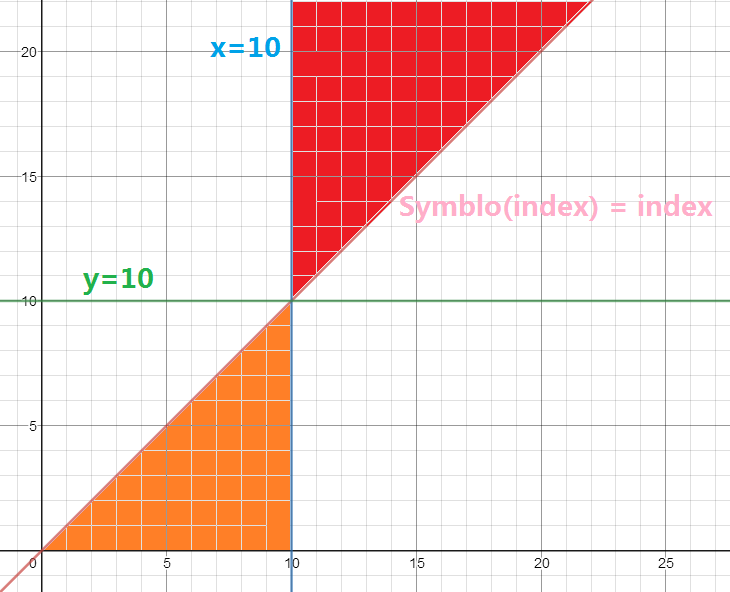


橙色区域是合法的buffer 引用范围,红色区域是buffer 引用越界的范围.**横坐标的index 经过一系列的运算(Symblo(index)) 最后得出纵坐标buffer_index 的值;而且,对index 所做的if 校验,实际上都是对index 的范围进行限制,只有Symblo(index) 在符合index 的取值范围内能够让buffer_index 的值大于10 才能导致的越界,所以就把y = 10 表示为漏洞边界表达式,只要存在越过这一边界的值,那么就存在越界漏洞.**


#### Example 6 -- 任意地址读写漏洞分析


```c
int resolve_buffer(int* recv_buffer) {
    int offset = recv_buffer[1];
    
    return *(recv_buffer + offset);
}
```


代码语句*(recv_buffer + offset) 的意思是要获取这个地址中的内容.一般来说,recv_buffer 是一个特定的内存地址(一个固定的常数值),offset 则是一个变量值(因为是来自用户输入),那么最后**读取的地址函数式与recv_buffer ,offset 对应的关系为address = Symblo(offset) <=> recv_buffer + offset <=> C_recv_buffer + offset.**对应的变化关系图如下,横坐标为offset ,纵坐标为address :


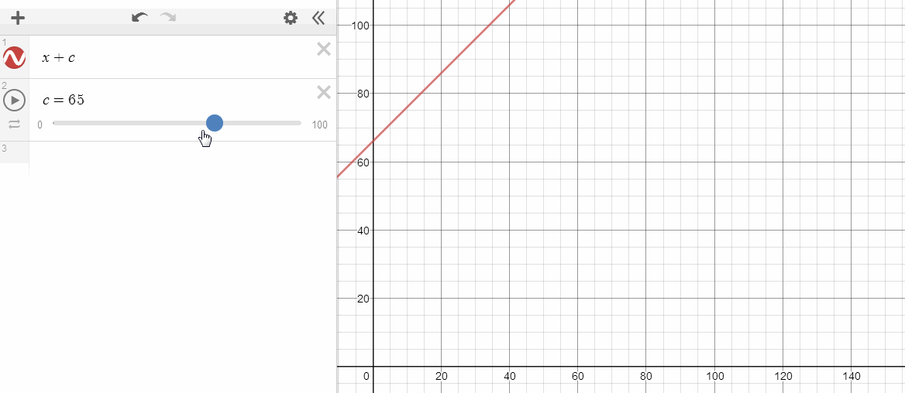


我们知道,C_recv_buffer 是一个正整数常数(0 <= C_recv_buffer <= max(int)),offset 则是一个变量,接下来对offset 的长度进行校验,代码如下:


```c
int resolve_buffer(int* recv_buffer) {
    int offset = recv_buffer[1];
    
    if (offset < 20)
    	return *(recv_buffer + offset);
    
    return 0;
}
```


对应的关系图如下:


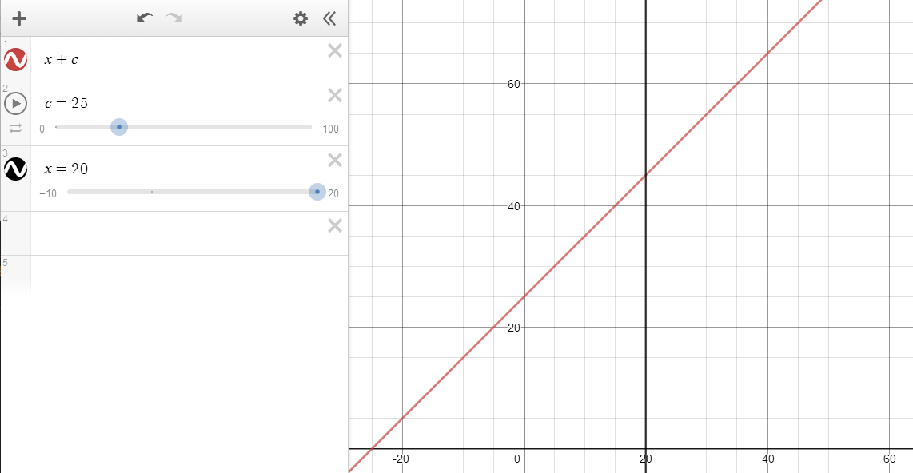


在此我们假设C_recv_buffer 的值为25 ,offset 是变量,但是被约束offset < 20 ,那么橙色区域是合法的访问区域,红色区域则是不合法的访问区域,因为offset 是int 类型,可以取值为负数,那么久可以越过recv_buffer 的合法读取往前读取地址空间小于20 的位置.


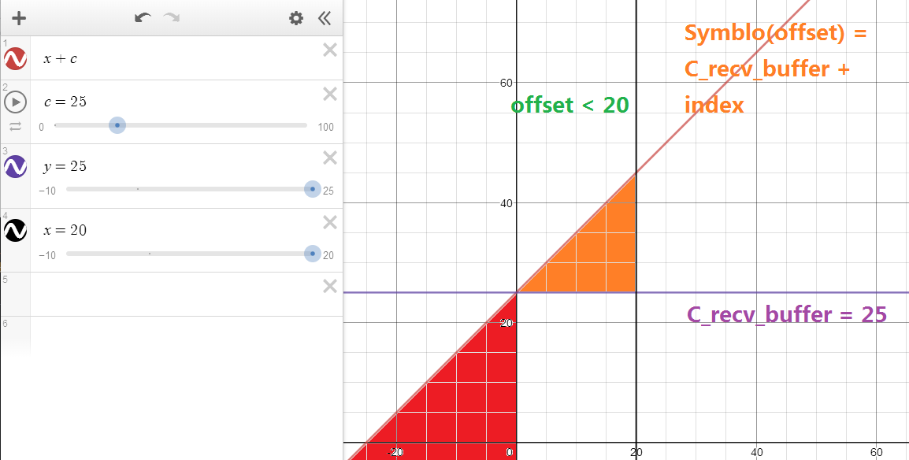


所以我们分析这个图形,漏洞的边界函数有两个,分别是C_recv_buffer_lower_bound = 25 与C_recv_buffer_upper_bound = 45 .只有**C_recv_buffer_lower_bound  <= address < C_recv_buffer_upper_bound** 时访问数组才是合法的.


实际上,我们在用Symblo Executge (符号执行)和Coverage (代码覆盖率)就是为了不断探索出if 判断对于变量所设定的取值范围.对变量每增多一个if 判断,那么取值范围就会相应地减小.


#### 取值范围与函数相交


下面是一个函数C1 穿过一个数据集R1 的例子.


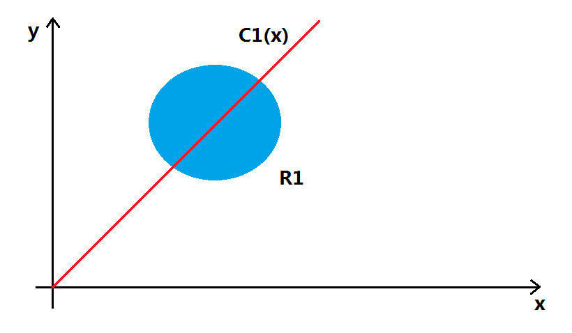


我们假设R1 是某个变量的取值范围,C1 是边界函数.**使用机器学习的思想,边界函数C1 根据数据出现在边界函数的左右两则位置而确定数据的分类,我们只需要给定数据,那么就可以拟合出边界函数C1 的曲线,然后给数据进行分类**.*那么我们能不能通过对这些数据集进行分类进而确定是否存在漏洞呢?*


##### 曲线拟合


我们知道,对一些已经打好分类标签的数据集再传递给模型学习,那么模型就能够拟合出一条曲线C(x) ,如下图:


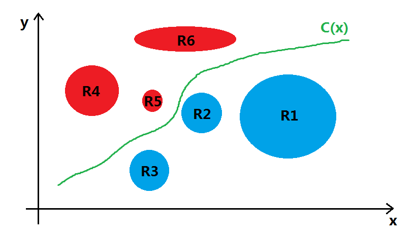


但是,**对于某种特定的漏洞检验函数,它是唯一的**.比如说:任意地址写对应的检验函数为C(x) = x ;数组越界检验函数为C_upper(buffer) = C1 ,C_lower(buffer) = C2 .这些漏洞边界函数都是较为**固定**的,并不是像需要依靠分类的样本数据使用算法来拟合出的边界函数,**漏洞的产生存在因果关系,而不是相关性**.


#### 漏洞样本检验


我们研究一下样本代码,看看能不能发现些什么.


```c
//  Buffer Overflow

code_sample_buffer_check_1 = '''
void main() {
    char buffer[10] = {0};

    buffer[10] = '\0';
}
'''
code_sample_buffer_check_2 = '''
void main() {
    char* buffer = (char*)malloc(10);

    buffer[20] = '\0';
}
'''
```


前面已经说过,漏洞之所以会产生,那是因为buffer_size 和buffer_index 的关系.**因为只有buffer_index > buffer_size 时,才导致了buffer 访问溢出.**我们使用ASAN ,Gflags 的目的就是要挖掘出来这两者之间的关系(通过代码插桩或者内存读写权限控制实现越界检测).对于code_sample_buffer_check_1 来说,buffer 大小是显式表达的(变量语句中已经声明了buffer 大小为10 );code_sample_buffer_check_2 则是隐式表达的(因为是通过malloc 分配指定,大部分情况下不容易确定它具体的值).


```c
//  Arbitrarily_Write

code_sample_arbitrarily_write_check_1 = '''
void main(char* point) {
    char* buffer = point;

    *buffer = 0x1;
}
'''
code_sample_arbitrarily_write_check_2 = '''
void main(char* offset) {
    char buffer[10] = {0};

    *(buffer + offset) = 0x1;
}
'''
code_sample_arbitrarily_read_check_1 = '''
void main(char* point) {
    char* buffer = point;
    char  data = *buffer;
}
'''
code_sample_arbitrarily_read_check_2 = '''
void main(char* offset) {
    char buffer[10] = {0};
    char data = *(buffer + offset);
}
'''
```


任意地址读写也是一样的,对于buffer 的边界还是需要上下文来推断,offset 的变化函数容易推算出来,但是buffer 的边界函数却不容易推算.


#### 总结


漏洞验证阶段是最头疼的,**验证一个漏洞是否有效,本质上是对变量的取值范围与漏洞边界进行探讨.通过上述的一些讨论发现如果要使用AI 的算法去拟合出漏洞边界函数其实是不现实的,因为这些边界函数是根据相关变量动态变化的,倒不如让我们把所有的限制条件和变量初值设置好让求解器来运算.**博主太菜了,他真的没有办法了,写到这里的时候,不知不觉留下了没有技术的泪水...


那么因果推断能用上来吗? https://zhuanlan.zhihu.com/p/33860572


在线函数画图URL


https://zh.numberempire.com/graphingcalculator.php


https://www.desmos.com/calculator

