## 必备工具

  Python ,cparser (https://github.com/tscosine/cparser/) 

## 静态代码分析基本原理

  静态代码分析是基于有源码的情况下根据已有的规则来匹配源码中是否可能存在漏洞.对于漏洞规则,我们一般分为两种情况:二进制语言和脚本解析语言.为什么要这么样来区分呢?这是因为脚本解析语言绝大部分的漏洞是没有过滤用户的输入,使得用户的输入传递到了敏感函数中执行(比如SQL 注入,反序列化,远程命令执行的原理等),有少部分的漏洞是因为语言本身的特性而导致的.但是二进制语言(C/C++/go)除了前面所述的逻辑,最难的一点是计算程序内存区域是否会出现异常情况(也就是二进制漏洞中常见的UaF ,OOB 等),用静态代码分析比较难发现这些隐藏的漏洞.所以我们先从简单的来说起,相信做过PHP 白盒审计的读者们都知道Seay源码审计助手,这个工具的原理就是通过正则表达式在代码文本中匹配相应的规则,然后生成漏洞报告.

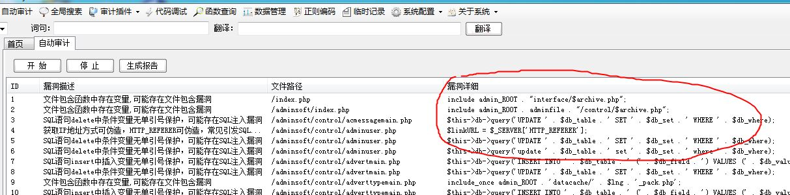

  Seay源码审计助手只定位到代码调用敏感函数的位置,但是并没有对参数进行相应的校验,比如说对代码`include  $Dir . "/test.php";` 的检测,假设`$Dir = "/var/www/";` ,审计助手也是依旧识别为可能存在文件包含漏洞,其实`$Dir` 的值是固定的,只需要跟踪这个值就可以知道它是不可控的变量.

  我们再来看一下fortity SCA ,fortify 对项目扫描除了匹配漏洞之外,还会根据程序的逻辑和函数交叉引用来绘制程序时序图表.接下来我们来了解一些静态代码分析的基本原理.

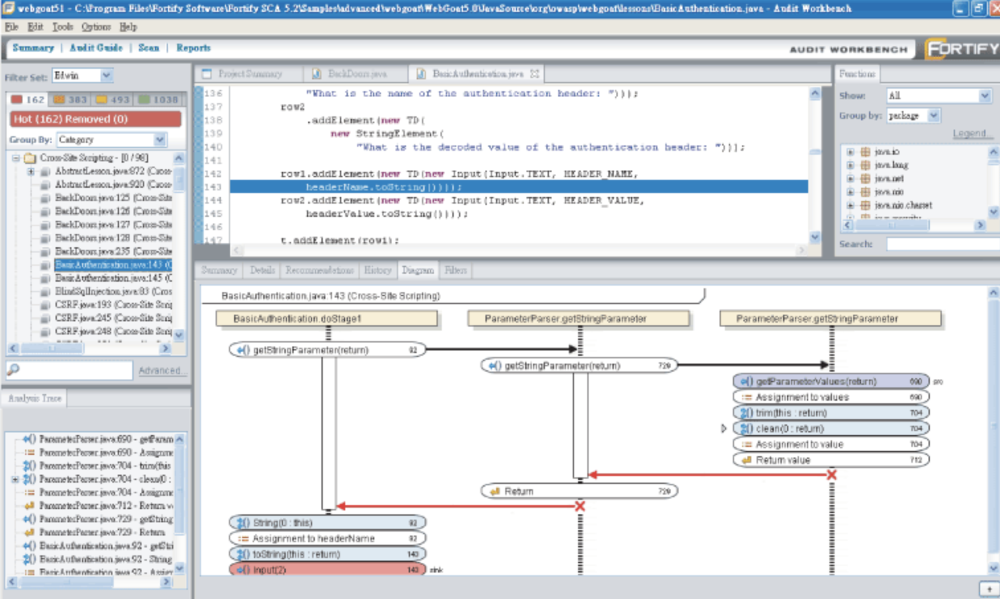

### 数据流跟踪

  我们先来一段示例代码:

```c

#include <malloc.h>
#include <memory.h>
#include <stdlib.h>
#include <stdio.h>


enum {
  MessageType_Hello = 0,
  MessageType_Execute,
  MessageType_Data
};

void execute_command(const unsigned char* command) {
    system(command);
}

void decrypt_data(const unsigned char* data_buffer,unsigned char data_buffer_length) {
    unsigned char* buffer[8] = {0};
    
    for (unsigned int data_index = 0;data_index < data_buffer_length;++data_index)
        buffer[data_index] = data_buffer[data_index] ^ 0x65;
    
    printf("Recv:%s\n",&buffer);
}

int buffer_resolver(const unsigned char* buffer) {
    unsigned char buffer_length = buffer[0];
    
    if (2 <= buffer_length)
        return 0;
    
    if (MessageType_Hello == buffer[1]) {
        printf("Hello\n");
    } else if (MessageType_Execute == buffer[1]) {
        unsigned char* command_buffer = (unsigned char*)malloc(buffer_length - 1);
        
        memset(&command_buffer,0,buffer_length);
        memcpy(&command_buffer,&buffer[2],buffer_length - 2);
        
        execute_command(command_buffer);
    } else if (MessageType_Data == buffer[1]) {
        decrypt_data(&buffer[2],buffer_length - 2);
    }
    
    return 1;
}

```

  这是一段简单的解析数据包的示例代码,可以看到入口点`buffer_resolver()` 函数提供了一个buffer 参数供外部调用,接下来程序逻辑就针对这个buffer 的内容进行解析然后做进一步的处理.数据流跟踪的意义在于,对一个特定的变量或者参数进行数据流分析,找到这个变量或者参数的来源是否为可控的.

  我们把`buffer_resolver()` 的代码抽象成数据流图.

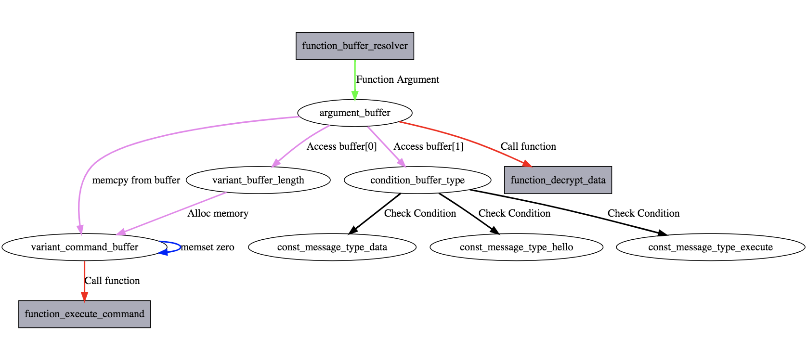

  现在我们可以很清楚地了解到`buffer_resolver()` 中的数据流过程.图表中绿色代表函数的参数输入,紫色线代表读数据,蓝色线代表写数据,红色线是传递该内容到函数中调用,在标注线的内容中也提到了如何操作数据和操作的位置.在我们做白盒分析代码的时候,一般是定位到敏感函数的位置再做数据流分析.上面的数据流图是**从上往下**分析的,但是如果要对敏感函数的参数进行溯源分析,此时就是要构画一个**从下往上**的数据流图分析.我们的规则匹配到`execute_command()` ,然后从第一个参数开始往上跟踪,可以得到图表如下:

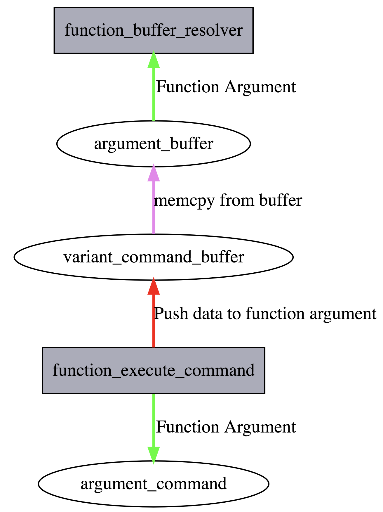

  有了这张粗略的从数据流回溯图,我们很容易就能看到`execute_command()` 的参数受到哪些地方影响.所以,**当我们定位到某个规则的时候,需要找到能够影响参数的内容,就需要从下往上(从敏感参数开始向上搜索)来对数据流进行回溯;当我们从数据输入位置开始搜索它能影响到哪些变量和参数,就需要从上往下(从可控输入开始向下搜索)对数据进行跟踪**.再举个简单的PHP 例子:

```php

<?php
    
    $user_id = $_GET['id'];

    $user_name = sql_query('SELECT user_name FROM user WHERE uid = ' . $user_id);

    echo 'Hello : ' . $user_name . ' Uid(' . $user_id . ')';
    
?>

```

  对$_GET['id'] 进行数据跟踪,可以发现两个漏洞问题:SQL 注入和XSS .

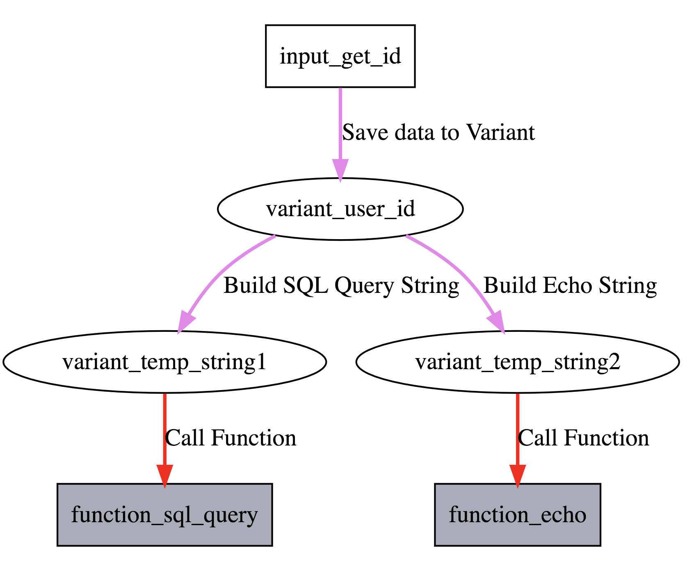

  对`sql_query()` 进行漏洞规则,我们可以看到在拼接字符串阶段直接把`$user_id` 引入到`sql_query()` 的参数中.

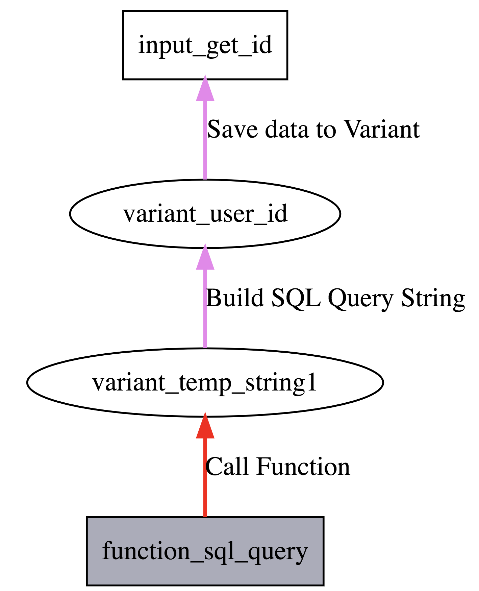

  对echo 的搜索方式也是一样的原理,限于篇幅此处省略.

  下面使用Python 来对示例C++ 代码实现分析.用到https://github.com/tscosine/cparser/ 来解析C++ 代码成AST 代码树

```python

import cparser

code = '''
int buffer_resolver(const unsigned char* buffer) {
    unsigned char buffer_length = buffer[0];
    
    if (2 <= buffer_length)
        return 0;
    
    if (MessageType_Hello == buffer[1]) {
        printf("Hello\n");
    } else if (MessageType_Execute == buffer[1]) {
        unsigned char* command_buffer = (unsigned char*)malloc(buffer_length - 1);
        
        memset(&command_buffer,0,buffer_length);
        memcpy(&command_buffer,&buffer[2],buffer_length - 2);
        
        execute_command(command_buffer);
    } else if (MessageType_Data == buffer[1]) {
        decrypt_data(&buffer[2],buffer_length - 2);
    }
    
    return 1;
}
'''

data = cparser.get_func_tree(code)

data.nprint()

```

  对应的nprint() 输出效果

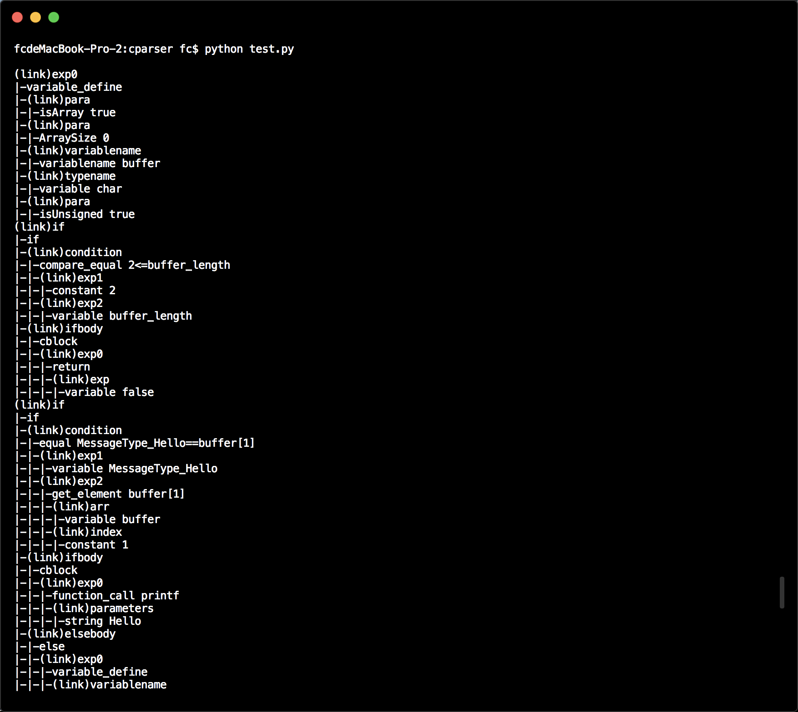

  我们使用subnode 对象来获取函数下的语句

```python

for subnode_index in data.subnode :
    print subnode_index

```

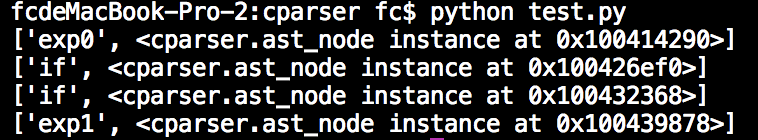

  接下来我们对AST 树进行递归搜索,遍历所有函数调用查找execute_command 并输出函数参数(注解:解析函数参数的代码也是遍历AST 树,建议调试理解这部分的代码)

```python

def get_function_parameters(ast_node) :
    parameters_list = []

    for subnode_index in ast_node.subnode :
        if subnode_index[1].type == 'parallel' :
            parameters_list += get_function_parameters(subnode_index[1])
        elif subnode_index[0] == 'parameters' :
            parameters_list.append({
                'type' : subnode_index[1].type ,
                'value' : subnode_index[1].value ,
            })
        elif subnode_index[0].startswith('exp') :
            parameters_list.append({
                'type' : subnode_index[1].type ,
                'value' : subnode_index[1].value ,
            })

    return parameters_list

def recursive_find_call(ast_node,find_function_name) :
    find_result = []

    for subnode_index in ast_node.subnode :
        if 'function_call' == subnode_index[1].type :
            if find_function_name == '*' or find_function_name == subnode_index[1].value :
                parameters_list = get_function_parameters(subnode_index[1])
                
                find_result.append((subnode_index,parameters_list))

        find_result += recursive_find_call(subnode_index[1],find_function_name)

    return find_result

def print_search_result(call_list) :
    for call_index in call_list :
        ast_node_info = call_index[0]
        parameters_info = call_index[1]

        print 'Call Function Name :',ast_node_info[1].value
        print '  Function Argument :',parameters_info


find_function_call = recursive_find_call(data,'execute_command')

print_search_result(find_function_call)

```

  程序输出如下:

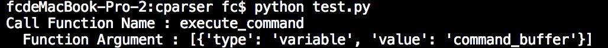

  现在已经可以在AST 树中搜索指定的函数调用和对应的参数列表了,然后我们再拓展自定义搜索规则的功能

```python

search_strategy = '''
execute_command(*)
'''

def resolve_strategy(user_search_strategy) :
    user_search_strategy = user_search_strategy.split('\n')
    check_strategy = []

    for user_search_strategy_index in user_search_strategy :
        strategy_record = user_search_strategy_index.strip()

        if not len(strategy_record) :
            continue

        search_function_name = strategy_record.split('(')[0].strip()
        search_parameter_string = strategy_record.split('(')[1].strip()
        search_parameter_string = search_parameter_string.split(')')[0].strip()
        search_parameter_list = []

        if len(search_parameter_string) :
            if not -1 == search_parameter_string.find(',') :
                search_parameter_string = search_parameter_string.split(',')
                parameter_index = -1

                for search_parameter_index in search_parameter_string :
                    check_parameter = search_parameter_index.strip()
                    parameter_index += 1

                    if not check_parameter == '*' :
                        continue

                    search_parameter_list.append(parameter_index)
            else :
                check_parameter = search_parameter_string.strip()

                if check_parameter == '*' :
                    search_parameter_list.append(0)

        check_strategy.append((search_function_name,search_parameter_list))

    return check_strategy

print resolve_strategy(search_strategy)

```

  自定义匹配策略的规则是:函数名(检测的函数参数),举个例子:比如要我们知道`eval()` 函数的第一个参数对输入是敏感的,那么就需要对所有调用`eval()` 函数的第一个参数进行可控检测,对应的规则是`eval(*)` ;如果要检测`call_user_func()` ,那么就要检测第一和第二个参数是否可控,对应的策略为`call_user_func(*,*)` .有了策略解析器之后,我们再来完善漏洞规则匹配功能:

```python

search_strategy = '''
execute_command(*)
'''

search_strategy = resolve_strategy(search_strategy)
search_record = {}

for search_strategy_index in search_strategy :  #  Search Call by Strategy
    find_function_name = search_strategy_index[0]
    search_check_parameter_list = search_strategy_index[1]
    find_function_call = recursive_find_call(data,find_function_name)

    print_search_result(find_function_call)
    search_record[find_function_name] = []

    for call_index in find_function_call :  #  Find Match Strategy Call
        ast_node_info = call_index[0]
        parameters_list = call_index[1]

        if search_check_parameter_list :
            check_parameter_list = []

            for search_check_parameter_index in search_check_parameter_list :  #  Filter Call Argument
                if len(parameters_list) <= search_check_parameter_index :
                    continue

                target_search_parameter = parameters_list[search_check_parameter_index]

                if not target_search_parameter['type'] in ['variable','address_of'] :  #  Check this Argument is a Variant ..
                    continue

                check_parameter_list.append(target_search_parameter)

            if check_parameter_list :
                search_record[find_function_name].append((ast_node_info,check_parameter_list))
        else :
            search_record[find_function_name].append((ast_node_info,[]))


print search_record

```

  现在可以根据指定的参数来匹配代码中的函数调用了,输出内容如下


  修改策略,搜索`memcpy()` 函数

```python

search_strategy = '''
execute_command(*)
memcpy(,*,)
'''

```

  搜索结果如下

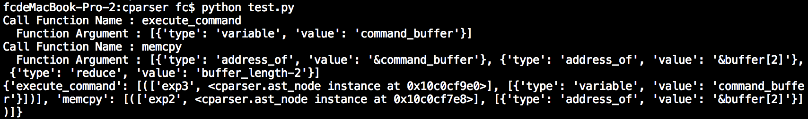

  最后一步就是实现数据流跟踪功能,在此我们只关注variable 和address_of 类型的AST 树节点数据

```python

def xref_variant(trance_record,bingo_parameter_name) :
    xref_record = []

    for trance_record_index in trance_record[ :: -1 ] :
        if trance_record_index[1].type in ['get_element','assign'] :
            if bingo_parameter_name in trance_record_index[1].value :
                xref_record.append({
                    'type' : trance_record_index[1].type ,
                    'value' : trance_record_index[1].value ,
                    'node' : trance_record_index
                })
        elif trance_record_index[1].type == 'function_call' :
            function_parameters = get_function_parameters(trance_record_index[1])

            for function_parameter_index in function_parameters :
                if not bingo_parameter_name in function_parameter_index['value'] :
                    continue

                xref_record.append({
                    'type' : trance_record_index[1].type ,
                    'value' : trance_record_index[1].value ,
                    'node' : trance_record_index
                })

    return xref_record

def trance_record_by_ast(start_node,target_node,bingo_parameters,trance_record) :
    code_record = []

    for node_object_index in start_node.subnode :
        if node_object_index == target_node :
            xref_record_list = []

            for bingo_parameter_index in bingo_parameters :
                xref_record_list.append(xref_variant(trance_record + code_record,bingo_parameter_index['value']))

            return (True,xref_record_list)

        code_record.append(node_object_index)

        is_search,sub_data = trance_record_by_ast(node_object_index[1],target_node,bingo_parameters,trance_record + code_record)

        if is_search :
            xref_record_list = sub_data

            return (True,xref_record_list)

        sub_code_record = sub_data
        code_record += sub_code_record

    return (False,code_record)


search_strategy = '''
execute_command(*)
'''
search_record = search_call_by_strategy(search_strategy,data)

print 'Search Record :',search_record

for search_record_index in search_record.keys() :
    functinon_name = search_record_index
    bingo_record_list = search_record[search_record_index]

    for bingo_record_index in bingo_record_list :
        print trance_record_by_ast(data,bingo_record_index[0],bingo_record_index[1],[])

```

  运行效果如下

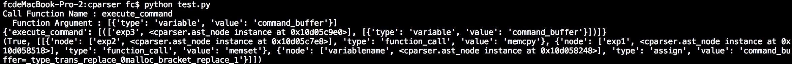

  对数据流的分析需要比较多的递归,笔者在设计PHP 白盒审计工具时(https://github.com/lcatro/PHP_Source_Audit_Tools) 就遇到过性能问题,在几个页面之间做深度数据流分析很容易会产生大量递归和循环,做好数据流跟踪之后,接下来就是控制流分析.


### 控制流分析

  控制流分析面向的是对程序判断的分析,程序通过if switch for while 这些语句对代码块进行跳转执行处理,我们把一段代码改为代码块来理解,把判断语句作为分割代码块之间的跳转条件,这样我们就能得到程序的执行图.对于`buffer_resolve()` 它的程序执行图如下:


  可以看到,`buffer_resolve()` 中有4 个判断语句,整个程序一共有5 条路径,分别如下:

```txt

entry -> block_1
entry -> block_2 -> block_3 -> block_6
entry -> block_2 -> block_4 -> block_6
entry -> block_2 -> block_5 -> block_6
entry -> block_2 -> block_6

```

  `buffer_resolve()` 调用`execute_command()` 函数的代码在block5 代码块里面,要想让代码执行到block5 的路径,那就只有路径`entry -> block_2 -> block_5 -> block_6` .要满足这条路径,那就必须要满足三个条件:

```txt

condition_1 = (2 <= buffer_length)
condition_2 = (MessageType_Hello == buffer[1])
condition_3 = (MessageType_Execute == buffer[1])

!condition_1 && !condition_2 && conditon_3

```

  `!condition_1 && !condition_2 && conditon_3` 指的是条件约束,需我们给定的输入满足这些条件才可以让程序执行到block5 .现在我们继续用AST 从代码中分析控制流.

```python

def get_condition(ast_node) :
    for index in ast_node.subnode :
        if 'condition' == index[0] :
            return index[1].value

    return False

def trance_control_flow_by_ast(start_node,target_node,trance_record) :
    code_record = []

    for node_object_index in start_node.subnode :
        if node_object_index == target_node :
            all_trance_record = trance_record + code_record
            control_flow_list = []

            for trance_record_index in all_trance_record :
                if trance_record_index[1].type == 'if' :
                    control_flow_list.append(get_condition(trance_record_index[1]))

            return (True,control_flow_list)

        code_record.append(node_object_index)

        is_search,sub_data = trance_control_flow_by_ast(node_object_index[1],target_node,trance_record + code_record)

        if is_search :
            control_flow_record_list = sub_data

            return (True,control_flow_record_list)

    return (False,code_record)


search_strategy = '''
execute_command(*)
'''
search_record = search_call_by_strategy(search_strategy,data)

print 'Search Record :',search_record

for search_record_index in search_record.keys() :
    functinon_name = search_record_index
    bingo_record_list = search_record[search_record_index]

    for bingo_record_index in bingo_record_list :
        print trance_control_flow_by_ast(data,bingo_record_index[0],[])

```

  运行结果如下:

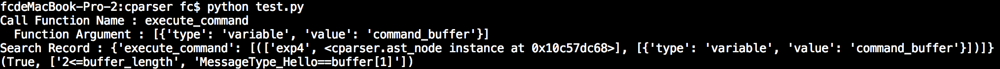


### 函数交叉引用

  函数交叉引用旨在于函数之间的调用关系,我们可以用IDA 对上面的代码进行交叉引用图表生成,找到`buffer_resolver()` 函数,右键"xrefs graph to".

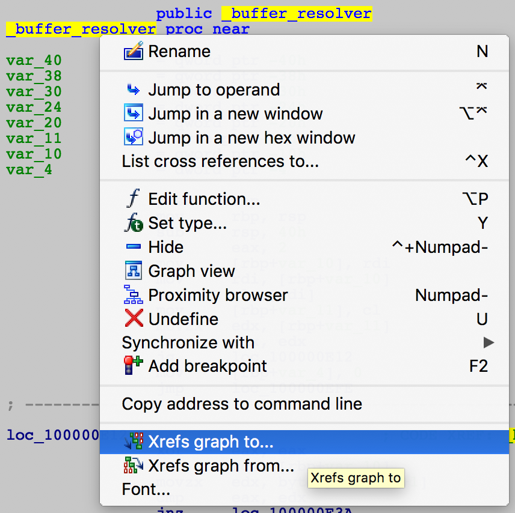

  但是IDA 却弹出了没有找到

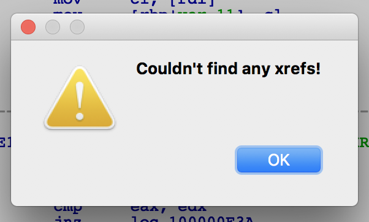

  "xrefs graph to" 选项的意思是,搜索哪里调用到这个函数(对应从下往上);"xrefs graph from"是搜索当前函数调用了哪些函数(对应从上往下),于是我们选择"xrefs graph from" 再次查看结果

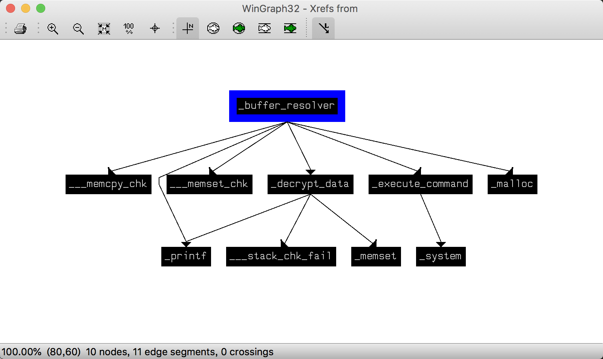

  然后我们继续来实现函数交叉引用的功能.代码如下(由于这个代码库只支持对一个函数代码进行序列化AST ,所以用了一个dict 对象保存所有序列化后的代码,故以下的示例代码比较亢长):

```python


code_emun = '''
enum {
  MessageType_Hello = 0,
  MessageType_Execute,
  MessageType_Data
};
'''

code_execute_command = '''
void execute_command(const unsigned char* command) {
    system(command);
}
'''

code_decrypt_data = '''
void decrypt_data(const unsigned char* data_buffer,unsigned char data_buffer_length) {
    unsigned char* buffer[8] = {0};
    
    for (unsigned int data_index = 0;data_index < data_buffer_length;++data_index)
        buffer[data_index] = data_buffer[data_index] ^ 0x65;
    
    printf("Recv:%s\n",&buffer);
}
'''

code_buffer_resolver = '''
int buffer_resolver(const unsigned char* buffer) {
    unsigned char buffer_length = buffer[0];
    
    if (2 <= buffer_length)
        return 0;
    
    if (MessageType_Hello == buffer[1]) {
        printf("Hello\n");
    } else if (MessageType_Execute == buffer[1]) {
        unsigned char* command_buffer = (unsigned char*)malloc(buffer_length - 1);
        
        memset(&command_buffer,0,buffer_length);
        memcpy(&command_buffer,&buffer[2],buffer_length - 2);
        
        execute_command(command_buffer);
    } else if (MessageType_Data == buffer[1]) {
        decrypt_data(&buffer[2],buffer_length - 2);
    }
    
    return 1;
}
'''

code_stream = {
    'global_enum' : cparser.get_func_tree(code_emun) ,
    'decrypt_data' : cparser.get_func_tree(code_decrypt_data) ,
    'execute_command' : cparser.get_func_tree(code_execute_command) ,
    'buffer_resolver' : cparser.get_func_tree(code_buffer_resolver) ,
}


def get_function_parameters(ast_node) :
    parameters_list = []

    for subnode_index in ast_node.subnode :
        if subnode_index[1].type == 'parallel' :
            parameters_list += get_function_parameters(subnode_index[1])
        elif subnode_index[0] == 'parameters' :
            parameters_list.append({
                'type' : subnode_index[1].type ,
                'value' : subnode_index[1].value ,
            })
        elif subnode_index[0].startswith('exp') :
            parameters_list.append({
                'type' : subnode_index[1].type ,
                'value' : subnode_index[1].value ,
            })

    return parameters_list

def recursive_find_call(ast_node,find_function_name) :
    find_result = []

    for subnode_index in ast_node.subnode :
        if subnode_index[1] == None :  #  Fix cparser Bug , Maybe Some Node is None ..
            continue

        if 'function_call' == subnode_index[1].type :
            if find_function_name == '*' or find_function_name == subnode_index[1].value :
                parameters_list = get_function_parameters(subnode_index[1])
                
                find_result.append((subnode_index,parameters_list))

        find_result += recursive_find_call(subnode_index[1],find_function_name)

    return find_result

def xref_function(code_stream,search_function_name) :
    search_xref_data = {}

    for function_name in code_stream.keys() :
        function_code = code_stream[function_name]
        search_result = recursive_find_call(function_code,search_function_name)

        if not search_result :
            continue

        xref_record = xref_function(code_stream,function_name)  #  Recursive find function's Xref ..
        search_xref_data[function_name] = {
            'xref' : xref_record ,
            'reference' : search_result ,
        }

    return search_xref_data


print xref_function(code_stream,'execute_command')


```

  输出结果如下,因为`execute_command()` 只被`buffer_resolver()` 这个函数引用,所以只输出这一个结果.

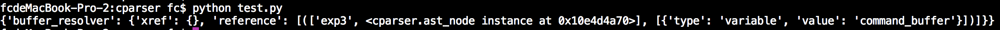

  为了结果更明显,我们搜索`system()` 函数.

```python

print xref_function(code_stream,'system')

```

  运行结果如下:

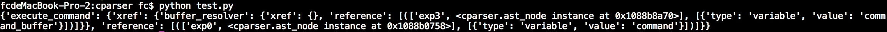


### 综合分析

  综合分析阶段我们主要运用以上的四个步骤对源码进行扫描:匹配漏洞->函数内部数据流跟踪->控制流跟踪->交叉引用.有了上面已经写好的功能代码,接下来就是按照逻辑来拼装代码了,Talk is Cheap ,Show you the code :

  首先是要修复cparse 库不能对函数参数进行解析的问题,因为我们除了要在函数内部代码定位数据流,最后也需要定位到函数参数中去,故在此先添加第一部分代码

```python

def resolver_function_parameter(code_string) :
    code_string = code_string.strip()
    code_block_declare_offset = code_string.find('{')

    if -1 == code_block_declare_offset :
        return False

    try :
        function_declare_string = code_string[ : code_block_declare_offset ].strip()
        function_return_type = function_declare_string.split(' ')[0]
        function_name = function_declare_string.split('(')[0]
        function_name = function_name.split(' ')[1]
        function_parameters_string = function_declare_string.split('(')[1].strip()
        function_parameters_string = function_parameters_string.split(')')[0].strip()
        resolve_function_parameters_list = function_parameters_string.split(',')
        function_parameters_list = []

        for resolve_function_parameters_index in resolve_function_parameters_list :
            function_parameters_list.append({
                'type' : resolve_function_parameters_index[ : resolve_function_parameters_index.rfind(' ') ] ,
                'name' : resolve_function_parameters_index.split(' ')[-1] ,
            })

        return {
            'type' : function_return_type ,
            'name' : function_name ,
            'parameters' : function_parameters_list ,
        }
    except :
        pass

    return False


code_stream = {
    'global_enum' : {
        'code' : cparser.get_func_tree(code_emun) ,
        'declare' : resolver_function_parameter(code_emun) ,
    } ,
    'decrypt_data' : {
        'code' : cparser.get_func_tree(code_decrypt_data) ,
        'declare' : resolver_function_parameter(code_decrypt_data) ,
    } ,
    'execute_command' : {
        'code' : cparser.get_func_tree(code_execute_command) ,
        'declare' : resolver_function_parameter(code_execute_command) ,
    } ,
    'buffer_resolver' : {
        'code' : cparser.get_func_tree(code_buffer_resolver) ,
        'declare' : resolver_function_parameter(code_buffer_resolver) ,
    } ,
}

# ...

def xref_function(code_stream,search_function_name) :
    search_xref_data = {}

    for function_name in code_stream.keys() :
        function_code = code_stream[function_name]['code']  #  Get Code from code_stream .
        search_result = recursive_find_call(function_code,search_function_name)

        if not search_result :
            continue

        xref_record = xref_function(code_stream,function_name)
        search_xref_data[function_name] = {
            'xref' : xref_record ,
            'reference' : search_result ,
        }

    return search_xref_data


```

  然后为了让`search_call_by_strategy()` 减少输出无用的结果,在此加入了对搜索结果的内容是否为空进行筛选:

```python

def search_call_by_strategy(search_strategy,code_object) :
    search_strategy = resolve_strategy(search_strategy)
    search_record = {}

    for search_strategy_index in search_strategy :  #  Search Call by Strategy
        find_function_name = search_strategy_index[0]
        search_check_parameter_list = search_strategy_index[1]
        find_function_call = recursive_find_call(code_object,find_function_name)
        search_record_list = []

        print_search_result(find_function_call)

        for call_index in find_function_call :  #  Find Match Strategy Call
            ast_node_info = call_index[0]
            parameters_list = call_index[1]

            if search_check_parameter_list :
                check_parameter_list = []

                for search_check_parameter_index in search_check_parameter_list :  #  Filter Call Argument
                    if len(parameters_list) <= search_check_parameter_index :
                        continue

                    target_search_parameter = parameters_list[search_check_parameter_index]

                    if not target_search_parameter['type'] in ['variable','address_of'] :  #  Check this Argument is a Variant ..
                        continue

                    check_parameter_list.append(target_search_parameter)

                if check_parameter_list :
                    search_record_list.append((ast_node_info,check_parameter_list))
            else :
                search_record_list.append((ast_node_info,[]))

        if search_record_list :  #  Fix This : If not found function call result so we let it empty (我总感觉这个语法不对。。。)
            search_record[find_function_name] = search_record_list

    return search_record

```

  接下来我们继续修复数据流分析的代码,支持跟踪到函数参数

```python

def xref_variant(trance_record,bingo_parameter_name,function_declare) :
    xref_record = []

    for trance_record_index in trance_record[ :: -1 ] :
        if trance_record_index[1].type in ['get_element','assign'] :
            if bingo_parameter_name in trance_record_index[1].value :
                xref_record.append({
                    'type' : trance_record_index[1].type ,
                    'value' : trance_record_index[1].value ,
                    'node' : trance_record_index
                })
        elif trance_record_index[1].type == 'function_call' :
            function_parameters = get_function_parameters(trance_record_index[1])

            for function_parameter_index in function_parameters :
                if not bingo_parameter_name in function_parameter_index['value'] :
                    continue

                xref_record.append({
                    'type' : trance_record_index[1].type ,
                    'value' : trance_record_index[1].value ,
                    'node' : trance_record_index
                })

    for function_parameter_index in function_declare['parameters'] :  #  Add this
        function_parameter_name = function_parameter_index['name']

        if not bingo_parameter_name == function_parameter_name :
            continue

        xref_record.append({
            'type' : 'parameter' ,
            'value' : function_parameter_name ,
            'node' : None
        })

    return xref_record

def trance_record_by_ast(start_node,target_node,bingo_parameters,function_declare,trance_record) :  #  Add new Parameter : function_declare
    code_record = []

    for node_object_index in start_node.subnode :
        if node_object_index == target_node :
            xref_record_list = []

            for bingo_parameter_index in bingo_parameters :
                xref_record_list.append(xref_variant(trance_record + code_record,bingo_parameter_index['value'],function_declare))

            return (True,xref_record_list)

        code_record.append(node_object_index)

        is_search,sub_data = trance_record_by_ast(node_object_index[1],target_node,bingo_parameters,function_declare,trance_record + code_record)

        if is_search :
            xref_record_list = sub_data

            return (True,xref_record_list)

        sub_code_record = sub_data
        code_record += sub_code_record

    return (False,code_record)

```

  组合这些代码,我们可以进行基本的漏洞匹配和回溯功能了.

```python

search_strategy = 'system(*)'
search_record_list = []

for function_name in code_stream.keys() :
    search_record = search_call_by_strategy(search_strategy,code_stream[function_name]['code'])

    #print 'Search Record :',search_record

    if not search_record :
        continue

    search_record_list.append({
        'function_name' : function_name ,
        'record' : search_record ,
    })

for search_record_index in search_record_list :
    xref_reference_function_name = search_record_index['function_name']
    reference_record_list = search_record_index['record']

    for reference_function_name in reference_record_list.keys() :
        reference_point_list = reference_record_list[reference_function_name]

        for reference_point in reference_point_list :
            code_object = code_stream[xref_reference_function_name]['code']
            code_function_declare = code_stream[xref_reference_function_name]['declare']
            reference_point_ast_node = reference_point[0]
            reference_variant_list = reference_point[1]
            control_flow_list = trance_control_flow_by_ast(code_object,reference_point_ast_node,[])
            data_flow_list = trance_record_by_ast(code_object,reference_point_ast_node,reference_variant_list,code_function_declare,[])
            xref_function_list = xref_function(code_stream,xref_reference_function_name)

            print 'reference_point',reference_point
            print 'control_flow_list',control_flow_list
            print 'data_flow_list',data_flow_list
            print 'xref_function_list',xref_function_list

```

  运行结果如下:

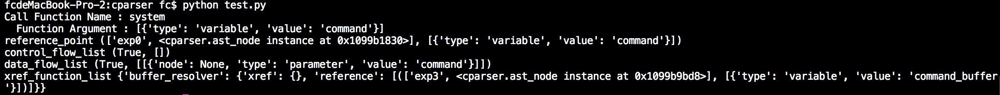

  接下来我们继续拓展深度递归功能,把上面的分析代码再修改

```python

def deep_trance(reference_point_list,xref_reference_function_name,current_function_name) :
    trance_record = {}
    #print 'deep_trance  :  ',current_function_name,'->',xref_reference_function_name

    for reference_point in reference_point_list :
        code_object = code_stream[xref_reference_function_name]['code']
        code_function_declare = code_stream[xref_reference_function_name]['declare']
        reference_point_ast_node = reference_point[0]
        reference_variant_list = reference_point[1]
        control_flow_list = trance_control_flow_by_ast(code_object,reference_point_ast_node,[])[1]
        data_flow_list = trance_record_by_ast(code_object,reference_point_ast_node,reference_variant_list,code_function_declare,[])[1]
        xref_function_list = xref_function(code_stream,xref_reference_function_name)
        xref_record_list = []

        for xref_function_name in xref_function_list.keys() :
            xref_function_object = xref_function_list[xref_function_name]

            xref_record_list.append(deep_trance(xref_function_object['reference'],xref_function_name,xref_reference_function_name))

        trance_record[xref_reference_function_name] = {
            'data_flow' : data_flow_list ,
            'control_flow' : control_flow_list ,
            'xref' : xref_record_list ,
        }

    return trance_record


search_strategy = 'system(*)'
search_record_list = []

for function_name in code_stream.keys() :
    search_record = search_call_by_strategy(search_strategy,code_stream[function_name]['code'])

    if not search_record :
        continue

    search_record_list.append({
        'function_name' : function_name ,
        'record' : search_record ,
    })

for search_record_index in search_record_list :
    xref_reference_function_name = search_record_index['function_name']
    reference_record_list = search_record_index['record']

    for reference_function_name in reference_record_list.keys() :
        reference_point_list = reference_record_list[reference_function_name]

        print 'Xref-Search for',reference_function_name,'deep_trance() Result :'
        print deep_trance(reference_point_list,xref_reference_function_name,reference_function_name)

```

  搜索输出结果如下:

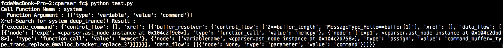


### 判断求解

  静态代码分析的最后一部分就是尝试对控制流进行求解了,前面我们已经可以从`system(*)` 策略中指定一个敏感参数然后向上溯源(在此为了方便演示,没有对数据输入来源进行可控判断[比如判断是不是可以接受$_GET[],$_POST[],$_COOKIE[] 中接收到的数据],读者们有意可以自行完善),其实这对于自动化白盒审计来说还是不足的,接下来我们尝试对判断进行求解,让程序可以计算满足输入条件的内容.

  我们先来一些简单的条件约束来探索,这是一段简单的对两个输入变量的判断

```c

int main(int argc,int argv) {
    a = atoi(argv[1]);  //  atoi() 的意思是转换字符串到数字
    b = atoi(argv[2]);

    if (a < 10)
      if (b >= 5)
        printf("niubi");
      else
        printf("666");
    else
      if (b < 4)
        printf("777");
      else if (b == 5)
        printf("?");
      else
        printf("so diao");

    return 1;
}

```

  对应的程序流程图如下:

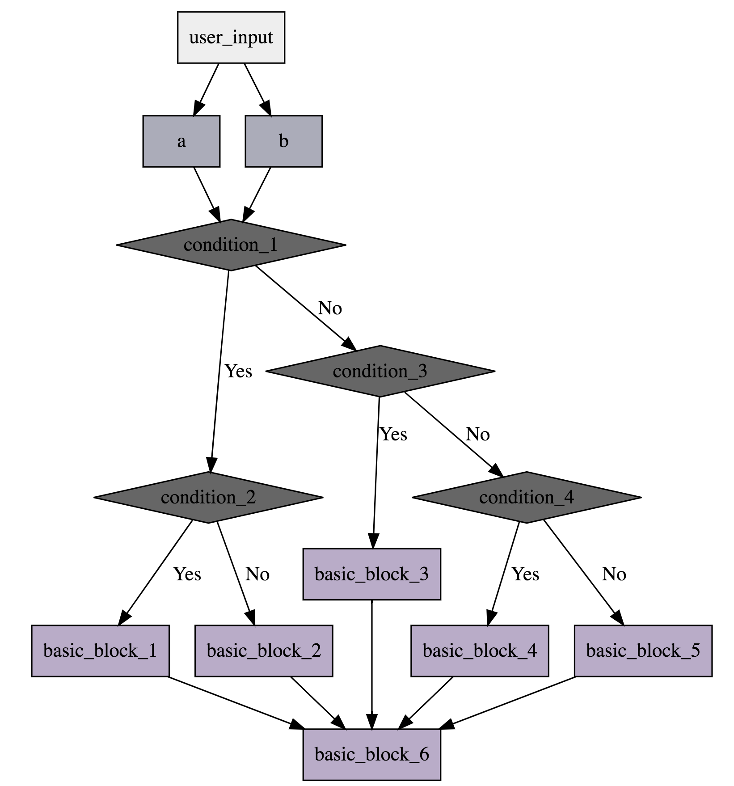

  如果想要程序满足条件输出"niubi" ,那么a 的值需要小于10 且b 的值大于等于5 .那么我们用z3 来尝试对此进行条件求解,代码如下:

```python

from z3 import *


a = Int('a')
b = Int('b')
solver = Solver()

solver.add(a < 10)
solver.add(b >= 5)
solver.check()

result = solver.model()

print result

```

  输出结果如下:

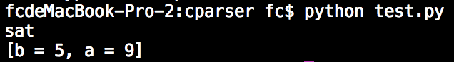

  了解原理后,我们用这段示例代码来进行审计,然后对判断进行求解.先对原有的函数代码继续完善.

```python

def search_call_by_strategy(search_strategy,code_object) :
    search_strategy = resolve_strategy(search_strategy)
    search_record = {}

    for search_strategy_index in search_strategy :  #  Search Call by Strategy
        find_function_name = search_strategy_index[0]
        search_check_parameter_list = search_strategy_index[1]
        find_function_call = recursive_find_call(code_object,find_function_name)
        search_record_list = []

        print_search_result(find_function_call)

        for call_index in find_function_call :  #  Find Match Strategy Call
            ast_node_info = call_index[0]
            parameters_list = call_index[1]

            if search_check_parameter_list :
                check_parameter_list = []

                for search_check_parameter_index in search_check_parameter_list :  #  Filter Call Argument
                    if len(parameters_list) <= search_check_parameter_index :
                        continue

                    target_search_parameter = parameters_list[search_check_parameter_index]

                    if not target_search_parameter['type'] in ['variable','address_of','string'] :  #  Fix there , add check string
                        continue

                    check_parameter_list.append(target_search_parameter)

                if check_parameter_list :
                    search_record_list.append((ast_node_info,check_parameter_list))
            else :
                search_record_list.append((ast_node_info,[]))

        if search_record_list :
            search_record[find_function_name] = search_record_list

    return search_record


def trance_control_flow_by_ast(start_node,target_node,trance_record) :
    other_if_condition = []

    for node_object_index in start_node.subnode :
        if node_object_index == target_node :
            if_block_list = {}
            if_block_depth = 0
            control_flow_list = []

            for trance_record_index in trance_record :
                #print trance_record_index[0],trance_record_index[1].type,trance_record_index[1].value

                if trance_record_index[0] in ['if','ifbody','condition'] :
                    condition_data = get_condition(trance_record_index[1])

                    if not condition_data :
                        continue

                    if_block_depth += 1
                    if_block_list[if_block_depth] = [ condition_data ]
                elif trance_record_index[0] == 'elsebody' :
                    condition_data = get_condition(trance_record_index[1])

                    if not condition_data :
                        if_condition_list = if_block_list[if_block_depth]

                        for if_condition_index in range(len(if_condition_list)) :
                            if_condition_list[if_condition_index] = '!(%s)' % if_condition_list[if_condition_index]

                        if_block_list[if_block_depth] = if_condition_list
                        if_block_depth -= 1

                        if not if_block_depth :
                            for if_block_index in if_block_list.values() :
                                control_flow_list += if_block_index

                            if_block_list = {}
                    else :
                        if_block_list[if_block_depth][-1] = '!(%s)' % if_block_list[if_block_depth][-1]
                        if_block_list[if_block_depth].append(condition_data)

            if if_block_list :
                for if_block_index in if_block_list.values() :
                    control_flow_list += if_block_index

            return (True,control_flow_list)

        is_search = False

        if node_object_index[0] == 'if' :
            other_if_condition = [ node_object_index ]
            is_search,sub_data = trance_control_flow_by_ast(node_object_index[1],target_node,trance_record + other_if_condition)
        elif node_object_index[0] in ['ifbody','elsebody'] :
            other_if_condition.append(node_object_index)
            is_search,sub_data = trance_control_flow_by_ast(node_object_index[1],target_node,trance_record + other_if_condition)

        if is_search :
            control_flow_record_list = sub_data

            return (True,control_flow_record_list)

    return (False,None)

```

  接口功能代码写好之后,接下来就是实现逻辑代码:

```python

from z3 import *


def adjust_calculate(calculate_string) :
    if calculate_string.startswith('!(') :
        calculate_string = calculate_string[ calculate_string.find('!(') + 2 : calculate_string.rfind(')') ]

        if calculate_string.startswith('!(') :
            calculate_string = adjust_calculate(calculate_string)

        calculate_string = calculate_string.replace('==','!=')
        calculate_string = calculate_string.replace('!=','==')
        calculate_string = calculate_string.replace('<','>=')
        calculate_string = calculate_string.replace('>','<=')
        calculate_string = calculate_string.replace('>=','<')
        calculate_string = calculate_string.replace('<=','>')

    return calculate_string


code_object = cparser.get_func_tree(test_code)
search_record = search_call_by_strategy('printf(*)',code_object)

for search_function_name in search_record.keys() :
    search_record_object = search_record[search_function_name]

    for reference_point in search_record_object :
        control_flow_list = trance_control_flow_by_ast(code_object,reference_point[0],[])[1]

        a = Int('a')
        b = Int('b')
        solver = Solver()

        print control_flow_list

        for control_flow_index in control_flow_list :
            exec('solver.add(' + adjust_calculate(control_flow_index) + ')')  #  Z3 solver.add() just only support condition that is not string .

        solver.check()

        print 'Result :',solver.model()


```

  运行效果如下:

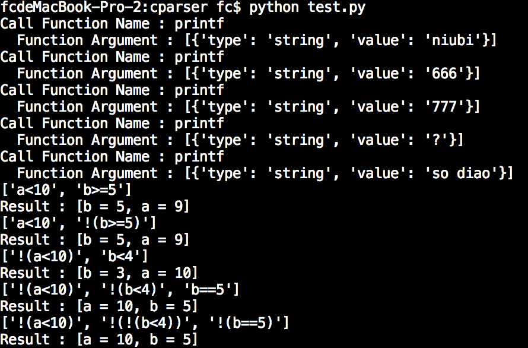

  对于整数的求解还是相对较为简单的,因为对整数的求解是**连续**的,这个很容易计算,但是对于内存区域来说变化就非常多了,而且各个内存的字节是**不连续**的,这就导致使求解的难度增高了不少.我们用图例来讲解:

  对于一个字符串进行内容过滤/检测限制,实质是在字符串上搜索有没有存在特定的内容,比如我们要进行SQL 注入防护,可以对单引号和and 进行字符串过滤

```php

$user_id = str_replace("'","",$_GET['id']);
$user_id = str_replace("and","",$user_id);

```

  `str_replace()` 会对在字符串上一步一步地搜索匹配指定的内容.

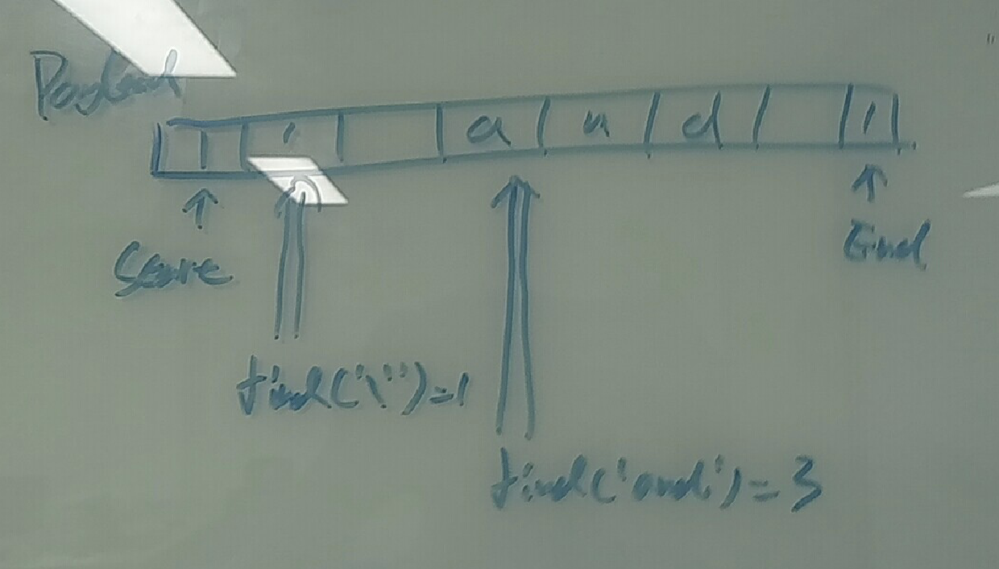

  翻译到条件求解,也就是说各个字节都存在一个合并的判断,如果第一个字节为a ,那么再判断后一字节是否为n ,然后再判断最后一字节是不是d .那么可以把他们合并条件约束:`str[0] != 'a' && str[1] != 'n' && str[2] != 'd'`;对于后一字节,同样进行条件约束:`str[1] != 'a' && str[2] != 'n' && str[3] != 'd'`,一直到n-2 字节.

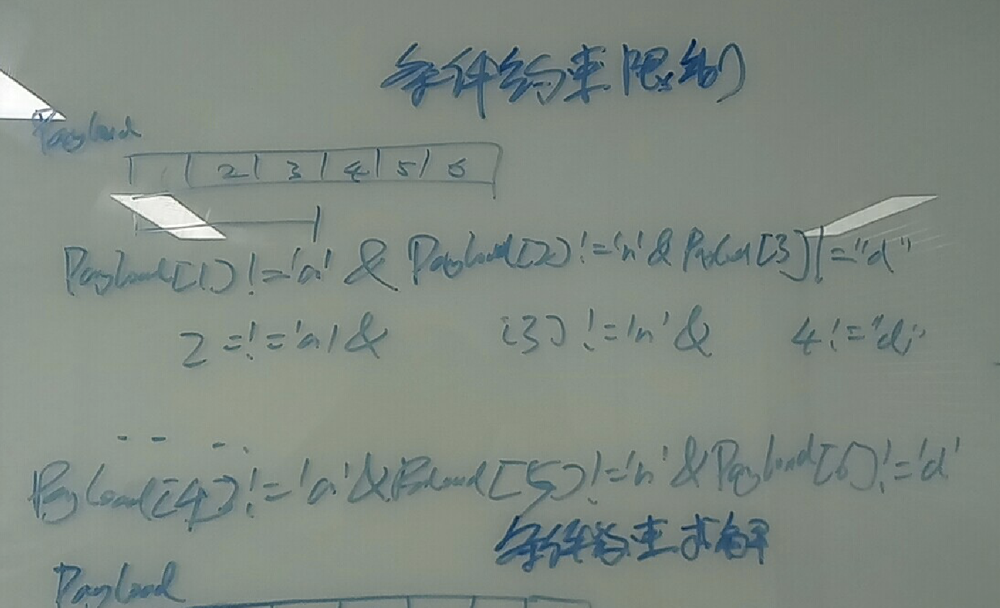

  我们可以尝试在判断求解的时候对数据内容进行一个假定,假设某处内容为a ,b ,c 并赋予到指定的buffer 空间中尝试进行求解,这个过程就是Fuzzing ,只不过通常我们是用程序执行来跑判断,而现在使用求解器来跑判断.

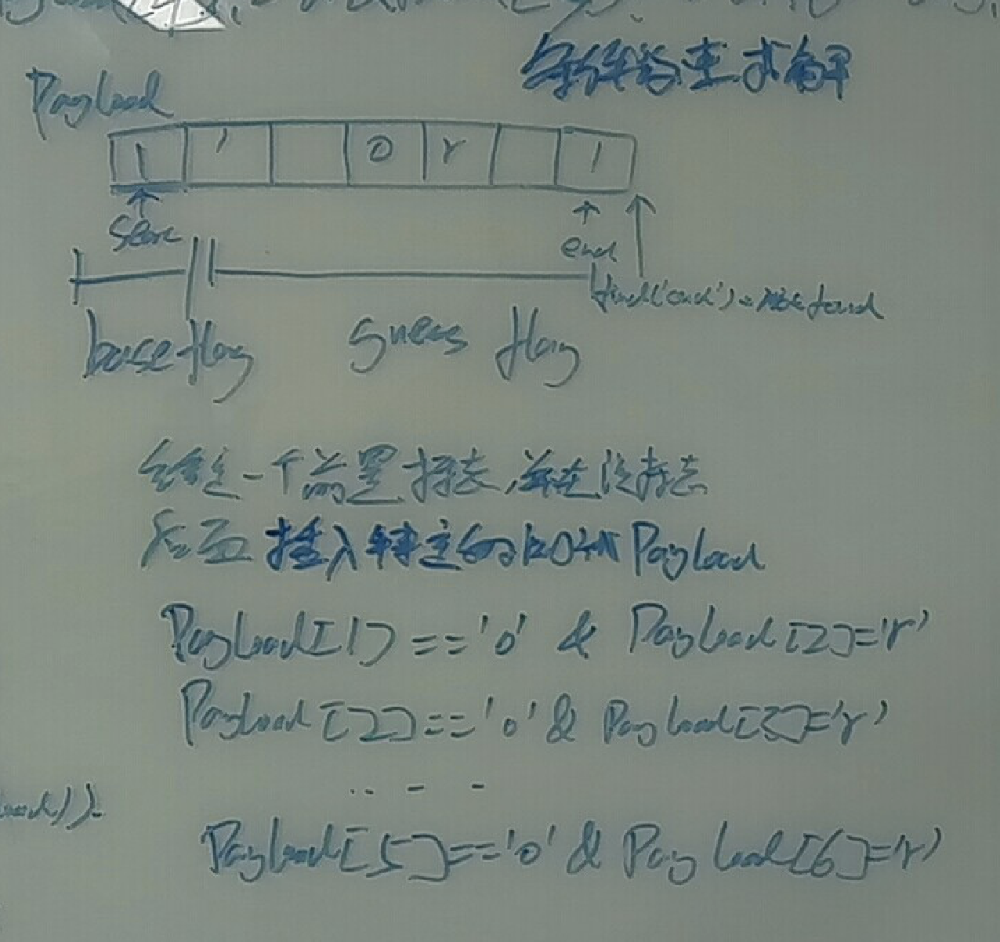

  先来构造一个简单的buffer ,然后对buffer 的内容做一些基本的条件限制.

```python

byte1 = BitVec('byte1',8)
byte2 = BitVec('byte2',8)
byte3 = BitVec('byte3',8)
solver = Solver()

solver.add(Or(And(65 <= byte1,byte1 <= 65+25),And(105 <= byte1,byte1 <= 105+25)))
solver.add(Or(And(65 <= byte2,byte2 <= 65+25),And(105 <= byte2,byte2 <= 105+25)))
solver.add(Or(And(65 <= byte3,byte3 <= 65+25),And(105 <= byte3,byte3 <= 105+25)))
solver.add(byte1 != ord('A'),byte2 != ord('N'),byte3 != ord('D'))

solver.check()

result = solver.model()

for index in result :
    print chr(result[index].as_long()) ,

```

  运行结果如下:

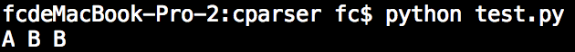

  因为在SQL 注入中是需要依赖特点的字符串组合来触发漏洞的,所以我们在此需要构建一段可以触发问题的测试Payload

```python

byte1 = BitVec('byte1',8)
byte2 = BitVec('byte2',8)
byte3 = BitVec('byte3',8)
solver = Solver()

solver.add(Or(And(65 <= byte1,byte1 <= 65+25),And(105 <= byte1,byte1 <= 105+25)))
solver.add(Or(And(65 <= byte2,byte2 <= 65+25),And(105 <= byte2,byte2 <= 105+25)))
solver.add(Or(And(65 <= byte3,byte3 <= 65+25),And(105 <= byte3,byte3 <= 105+25)))
solver.add(byte1 != ord('A'),byte2 != ord('N'),byte3 != ord('D'))
solver.add(byte1 == ord('O'),byte2 != ord('r'))

solver.check()

result = solver.model()

print chr(result[byte1].as_long()) ,
print chr(result[byte2].as_long()) ,
print chr(result[byte3].as_long()) ,

```

  运行结果如下:

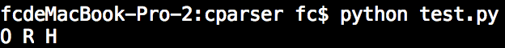

  对字符串的求解的基本原理就是这样了,读者们有兴趣可以尝试利用上面的代码对`system()` 进行求解.


## 附录一 -- 各图的Graphiz 生成代码

  在线生成Graphiz . http://dreampuf.github.io/GraphvizOnline/

```txt
digraph G {

  function_buffer_resolver[shape=box,label="function_buffer_resolver",style=filled,fillcolor="#ABACBA"];
  buffer[label="argument_buffer"];
  buffer_length[label="variant_buffer_length"];
  buffer_type[label="condition_buffer_type"];
  const_message_type_hello[label="const_message_type_hello"];
  const_message_type_execute[label="const_message_type_execute"];
  const_message_type_data[label="const_message_type_data"];
  command_buffer[label="variant_command_buffer"];
  function_execute_command[shape=box,label="function_execute_command",style=filled,fillcolor="#ABACBA"];
  function_decrypt_data[shape=box,label="function_decrypt_data",style=filled,fillcolor="#ABACBA"];
  
  function_buffer_resolver->buffer [label="Function Argument ",style=bold,color=green];
  
  buffer->buffer_length [label="Access buffer[0] ",style=bold,color=violet];
  buffer->buffer_type [label="Access buffer[1] ",style=bold,color=violet];
  
  buffer_type->const_message_type_hello [label="Check Condition ",style=bold];
  buffer_type->const_message_type_execute [label="Check Condition ",style=bold];
  buffer_type->const_message_type_data [label="Check Condition ",style=bold];
  
  buffer_length->command_buffer [label="Alloc memory",style=bold,color=violet];
  command_buffer->command_buffer [label="memset zero",style=bold,color=blue];
  buffer->command_buffer [label="memcpy from buffer",style=bold,color=violet];
  
  command_buffer->function_execute_command [label="Call function",style=bold,color=red];
  buffer->function_decrypt_data [label="Call function",style=bold,color=red];

}
```


```txt
digraph G {

    function_buffer_resolver[shape=box,label="function_buffer_resolver",style=filled,fillcolor="#ABACBA"];
    buffer[label="argument_buffer"];
    command[label="argument_buffer"];
    command_buffer[label="variant_command_buffer"];
    function_execute_command[shape=box,label="function_execute_command",style=filled,fillcolor="#ABACBA"];
    
    function_buffer_resolver->buffer [label="Function Argument ",style=bold,color=green,dir="back"];
    
    buffer->command_buffer [label="memcpy from buffer",style=bold,color=violet,dir="back"];
    
    command_buffer->function_execute_command [label="Push data to function argument",style=bold,color=red,dir="back"];
    function_execute_command->command [label="Function Argument ",style=bold,color=green];
    
}
```


```txt
digraph G {

    input_id [shape=box,label="input_get_id"];
    variant_user_id [label="variant_user_id"];
    variant_temp_string1 [label="variant_temp_string1"];
    variant_temp_string2 [label="variant_temp_string2"];
    function_sql_query [shape=box,label="function_sql_query",style=filled,fillcolor="#ABACBA"];
    function_echo [shape=box,label="function_echo",style=filled,fillcolor="#ABACBA"];
    
    input_id->variant_user_id [label="Save data to Variant",style=bold,color=violet];
    variant_user_id->variant_temp_string1 [label="Build SQL Query String",style=bold,color=violet];
    variant_temp_string1->function_sql_query [label="Call Function",style=bold,color=red];
    variant_user_id->variant_temp_string2 [label="Build Echo String",style=bold,color=violet];
    variant_temp_string2->function_echo [label="Call Function",style=bold,color=red];
    
}
```


```txt
digraph G {

    input_id [shape=box,label="input_get_id"];
    variant_user_id [label="variant_user_id"];
    variant_temp_string1 [label="variant_temp_string1"];
    function_sql_query [shape=box,label="function_sql_query",style=filled,fillcolor="#ABACBA"];
    
    input_id->variant_user_id [label="Save data to Variant",style=bold,color=violet,dir="back"];
    variant_user_id->variant_temp_string1 [label="Build SQL Query String",style=bold,color=violet,dir="back"];
    variant_temp_string1->function_sql_query [label="Call Function",style=bold,color=red,dir="back"];
    
}
```


```txt

digraph G {

  function_buffer_resolver[shape=box,label="function_buffer_resolver",style=filled,fillcolor="#ABACBA"];
  basic_block_entry[shape=box,style=filled,fillcolor="#BCABCA"];
  basic_block_1[shape=box,style=filled,fillcolor="#BCABCA"];
  basic_block_2[shape=box,style=filled,fillcolor="#BCABCA"];
  basic_block_3[shape=box,style=filled,fillcolor="#BCABCA"];
  basic_block_4[shape=box,style=filled,fillcolor="#BCABCA"];
  basic_block_5[shape=box,style=filled,fillcolor="#BCABCA"];
  basic_block_6[shape=box,style=filled,fillcolor="#BCABCA"];
  condition_1[shape=diamond,style=filled,fillcolor="#666666"];
  condition_2[shape=diamond,style=filled,fillcolor="#666666"];
  condition_3[shape=diamond,style=filled,fillcolor="#666666"];
  condition_4[shape=diamond,style=filled,fillcolor="#666666"];
  
  function_buffer_resolver->basic_block_entry;
  basic_block_entry->condition_1[label="2 <= buffer_length"];
  condition_1->basic_block_1[label="No"];
  condition_1->basic_block_2[label="Yes"];
  basic_block_2->condition_2[label="MessageType_Hello == buffer[1]"];
  condition_2->basic_block_3[label="Yes"];
  condition_3->basic_block_4[label="Yes"];
  condition_4->basic_block_5[label="Yes"];
  condition_2->condition_3[label="No ,Check MessageType_Execute == buffer[1]"];
  condition_3->condition_4[label="No ,Check MessageType_Data == buffer[1]"];
  condition_4->basic_block_6[label="No"];
  basic_block_3->basic_block_6;
  basic_block_4->basic_block_6;
  basic_block_5->basic_block_6;

}

```

```txt

digraph G {

  user_input[shape=box,style=filled,fillcolor="#EEEEEE"];
  a[shape=box,style=filled,fillcolor="#ABACBA"];
  b[shape=box,style=filled,fillcolor="#ABACBA"];
  basic_block_1[shape=box,style=filled,fillcolor="#BCABCA"];
  basic_block_2[shape=box,style=filled,fillcolor="#BCABCA"];
  basic_block_3[shape=box,style=filled,fillcolor="#BCABCA"];
  basic_block_4[shape=box,style=filled,fillcolor="#BCABCA"];
  basic_block_5[shape=box,style=filled,fillcolor="#BCABCA"];
  basic_block_6[shape=box,style=filled,fillcolor="#BCABCA"];
  condition_1[shape=diamond,style=filled,fillcolor="#666666"];
  condition_2[shape=diamond,style=filled,fillcolor="#666666"];
  condition_3[shape=diamond,style=filled,fillcolor="#666666"];
  condition_4[shape=diamond,style=filled,fillcolor="#666666"];
  
  user_input->a;
  user_input->b;
  a->condition_1;
  b->condition_1;
  
  condition_1->condition_2[label="Yes"];
  condition_2->basic_block_1[label="Yes"];
  condition_2->basic_block_2[label="No"];
  condition_1->condition_3[label="No"];
  condition_3->basic_block_3[label="Yes"];
  condition_3->condition_4[label="No"];
  condition_4->basic_block_4[label="Yes"];
  condition_4->basic_block_5[label="No"];
  basic_block_1->basic_block_6;
  basic_block_2->basic_block_6;
  basic_block_3->basic_block_6;
  basic_block_4->basic_block_6;
  basic_block_5->basic_block_6;

}

```

## 附录二 -- 静态审计工具完整源码

```python


import json

import cparser


code_emun = '''
enum {
  MessageType_Hello = 0,
  MessageType_Execute,
  MessageType_Data
};
'''

code_execute_command = '''
void execute_command(const unsigned char* command) {
    system(command);
}
'''

code_decrypt_data = '''
void decrypt_data(const unsigned char* data_buffer,unsigned char data_buffer_length) {
    unsigned char* buffer[8] = {0};
    
    for (unsigned int data_index = 0;data_index < data_buffer_length;++data_index)
        buffer[data_index] = data_buffer[data_index] ^ 0x65;
    
    printf("Recv:%s\n",&buffer);
}
'''

code_buffer_resolver = '''
int buffer_resolver(const unsigned char* buffer) {
    unsigned char buffer_length = buffer[0];
    
    if (2 <= buffer_length)
        return 0;
    
    if (MessageType_Hello == buffer[1]) {
        printf("Hello\n");
    } else if (MessageType_Execute == buffer[1]) {
        unsigned char* command_buffer = (unsigned char*)malloc(buffer_length - 1);
        
        memset(&command_buffer,0,buffer_length);
        memcpy(&command_buffer,&buffer[2],buffer_length - 2);
        
        execute_command(command_buffer);
    } else if (MessageType_Data == buffer[1]) {
        decrypt_data(&buffer[2],buffer_length - 2);
    }
    
    return 1;
}
'''


def resolver_function_parameter(code_string) :
    code_string = code_string.strip()
    code_block_declare_offset = code_string.find('{')

    if -1 == code_block_declare_offset :
        return False

    try :
        function_declare_string = code_string[ : code_block_declare_offset ].strip()
        function_return_type = function_declare_string.split(' ')[0]
        function_name = function_declare_string.split('(')[0]
        function_name = function_name.split(' ')[1]
        function_parameters_string = function_declare_string.split('(')[1].strip()
        function_parameters_string = function_parameters_string.split(')')[0].strip()
        resolve_function_parameters_list = function_parameters_string.split(',')
        function_parameters_list = []

        for resolve_function_parameters_index in resolve_function_parameters_list :
            function_parameters_list.append({
                'type' : resolve_function_parameters_index[ : resolve_function_parameters_index.rfind(' ') ] ,
                'name' : resolve_function_parameters_index.split(' ')[-1] ,
            })

        return {
            'type' : function_return_type ,
            'name' : function_name ,
            'parameters' : function_parameters_list ,
        }
    except :
        pass

    return False


code_stream = {
    'global_enum' : {
        'code' : cparser.get_func_tree(code_emun) ,
        'declare' : resolver_function_parameter(code_emun) ,
    } ,
    'decrypt_data' : {
        'code' : cparser.get_func_tree(code_decrypt_data) ,
        'declare' : resolver_function_parameter(code_decrypt_data) ,
    } ,
    'execute_command' : {
        'code' : cparser.get_func_tree(code_execute_command) ,
        'declare' : resolver_function_parameter(code_execute_command) ,
    } ,
    'buffer_resolver' : {
        'code' : cparser.get_func_tree(code_buffer_resolver) ,
        'declare' : resolver_function_parameter(code_buffer_resolver) ,
    } ,
}


def get_function_parameters(ast_node) :
    parameters_list = []

    for subnode_index in ast_node.subnode :
        if subnode_index[1].type == 'parallel' :
            parameters_list += get_function_parameters(subnode_index[1])
        elif subnode_index[0] == 'parameters' :
            parameters_list.append({
                'type' : subnode_index[1].type ,
                'value' : subnode_index[1].value ,
            })
        elif subnode_index[0].startswith('exp') :
            parameters_list.append({
                'type' : subnode_index[1].type ,
                'value' : subnode_index[1].value ,
            })

    return parameters_list

def recursive_find_call(ast_node,find_function_name) :
    find_result = []

    for subnode_index in ast_node.subnode :
        if subnode_index[1] == None :
            continue

        if 'function_call' == subnode_index[1].type :
            if find_function_name == '*' or find_function_name == subnode_index[1].value :
                parameters_list = get_function_parameters(subnode_index[1])
                
                find_result.append((subnode_index,parameters_list))

        find_result += recursive_find_call(subnode_index[1],find_function_name)

    return find_result

def print_search_result(call_list) :
    for call_index in call_list :
        ast_node_info = call_index[0]
        parameters_info = call_index[1]

        print 'Call Function Name :',ast_node_info[1].value
        print '  Function Argument :',parameters_info

def resolve_strategy(user_search_strategy) :
    user_search_strategy = user_search_strategy.split('\n')
    check_strategy = []

    for user_search_strategy_index in user_search_strategy :
        strategy_record = user_search_strategy_index.strip()

        if not len(strategy_record) :
            continue

        search_function_name = strategy_record.split('(')[0].strip()
        search_parameter_string = strategy_record.split('(')[1].strip()
        search_parameter_string = search_parameter_string.split(')')[0].strip()
        search_parameter_list = []

        if len(search_parameter_string) :
            if not -1 == search_parameter_string.find(',') :
                search_parameter_string = search_parameter_string.split(',')
                parameter_index = -1

                for search_parameter_index in search_parameter_string :
                    check_parameter = search_parameter_index.strip()
                    parameter_index += 1

                    if not check_parameter == '*' :
                        continue

                    search_parameter_list.append(parameter_index)
            else :
                check_parameter = search_parameter_string.strip()

                if check_parameter == '*' :
                    search_parameter_list.append(0)

        check_strategy.append((search_function_name,search_parameter_list))

    return check_strategy

def search_call_by_strategy(search_strategy,code_object) :
    search_strategy = resolve_strategy(search_strategy)
    search_record = {}

    for search_strategy_index in search_strategy :  #  Search Call by Strategy
        find_function_name = search_strategy_index[0]
        search_check_parameter_list = search_strategy_index[1]
        find_function_call = recursive_find_call(code_object,find_function_name)
        search_record_list = []

        print_search_result(find_function_call)

        for call_index in find_function_call :  #  Find Match Strategy Call
            ast_node_info = call_index[0]
            parameters_list = call_index[1]

            if search_check_parameter_list :
                check_parameter_list = []

                for search_check_parameter_index in search_check_parameter_list :  #  Filter Call Argument
                    if len(parameters_list) <= search_check_parameter_index :
                        continue

                    target_search_parameter = parameters_list[search_check_parameter_index]

                    if not target_search_parameter['type'] in ['variable','address_of'] :  #  Check this Argument is a Variant ..
                        continue

                    check_parameter_list.append(target_search_parameter)

                if check_parameter_list :
                    search_record_list.append((ast_node_info,check_parameter_list))
            else :
                search_record_list.append((ast_node_info,[]))

        if search_record_list :
            search_record[find_function_name] = search_record_list

    return search_record


def xref_variant(trance_record,bingo_parameter_name,function_declare) :
    xref_record = []

    for trance_record_index in trance_record[ :: -1 ] :
        if trance_record_index[1].type in ['get_element','assign'] :
            if bingo_parameter_name in trance_record_index[1].value :
                xref_record.append({
                    'type' : trance_record_index[1].type ,
                    'value' : trance_record_index[1].value ,
                    'node' : trance_record_index
                })
        elif trance_record_index[1].type == 'function_call' :
            function_parameters = get_function_parameters(trance_record_index[1])

            for function_parameter_index in function_parameters :
                if not bingo_parameter_name in function_parameter_index['value'] :
                    continue

                xref_record.append({
                    'type' : trance_record_index[1].type ,
                    'value' : trance_record_index[1].value ,
                    'node' : trance_record_index
                })

    for function_parameter_index in function_declare['parameters'] :
        function_parameter_name = function_parameter_index['name']

        if not bingo_parameter_name == function_parameter_name :
            continue

        xref_record.append({
            'type' : 'parameter' ,
            'value' : function_parameter_name ,
            'node' : None
        })

    return xref_record

def trance_record_by_ast(start_node,target_node,bingo_parameters,function_declare,trance_record) :
    code_record = []

    for node_object_index in start_node.subnode :
        if node_object_index == target_node :
            xref_record_list = []

            for bingo_parameter_index in bingo_parameters :
                xref_record_list.append(xref_variant(trance_record + code_record,bingo_parameter_index['value'],function_declare))

            return (True,xref_record_list)

        code_record.append(node_object_index)

        is_search,sub_data = trance_record_by_ast(node_object_index[1],target_node,bingo_parameters,function_declare,trance_record + code_record)

        if is_search :
            xref_record_list = sub_data

            return (True,xref_record_list)

        sub_code_record = sub_data
        code_record += sub_code_record

    return (False,code_record)

def get_condition(ast_node) :
    for index in ast_node.subnode :
        if 'condition' == index[0] :
            return index[1].value

    return False

def trance_control_flow_by_ast(start_node,target_node,trance_record) :
    code_record = []

    for node_object_index in start_node.subnode :
        if node_object_index == target_node :
            all_trance_record = trance_record + code_record
            control_flow_list = []

            for trance_record_index in all_trance_record :
                if trance_record_index[1].type == 'if' :
                    control_flow_list.append(get_condition(trance_record_index[1]))

            return (True,control_flow_list)

        code_record.append(node_object_index)

        is_search,sub_data = trance_control_flow_by_ast(node_object_index[1],target_node,trance_record + code_record)

        if is_search :
            control_flow_record_list = sub_data

            return (True,control_flow_record_list)

    return (False,code_record)

def xref_function(code_stream,search_function_name) :
    search_xref_data = {}

    for function_name in code_stream.keys() :
        function_code = code_stream[function_name]['code']
        search_result = recursive_find_call(function_code,search_function_name)

        if not search_result :
            continue

        xref_record = xref_function(code_stream,function_name)
        search_xref_data[function_name] = {
            'xref' : xref_record ,
            'reference' : search_result ,
        }

    return search_xref_data

def deep_trance(reference_point_list,xref_reference_function_name,current_function_name) :
    trance_record = {}
    #print 'deep_trance  :  ',current_function_name,'->',xref_reference_function_name

    for reference_point in reference_point_list :
        code_object = code_stream[xref_reference_function_name]['code']
        code_function_declare = code_stream[xref_reference_function_name]['declare']
        reference_point_ast_node = reference_point[0]
        reference_variant_list = reference_point[1]
        control_flow_list = trance_control_flow_by_ast(code_object,reference_point_ast_node,[])[1]
        data_flow_list = trance_record_by_ast(code_object,reference_point_ast_node,reference_variant_list,code_function_declare,[])[1]
        xref_function_list = xref_function(code_stream,xref_reference_function_name)
        xref_record_list = []

        for xref_function_name in xref_function_list.keys() :
            xref_function_object = xref_function_list[xref_function_name]

            xref_record_list.append(deep_trance(xref_function_object['reference'],xref_function_name,xref_reference_function_name))

        trance_record[xref_reference_function_name] = {
            'data_flow' : data_flow_list ,
            'control_flow' : control_flow_list ,
            'xref' : xref_record_list ,
        }

    return trance_record


search_strategy = 'system(*)'
search_record_list = []

for function_name in code_stream.keys() :
    search_record = search_call_by_strategy(search_strategy,code_stream[function_name]['code'])

    #print 'Search Record :',search_record

    if not search_record :
        continue

    search_record_list.append({
        'function_name' : function_name ,
        'record' : search_record ,
    })

for search_record_index in search_record_list :
    xref_reference_function_name = search_record_index['function_name']
    reference_record_list = search_record_index['record']

    for reference_function_name in reference_record_list.keys() :
        reference_point_list = reference_record_list[reference_function_name]

        print 'Xref-Search for',reference_function_name,'deep_trance() Result :'
        print deep_trance(reference_point_list,xref_reference_function_name,reference_function_name)

```


