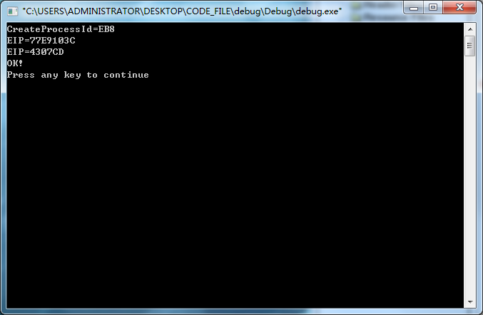
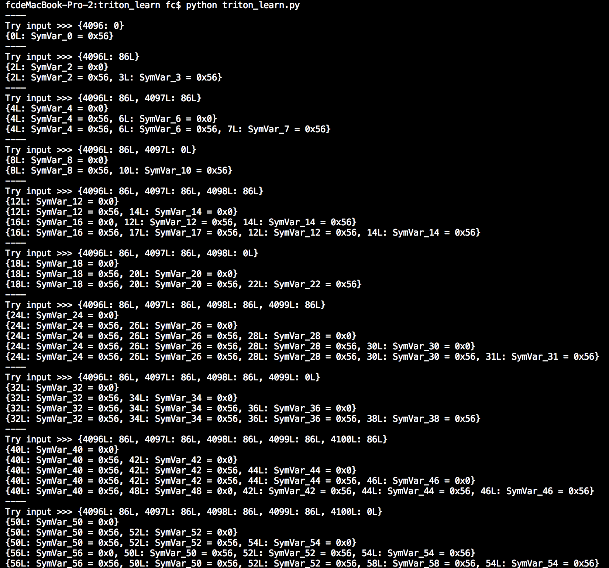
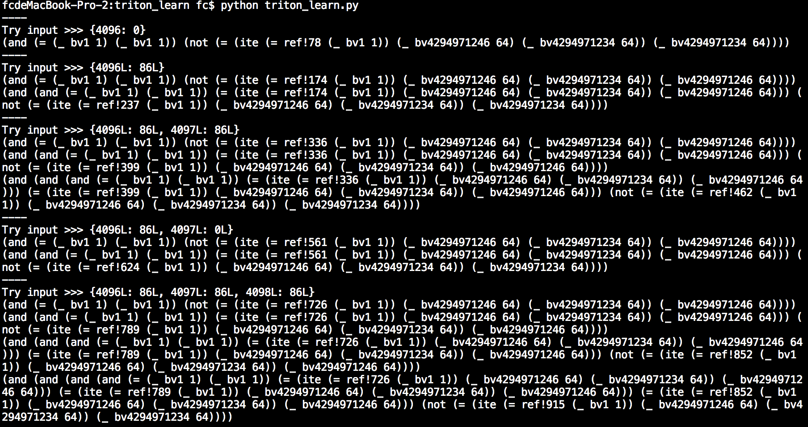
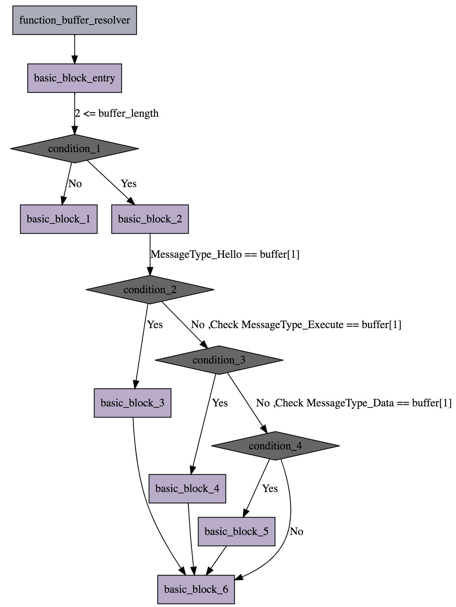
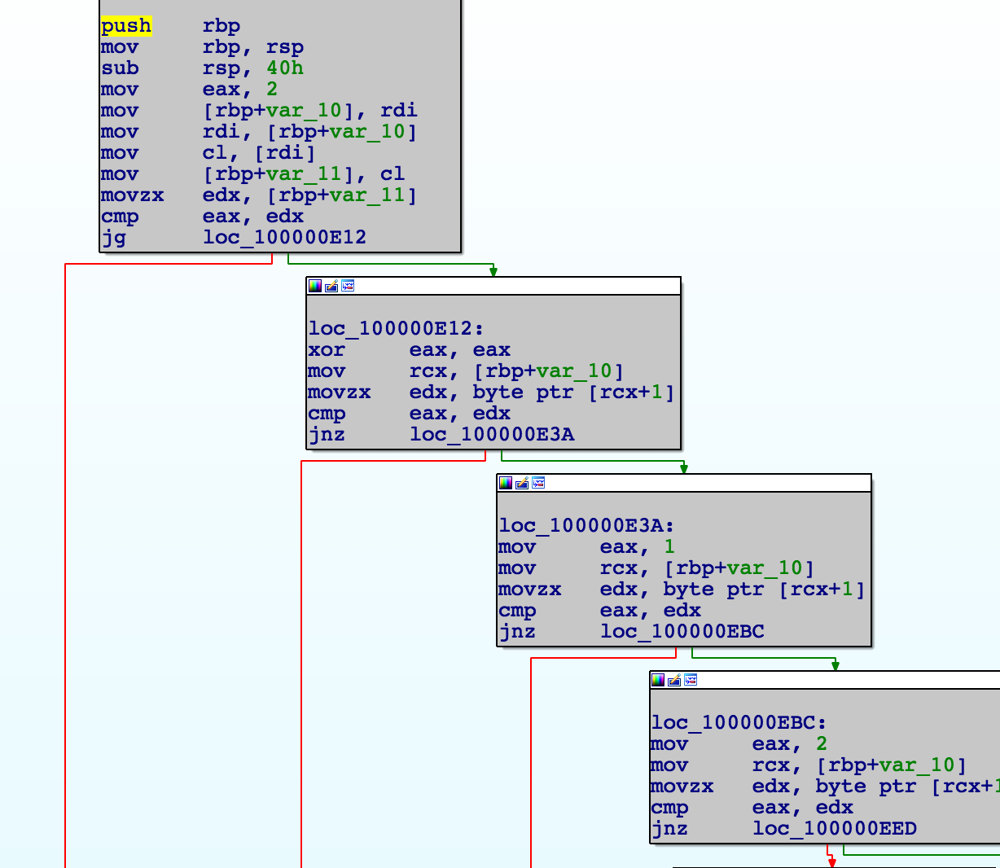
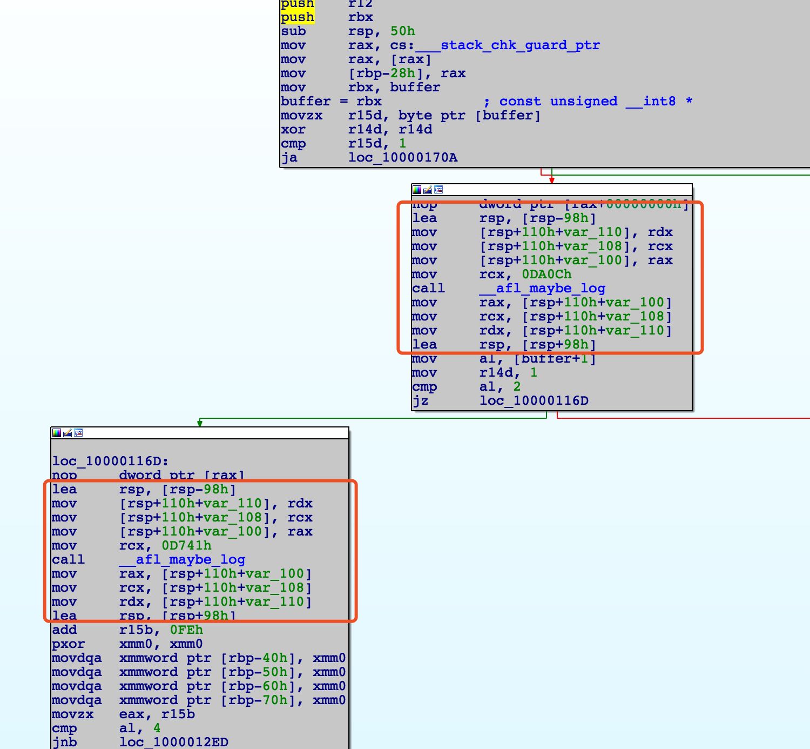

## 必备工具

  Python ,Triton (https://github.com/JonathanSalwan/Triton) 


## 动态代码分析基本原理

  动态代码执行主要是使用调试模式或者模拟执行的模式跟踪执行程序.动态分析主要分为四部分:内存监控,污点追踪,符号执行,程序插桩.


## 内存监控

  在动态调试代码的过程中,我们往往会需要对某一块特定的内存,字符串或对代码执行过程进行跟踪分析.内存监控分为软件监控和硬件监控,下面将一一描述.

  
### 软件监控

  软件监控的方式分为两种,一种是在代码段中插入`Int 3`指令,代码执行到这段指令后就会触发调试中断;另一种是对内存区域进行读写权限限制,对于某个在堆(HeapAlloc())的权限是不可读写的,但是通过malloc() 申请的内存是可以被读写的,那么一旦这块内存产生越界读写就可以触发程序异常.

  我们以UPX 加壳举个例子,Link : https://github.com/lcatro/my-blog/blob/master/2015/%E5%88%A9%E7%94%A8Debug%20API%20%E5%AE%9E%E7%8E%B0%E5%86%85%E5%AD%98%E6%B3%A8%E5%86%8C%E6%9C%BA.md .假定已经通过逆向知道0x4307CC 是UPX 解压缩之后的程序入口点,那么我们在编写调试器的时候可以在0x4307CC 处设置调试断点.

```c

#include <malloc.h>
#include <memory.h>
#include <stdio.h>
#include <windows.h>
#include <winnt.h>

#define BREAK_ADDRESS_SHELL_JMP 0x4307CC
#define BREAK_ADDRESS_JE        0x401188
#define BREAK_FLAG 0xCC

const char* set_break(HANDLE process,LPVOID set_address,unsigned int set_length=1) {  //  设置断点
    if (!set_length) return NULL;

    char* break_flag_buffer=(char*)malloc(set_length);
    memset(break_flag_buffer,BREAK_FLAG,set_length);
    DWORD write_length=0;

    char* old_code_buffer=(char*)malloc(set_length);
    DWORD read_length=0;
    ReadProcessMemory(process,set_address,(LPVOID)old_code_buffer,set_length,&read_length);  //  原理是通过写0xCC 来实现软中断

    WriteProcessMemory(process,set_address,(LPVOID)break_flag_buffer,set_length,&write_length);
    free(break_flag_buffer);

    return old_code_buffer;
}

bool remove_break(HANDLE process,LPVOID remove_address,const char* rewrite_code_buffer,unsigned int remove_length) {  //  删除断点
    DWORD write_length=0;

    return (bool)WriteProcessMemory(process,remove_address,(LPVOID)rewrite_code_buffer,remove_length,&write_length);
}

HANDLE open_process(DWORD processid) {
    return OpenProcess(PROCESS_ALL_ACCESS,FALSE,processid);
}

int main(int argc,char** argv) {
    STARTUPINFO process_startupinfo={0};
    PROCESS_INFORMATION process_info={0};
    CreateProcess(NULL,"crackme_shell.exe",NULL,NULL,FALSE,DEBUG_ONLY_THIS_PROCESS | CREATE_NEW_CONSOLE,NULL,NULL,&process_startupinfo,&process_info);  //  启动调试程序
    printf("CreateProcessId=%X\n",process_info.dwProcessId);

    HANDLE process=open_process(process_info.dwProcessId);

    set_break(process,(void*)BREAK_ADDRESS_SHELL_JMP,1);  //  在UPX 解压结束的长跳转中设置中断

    DEBUG_EVENT debug_event={0};
    debug_event.dwProcessId=process_info.dwProcessId;

    while (WaitForDebugEvent(&debug_event,INFINITE)) {  //  等待系统发来中断事件
        switch (debug_event.dwDebugEventCode) {
            case EXCEPTION_DEBUG_EVENT: {
                switch (debug_event.u.Exception.ExceptionRecord.ExceptionCode) {
                    case EXCEPTION_BREAKPOINT: {
                        CONTEXT regesit={0};
                        regesit.ContextFlags=CONTEXT_FULL;
                        GetThreadContext(process_info.hThread,&regesit);  //  主要是读取EIP
                        printf("EIP=%X\n",regesit.Eip);

                        switch (--regesit.Eip) {
                            case BREAK_ADDRESS_SHELL_JMP: {
                                SetThreadContext(process_info.hThread,&regesit);
                                char jmp_code[1]={0xE9};
                                remove_break(process,(void*)BREAK_ADDRESS_SHELL_JMP,jmp_code,sizeof(jmp_code));  //  消除断点替换0xE9 (JMP 的指令码)

                                char nop_code[2]={0x90,0x90};
                                remove_break(process,(void*)BREAK_ADDRESS_JE,nop_code,sizeof(nop_code));  //  往JE 写两个NOP
                            }
                        }
                    }
                }
            }
        }
        if (EXIT_PROCESS_DEBUG_EVENT==debug_event.dwDebugEventCode)  //  程序退出
            break;
        ContinueDebugEvent(process_info.dwProcessId,process_info.dwThreadId,DBG_CONTINUE);

    }
    printf("OK!\n");
    
    return 0;
}

```

  调试程序运行到0x4307CC 执行`Int 3`指令中断,然后把原来的中断二进制数据0xCC (Int 3 指令的Opcode)换回0xE9 (JMP 指令的Opcode),然后让被调试的程序执行至结束.执行结果如下:



  那么对内存区域进行读写权限限制具体是有哪些表现的.先用JAVA 举个例子(在https://tool.lu/coderunner/ 上执行):

```java

class Untitled {
	public static void main(String[] args) {
		String data = new String("Hello");
		
		data.charAt(0);
		data.charAt(6);
		
		System.out.println(data);
	}
}

```

  程序输出如下:

```txt

Exception in thread "main" java.lang.StringIndexOutOfBoundsException: String index out of range: 6
	at java.base/java.lang.StringLatin1.charAt(StringLatin1.java:47)
	at java.base/java.lang.String.charAt(String.java:693)
	at Untitled.main(Untitled.java:6)

```

  JAVA 在执行阶段,会根据对字符串的操作索引位置和字符串长度来检测是否存在上下标越界的问题,但是C/C++ 底层的汇编却不会对buffer 的操作索引进行检查.对于这个问题的解决方案,我们就使用`VirtualProtect()` 函数进行内存权限设置,下面是一段示例代码:

```c


```

  

```c++

```


### 硬件监控

  DB 寄存器


## 污点追踪

  


## 符号执行

  符号执行是指把程序的语义抽象变成逻辑公式或代码路径公式,通过对这条公式进行求解并得出符合的条件.第六章的综合分析中提到,当我们在检测可控的输入是否能够通过某些特定的判断语句达到触发点,需要满足哪些条件并进行求解,这是静态符号执行.动态符号执行的原理是跟踪程序的执行,在某些特定的判断和数据运算的过程中可以知道具体的内容值(在静态符号执行中有时候不容易获取某一行代码或者汇编的值,所以需要跟踪到此获得该值,而且静态符号执行在对非常多的条件进行求解的时候会产生路径爆炸的问题,又需要考虑条件优化)然后构建逻辑公式进行路径/数据求解.我们先研究这段代码:

```assembly

mov eax, 1
add eax, 2
mov ebx, eax

```

  对应到寄存器布局如下:

```txt

EAX : -1
EBX : -1
ECX : -1

```

  然后我们模拟执行这段汇编代码并填写寄存器布局,过程如下:

```txt

(Round 1)

Code :

mov eax, 1     <- Point
add eax, 2
mov ebx, eax

Symbolic Expression :

p0 = 1

Register Reference Table :

EAX : p0
EBX : -1
ECX : -1

----

(Round 2)

Code :

mov eax, 1
add eax, 2     <- Point
mov ebx, eax

Symbolic Expression :

p0 = 1
p1 = add(p0,2)

Register Reference Table :

EAX : p1
EBX : -1
ECX : -1

----

(Round 3)

Code :

mov eax, 1
add eax, 2
mov ebx, eax   <- Point

Symbolic Expression :

p0 = 1
p1 = add(p0,2)
p2 = p1

Register Reference Table :

EAX : p1
EBX : p2
ECX : -1

```

  然后我们要求解EBX 寄存器的值,只需要把公式组装即可:

```txt

EBX = p2 , p2 = p1 = add(p0,2) = add(1,2) = 3

```

  我们举一个对内存数据进行运算的例子

```c

char *serial = "\x31\x3e\x3d\x26\x31";

int check_password(char *ptr)
{
  int i = 0;
  while (i < 5){
    if (((ptr[i] - 1) ^ 0x55) != serial[i])
      return 1; /* bad password */
    i++;
  }
  return 0; /* good password */
}

```

  对应的汇编如下:

```assembly

__text:0000000100000F20                 public _check_password
__text:0000000100000F20 _check_password proc near
__text:0000000100000F20
__text:0000000100000F20 var_14          = dword ptr -14h
__text:0000000100000F20 var_10          = qword ptr -10h
__text:0000000100000F20 var_4           = dword ptr -4
__text:0000000100000F20
__text:0000000100000F20                 push    rbp
__text:0000000100000F21                 mov     rbp, rsp
__text:0000000100000F24                 mov     [rbp+var_10], rdi
__text:0000000100000F28                 mov     [rbp+var_14], 0
__text:0000000100000F2F
__text:0000000100000F2F loc_100000F2F:                          ; CODE XREF: _check_password+57↓j
__text:0000000100000F2F                 cmp     [rbp+var_14], 5
__text:0000000100000F33                 jge     loc_100000F7C
__text:0000000100000F39                 mov     rax, [rbp+var_10]
__text:0000000100000F3D                 movsxd  rcx, [rbp+var_14]
__text:0000000100000F41                 movsx   edx, byte ptr [rax+rcx]
__text:0000000100000F45                 sub     edx, 1
__text:0000000100000F48                 xor     edx, 55h
__text:0000000100000F4B                 mov     rax, cs:_serial
__text:0000000100000F52                 movsxd  rcx, [rbp+var_14]
__text:0000000100000F56                 movsx   esi, byte ptr [rax+rcx]
__text:0000000100000F5A                 cmp     edx, esi
__text:0000000100000F5C                 jz      loc_100000F6E
__text:0000000100000F62                 mov     [rbp+var_4], 1
__text:0000000100000F69                 jmp     loc_100000F83
__text:0000000100000F6E ; ---------------------------------------------------------------------------
__text:0000000100000F6E
__text:0000000100000F6E loc_100000F6E:                          ; CODE XREF: _check_password+3C↑j
__text:0000000100000F6E                 mov     eax, [rbp+var_14]
__text:0000000100000F71                 add     eax, 1
__text:0000000100000F74                 mov     [rbp+var_14], eax
__text:0000000100000F77                 jmp     loc_100000F2F
__text:0000000100000F7C ; ---------------------------------------------------------------------------
__text:0000000100000F7C
__text:0000000100000F7C loc_100000F7C:                          ; CODE XREF: _check_password+13↑j
__text:0000000100000F7C                 mov     [rbp+var_4], 0
__text:0000000100000F83
__text:0000000100000F83 loc_100000F83:                          ; CODE XREF: _check_password+49↑j
__text:0000000100000F83                 mov     eax, [rbp+var_4]
__text:0000000100000F86                 pop     rbp
__text:0000000100000F87                 retn

```

  我们知道,`_check_password()` 的字符串地址参数保存在rdi 寄存器中,然后`mov rax, [rbp+var_10]`和`movsx edx, byte ptr [rax+rcx]` 两句汇编从字符串缓冲区中读取字符出来,在`xor edx, 55h` 进行异或运算,最后使用`cmp edx, esi` 和程序中内置的字符串进行字符值判断,`jz loc_100000F6E` 的意思是如果两值不相等那就跳转到地址0x100000F83 ,不相等就执行到0x100000F6E 的jmp 指令跳转到0x100000F2F 处(这是for 循环结构).`_check_password()` 在校验异或过后的字符失败就会返回1 ,成功则返回0 .

  理解这段汇编代码之后,我们就对代码进行一步一步的符号执行分析.我们先抽出最核心的运算代码:

```assembly

__text:0000000100000F39                 mov     rax, [rbp+var_10]
__text:0000000100000F3D                 movsxd  rcx, [rbp+var_14]
__text:0000000100000F41                 movsx   edx, byte ptr [rax+rcx]
__text:0000000100000F45                 sub     edx, 1
__text:0000000100000F48                 xor     edx, 55h
__text:0000000100000F4B                 mov     rax, cs:_serial
__text:0000000100000F52                 movsxd  rcx, [rbp+var_14]
__text:0000000100000F56                 movsx   esi, byte ptr [rax+rcx]
__text:0000000100000F5A                 cmp     edx, esi

```

  然后对这段代码进行寄存器布局.

```txt

(Round 1)

Code :

mov     rax, [rbp+var_10]         <- Point
movsxd  rcx, [rbp+var_14]
movsx   edx, byte ptr [rax+rcx]
sub     edx, 1
xor     edx, 55h
mov     rax, cs:_serial
movsxd  rcx, [rbp+var_14]
movsx   esi, byte ptr [rax+rcx]
cmp     edx, esi

Symbolic Expression :

p0 = var_10

Register Reference Table :

RAX : p0
RBX : -1
RCX : -1
RDX : -1
RSI : -1
RDI : -1

----

(Round 2)

Code :

mov     rax, [rbp+var_10]
movsxd  rcx, [rbp+var_14]         <- Point
movsx   edx, byte ptr [rax+rcx]
sub     edx, 1
xor     edx, 55h
mov     rax, cs:_serial
movsxd  rcx, [rbp+var_14]
movsx   esi, byte ptr [rax+rcx]
cmp     edx, esi

Symbolic Expression :

p0 = var_10
p1 = var_14

Register Reference Table :

RAX : p0
RBX : -1
RCX : p1
RDX : -1
RSI : -1
RDI : -1

----

(Round 3)

Code :

mov     rax, [rbp+var_10]
movsxd  rcx, [rbp+var_14]
movsx   edx, byte ptr [rax+rcx]   <- Point
sub     edx, 1
xor     edx, 55h
mov     rax, cs:_serial
movsxd  rcx, [rbp+var_14]
movsx   esi, byte ptr [rax+rcx]
cmp     edx, esi

Symbolic Expression :

p0 = var_10
p1 = var_14
p2 = *(add(p0,p1)) (control)

Register Reference Table :

RAX : p0
RBX : -1
RCX : p1
RDX : p2
RSI : -1
RDI : -1

----

(Round 4)

Code :

mov     rax, [rbp+var_10]
movsxd  rcx, [rbp+var_14]
movsx   edx, byte ptr [rax+rcx]
sub     edx, 1                    <- Point
xor     edx, 55h
mov     rax, cs:_serial
movsxd  rcx, [rbp+var_14]
movsx   esi, byte ptr [rax+rcx]
cmp     edx, esi

Symbolic Expression :

p0 = var_10
p1 = var_14
p2 = *(add(p0,p1)) (control)
p3 = sub(p2,1)

Register Reference Table :

RAX : p0
RBX : -1
RCX : p1
RDX : p3
RSI : -1
RDI : -1

----

(Round 5)

Code :

mov     rax, [rbp+var_10]
movsxd  rcx, [rbp+var_14]
movsx   edx, byte ptr [rax+rcx]
sub     edx, 1
xor     edx, 55h                  <- Point
mov     rax, cs:_serial
movsxd  rcx, [rbp+var_14]
movsx   esi, byte ptr [rax+rcx]
cmp     edx, esi

Symbolic Expression :

p0 = var_10
p1 = var_14
p2 = *(add(p0,p1)) (control)
p3 = sub(p2,1)
p4 = xor(p3,0x55)

Register Reference Table :

RAX : p0
RBX : -1
RCX : p1
RDX : p4
RSI : -1
RDI : -1

----

(Round 6)

Code :

mov     rax, [rbp+var_10]
movsxd  rcx, [rbp+var_14]
movsx   edx, byte ptr [rax+rcx]
sub     edx, 1
xor     edx, 55h
mov     rax, cs:_serial           <- Point
movsxd  rcx, [rbp+var_14]
movsx   esi, byte ptr [rax+rcx]
cmp     edx, esi

Symbolic Expression :

p0 = var_10
p1 = var_14
p2 = *(add(p0,p1)) (control)
p3 = sub(p2,1)
p4 = xor(p3,0x55)
p5 = _serial

Register Reference Table :

RAX : p5
RBX : -1
RCX : p1
RDX : p4
RSI : -1
RDI : -1

----

(Round 7)

Code :

mov     rax, [rbp+var_10]
movsxd  rcx, [rbp+var_14]
movsx   edx, byte ptr [rax+rcx]
sub     edx, 1
xor     edx, 55h
mov     rax, cs:_serial
movsxd  rcx, [rbp+var_14]         <- Point
movsx   esi, byte ptr [rax+rcx]
cmp     edx, esi

Symbolic Expression :

p0 = var_10
p1 = var_14
p2 = *(add(p0,p1)) (control)
p3 = sub(p2,1)
p4 = xor(p3,0x55)
p5 = _serial
p6 = var_14

Register Reference Table :

RAX : p5
RBX : -1
RCX : p6
RDX : p4
RSI : -1
RDI : -1

----

(Round 8)

Code :

mov     rax, [rbp+var_10]
movsxd  rcx, [rbp+var_14]
movsx   edx, byte ptr [rax+rcx]
sub     edx, 1
xor     edx, 55h
mov     rax, cs:_serial
movsxd  rcx, [rbp+var_14]
movsx   esi, byte ptr [rax+rcx]   <- Point
cmp     edx, esi

Symbolic Expression :

p0 = var_10
p1 = var_14
p2 = *(add(p0,p1)) (control)
p3 = sub(p2,1)
p4 = xor(p3,0x55)
p5 = _serial
p6 = var_14
p7 = *(add(p5,p6))

Register Reference Table :

RAX : p5
RBX : -1
RCX : p6
RDX : p4
RSI : p7
RDI : -1

----

(Round 9)

Code :

mov     rax, [rbp+var_10]
movsxd  rcx, [rbp+var_14]
movsx   edx, byte ptr [rax+rcx]
sub     edx, 1
xor     edx, 55h
mov     rax, cs:_serial
movsxd  rcx, [rbp+var_14]
movsx   esi, byte ptr [rax+rcx]
cmp     edx, esi                  <- Point

Symbolic Expression :

p0 = var_10
p1 = var_14
p2 = *(add(p0,p1)) (control)
p3 = sub(p2,1)
p4 = xor(p3,0x55)
p5 = _serial
p6 = var_14
p7 = *(add(p5,p6))

Register Reference Table :

RAX : p5
RBX : -1
RCX : p6
RDX : p4
RSI : p7
RDI : -1

```

  在执行到第九步时,指令`cmp edx, esi` 会把edx 和esi 的值进行对比,于是我们根据寄存器布局来构造求解公式:

```txt

RDX = p4 = xor(p3,0x55) = xor(sub(p2,1),0x55) = xor(sub(*(add(p0,p1),1),0x55)) = xor(sub(*(add(var_10,var_14),1),0x55))
RSI = p7 = *(add(p5,p6)) = *(add(_serial,var_14))

(RDX == RSI) => (xor(sub(*(add(var_10,var_14),1),0x55)) == *(add(_serial,var_14)))

```

  在此先忽略`*(add(var_10,var_14)` 和`*(add(_serial,var_14)))` ,因为这是获取内存,后面再讨论.我们先假定一个未知值X (可控输入)和已知值(_serial 中的字符值)进行公式重组,约束如下.

```txt

(RDX == RSI) => (xor(sub(X,1),0x55) == 0x31)

```

  用z3 求解方式的代码:

```python

from z3 import *


x = BitVec('x',8)
solver = Solver()

solver.add((x - 1) ^ 0x55 == 0x31)
solver.check()

print solver.model()

```

  执行结果如下:


  在对寄存器求解的过程中,我们发现var_10,var_14,_serial 都是从内存中获取到的数据,但是具体数据是什么我们不得而知,所以还需要对进行内存布局,再进行求解

```txt

Code :

mov     rax, [rbp+var_10]
movsxd  rcx, [rbp+var_14]
movsx   edx, byte ptr [rax+rcx]
sub     edx, 1
xor     edx, 55h
mov     rax, cs:_serial
movsxd  rcx, [rbp+var_14]
movsx   esi, byte ptr [rax+rcx]
cmp     edx, esi                  <- Point

Symbolic Expression :

p0 = var_10
p1 = var_14
p2 = *(add(p0,p1)) (control)
p3 = sub(p2,1)
p4 = xor(p3,0x55)
p5 = _serial
p6 = var_14
p7 = *(add(p5,p6))

Register Reference Table :

RAX : p5
RBX : -1
RCX : p6
RDX : p4
RSI : p7
RDI : -1

Memory Reference Table :

var_14         : 0  #  假定为0
var_10_buffer  : [ -1 , -1 , -1 , -1 , -1 , -1 , -1 , -1 ]  #  未初始化为-1
_serial_buffer : [ 0x31 , 0x3E ,0x3D ,0x26 ,0x31 ]

```

  对于var_10 的第一个结果,我们的求解思路如下:

```txt

(RDX == RSI) => (xor(sub(*(add(var_10,var_14),1),0x55)) == *(add(_serial,var_14))) => (xor(sub(var_10_buffer_0,1),0x55)) == _serial_buffer_0)) => (xor(sub(x0,1),0x55)) == 0x31

```

  继续分析程序,汇编代码如下:

```assembly

mov     [rbp+var_10], rdi
mov     [rbp+var_14], 0
cmp     [rbp+var_14], 5
jge     loc_100000F7C
mov     rax, [rbp+var_10]
movsxd  rcx, [rbp+var_14]
movsx   edx, byte ptr [rax+rcx]
sub     edx, 1
xor     edx, 55h
mov     rax, cs:_serial
movsxd  rcx, [rbp+var_14]
movsx   esi, byte ptr [rax+rcx]
cmp     edx, esi
jz      loc_100000F6E
mov     [rbp+var_4], 1
jmp     loc_100000F83
mov     eax, [rbp+var_14]
add     eax, 1
mov     [rbp+var_14], eax
jmp     loc_100000F2F

```

  我们可以看到,rdi 是可控的输入,var_14 是0 ,然后继续进行分析:

```txt

(Round1)

Code :

mov     [rbp+var_10], rdi         <- Point
mov     [rbp+var_14], 0
cmp     [rbp+var_14], 5
jge     loc_100000F7C
mov     rax, [rbp+var_10]
movsxd  rcx, [rbp+var_14]
movsx   edx, byte ptr [rax+rcx]
sub     edx, 1
xor     edx, 55h
mov     rax, cs:_serial
movsxd  rcx, [rbp+var_14]
movsx   esi, byte ptr [rax+rcx]
cmp     edx, esi
jz      loc_100000F6E
mov     [rbp+var_4], 1
jmp     loc_100000F83
mov     eax, [rbp+var_14]
add     eax, 1
mov     [rbp+var_14], eax
jmp     loc_100000F2F

Symbolic Expression :

p0 = rdi

Register Reference Table :

RAX : -1
RBX : -1
RCX : -1
RDX : -1
RSI : -1
RDI : (control)

Memory Reference Table :

var_14         : -1
var_10         : p0
input_buffer   : [ -1 , -1 , -1 , -1 , -1 , -1 , -1 , -1 ]
_serial_buffer : [ 0x31 , 0x3E ,0x3D ,0x26 ,0x31 ]

----

(Round2)

Code :

mov     [rbp+var_10], rdi
mov     [rbp+var_14], 0           <- Point
cmp     [rbp+var_14], 5
jge     loc_100000F7C
mov     rax, [rbp+var_10]
movsxd  rcx, [rbp+var_14]
movsx   edx, byte ptr [rax+rcx]
sub     edx, 1
xor     edx, 55h
mov     rax, cs:_serial
movsxd  rcx, [rbp+var_14]
movsx   esi, byte ptr [rax+rcx]
cmp     edx, esi
jz      loc_100000F6E
mov     [rbp+var_4], 1
jmp     loc_100000F83
mov     eax, [rbp+var_14]
add     eax, 1
mov     [rbp+var_14], eax
jmp     loc_100000F2F

Symbolic Expression :

p0 = rdi
p1 = 0

Register Reference Table :

RAX : -1
RBX : -1
RCX : -1
RDX : -1
RSI : -1
RDI : (control)

Memory Reference Table :

var_14         : p1
var_10         : p0
input_buffer   : [ -1 , -1 , -1 , -1 , -1 , -1 , -1 , -1 ]
_serial_buffer : [ 0x31 , 0x3E ,0x3D ,0x26 ,0x31 ]

----

(Round3)

Code :

mov     [rbp+var_10], rdi
mov     [rbp+var_14], 0
cmp     [rbp+var_14], 5
jge     loc_100000F7C
mov     rax, [rbp+var_10]         <- Point
movsxd  rcx, [rbp+var_14]
movsx   edx, byte ptr [rax+rcx]
sub     edx, 1
xor     edx, 55h
mov     rax, cs:_serial
movsxd  rcx, [rbp+var_14]
movsx   esi, byte ptr [rax+rcx]
cmp     edx, esi
jz      loc_100000F6E
mov     [rbp+var_4], 1
jmp     loc_100000F83
mov     eax, [rbp+var_14]
add     eax, 1
mov     [rbp+var_14], eax
jmp     loc_100000F2F

Symbolic Expression :

p0 = rdi
p1 = 0
p2 = p0

Register Reference Table :

RAX : p2
RBX : -1
RCX : -1
RDX : -1
RSI : -1
RDI : (control)

Memory Reference Table :

var_14         : p1
var_10         : p0
input_buffer   : [ -1 , -1 , -1 , -1 , -1 , -1 , -1 , -1 ]
_serial_buffer : [ 0x31 , 0x3E ,0x3D ,0x26 ,0x31 ]

----

(Round4)

Code :

mov     [rbp+var_10], rdi
mov     [rbp+var_14], 0
cmp     [rbp+var_14], 5
jge     loc_100000F7C
mov     rax, [rbp+var_10]
movsxd  rcx, [rbp+var_14]         <- Point
movsx   edx, byte ptr [rax+rcx]
sub     edx, 1
xor     edx, 55h
mov     rax, cs:_serial
movsxd  rcx, [rbp+var_14]
movsx   esi, byte ptr [rax+rcx]
cmp     edx, esi
jz      loc_100000F6E
mov     [rbp+var_4], 1
jmp     loc_100000F83
mov     eax, [rbp+var_14]
add     eax, 1
mov     [rbp+var_14], eax
jmp     loc_100000F2F

Symbolic Expression :

p0 = rdi
p1 = 0
p2 = p0
p3 = p1

Register Reference Table :

RAX : p2
RBX : -1
RCX : p3
RDX : -1
RSI : -1
RDI : (control)

Memory Reference Table :

var_14         : p1
var_10         : p0
input_buffer   : [ -1 , -1 , -1 , -1 , -1 , -1 , -1 , -1 ]
_serial_buffer : [ 0x31 , 0x3E ,0x3D ,0x26 ,0x31 ]

----

(Round5)

Code :

mov     [rbp+var_10], rdi
mov     [rbp+var_14], 0
cmp     [rbp+var_14], 5
jge     loc_100000F7C
mov     rax, [rbp+var_10]
movsxd  rcx, [rbp+var_14]
movsx   edx, byte ptr [rax+rcx]   <- Point
sub     edx, 1
xor     edx, 55h
mov     rax, cs:_serial
movsxd  rcx, [rbp+var_14]
movsx   esi, byte ptr [rax+rcx]
cmp     edx, esi
jz      loc_100000F6E
mov     [rbp+var_4], 1
jmp     loc_100000F83
mov     eax, [rbp+var_14]
add     eax, 1
mov     [rbp+var_14], eax
jmp     loc_100000F2F

Symbolic Expression :

p0 = rdi
p1 = 0
p2 = p0
p3 = p1
p4 = *(add(p2,p3))

Register Reference Table :

RAX : p2
RBX : -1
RCX : p3
RDX : p4
RSI : -1
RDI : (control)

Memory Reference Table :

var_14         : p1
var_10         : p0
input_buffer   : [ -1 , -1 , -1 , -1 , -1 , -1 , -1 , -1 ]
_serial_buffer : [ 0x31 , 0x3E ,0x3D ,0x26 ,0x31 ]

----

(Round6)

Code :

mov     [rbp+var_10], rdi
mov     [rbp+var_14], 0
cmp     [rbp+var_14], 5
jge     loc_100000F7C
mov     rax, [rbp+var_10]
movsxd  rcx, [rbp+var_14]
movsx   edx, byte ptr [rax+rcx]
sub     edx, 1                    <- Point
xor     edx, 55h
mov     rax, cs:_serial
movsxd  rcx, [rbp+var_14]
movsx   esi, byte ptr [rax+rcx]
cmp     edx, esi
jz      loc_100000F6E
mov     [rbp+var_4], 1
jmp     loc_100000F83
mov     eax, [rbp+var_14]
add     eax, 1
mov     [rbp+var_14], eax
jmp     loc_100000F2F

Symbolic Expression :

p0 = rdi
p1 = 0
p2 = p0
p3 = p1
p4 = *(add(p2,p3))
p5 = sub(p4,1)

Register Reference Table :

RAX : p2
RBX : -1
RCX : p3
RDX : p5
RSI : -1
RDI : (control)

Memory Reference Table :

var_14         : p1
var_10         : p0
input_buffer   : [ -1 , -1 , -1 , -1 , -1 , -1 , -1 , -1 ]
_serial_buffer : [ 0x31 , 0x3E ,0x3D ,0x26 ,0x31 ]

----

(Round7)

Code :

mov     [rbp+var_10], rdi
mov     [rbp+var_14], 0
cmp     [rbp+var_14], 5
jge     loc_100000F7C
mov     rax, [rbp+var_10]
movsxd  rcx, [rbp+var_14]
movsx   edx, byte ptr [rax+rcx]
sub     edx, 1
xor     edx, 55h                  <- Point
mov     rax, cs:_serial
movsxd  rcx, [rbp+var_14]
movsx   esi, byte ptr [rax+rcx]
cmp     edx, esi
jz      loc_100000F6E
mov     [rbp+var_4], 1
jmp     loc_100000F83
mov     eax, [rbp+var_14]
add     eax, 1
mov     [rbp+var_14], eax
jmp     loc_100000F2F

Symbolic Expression :

p0 = rdi
p1 = 0
p2 = p0
p3 = p1
p4 = *(add(p2,p3))
p5 = sub(p4,1)
p6 = xor(p5,0x55)

Register Reference Table :

RAX : p2
RBX : -1
RCX : p3
RDX : p6
RSI : -1
RDI : (control)

Memory Reference Table :

var_14         : p1
var_10         : p0
input_buffer   : [ -1 , -1 , -1 , -1 , -1 , -1 , -1 , -1 ]
_serial_buffer : [ 0x31 , 0x3E ,0x3D ,0x26 ,0x31 ]

----

(Round8)

Code :

mov     [rbp+var_10], rdi
mov     [rbp+var_14], 0
cmp     [rbp+var_14], 5
jge     loc_100000F7C
mov     rax, [rbp+var_10]
movsxd  rcx, [rbp+var_14]
movsx   edx, byte ptr [rax+rcx]
sub     edx, 1
xor     edx, 55h
mov     rax, cs:_serial           <- Point
movsxd  rcx, [rbp+var_14]
movsx   esi, byte ptr [rax+rcx]
cmp     edx, esi
jz      loc_100000F6E
mov     [rbp+var_4], 1
jmp     loc_100000F83
mov     eax, [rbp+var_14]
add     eax, 1
mov     [rbp+var_14], eax
jmp     loc_100000F2F

Symbolic Expression :

p0 = rdi
p1 = 0
p2 = p0
p3 = p1
p4 = *(add(p2,p3))
p5 = sub(p4,1)
p6 = xor(p5,0x55)
p7 = _serial

Register Reference Table :

RAX : p7
RBX : -1
RCX : p3
RDX : p6
RSI : -1
RDI : (control)

Memory Reference Table :

var_14         : p1
var_10         : p0
input_buffer   : [ -1 , -1 , -1 , -1 , -1 , -1 , -1 , -1 ]
_serial_buffer : [ 0x31 , 0x3E ,0x3D ,0x26 ,0x31 ]

----

(Round9)

Code :

mov     [rbp+var_10], rdi
mov     [rbp+var_14], 0
cmp     [rbp+var_14], 5
jge     loc_100000F7C
mov     rax, [rbp+var_10]
movsxd  rcx, [rbp+var_14]
movsx   edx, byte ptr [rax+rcx]
sub     edx, 1
xor     edx, 55h
mov     rax, cs:_serial
movsxd  rcx, [rbp+var_14]         <- Point
movsx   esi, byte ptr [rax+rcx]
cmp     edx, esi
jz      loc_100000F6E
mov     [rbp+var_4], 1
jmp     loc_100000F83
mov     eax, [rbp+var_14]
add     eax, 1
mov     [rbp+var_14], eax
jmp     loc_100000F2F

Symbolic Expression :

p0 = rdi
p1 = 0
p2 = p0
p3 = p1
p4 = *(add(p2,p3))
p5 = sub(p4,1)
p6 = xor(p5,0x55)
p7 = _serial
p8 = p1

Register Reference Table :

RAX : p7
RBX : -1
RCX : p8
RDX : p6
RSI : -1
RDI : (control)

Memory Reference Table :

var_14         : p1
var_10         : p0
input_buffer   : [ -1 , -1 , -1 , -1 , -1 , -1 , -1 , -1 ]
_serial_buffer : [ 0x31 , 0x3E ,0x3D ,0x26 ,0x31 ]

----

(Round10)

Code :

mov     [rbp+var_10], rdi
mov     [rbp+var_14], 0
cmp     [rbp+var_14], 5
jge     loc_100000F7C
mov     rax, [rbp+var_10]
movsxd  rcx, [rbp+var_14]
movsx   edx, byte ptr [rax+rcx]
sub     edx, 1
xor     edx, 55h
mov     rax, cs:_serial
movsxd  rcx, [rbp+var_14]
movsx   esi, byte ptr [rax+rcx]   <- Point
cmp     edx, esi
jz      loc_100000F6E
mov     [rbp+var_4], 1
jmp     loc_100000F83
mov     eax, [rbp+var_14]
add     eax, 1
mov     [rbp+var_14], eax
jmp     loc_100000F2F

Symbolic Expression :

p0 = rdi
p1 = 0
p2 = p0
p3 = p1
p4 = *(add(p2,p3))
p5 = sub(p4,1)
p6 = xor(p5,0x55)
p7 = _serial
p8 = p1
p9 = *(add(p7,p8))

Register Reference Table :

RAX : p7
RBX : -1
RCX : p8
RDX : p6
RSI : p9
RDI : (control)

Memory Reference Table :

var_14         : p1
var_10         : p0
input_buffer   : [ -1 , -1 , -1 , -1 , -1 , -1 , -1 , -1 ]
_serial_buffer : [ 0x31 , 0x3E ,0x3D ,0x26 ,0x31 ]

----

(Round11)

Code :

mov     [rbp+var_10], rdi
mov     [rbp+var_14], 0
cmp     [rbp+var_14], 5
jge     loc_100000F7C
mov     rax, [rbp+var_10]
movsxd  rcx, [rbp+var_14]
movsx   edx, byte ptr [rax+rcx]
sub     edx, 1
xor     edx, 55h
mov     rax, cs:_serial
movsxd  rcx, [rbp+var_14]
movsx   esi, byte ptr [rax+rcx]
cmp     edx, esi                  <- Point ,Check EDX and ESI ..
jz      loc_100000F6E
mov     [rbp+var_4], 1
jmp     loc_100000F83
mov     eax, [rbp+var_14]
add     eax, 1
mov     [rbp+var_14], eax
jmp     loc_100000F2F

Symbolic Expression :

p0 = rdi
p1 = 0
p2 = p0
p3 = p1
p4 = *(add(p2,p3))
p5 = sub(p4,1)
p6 = xor(p5,0x55)
p7 = _serial
p8 = p1
p9 = *(add(p7,p8))

Register Reference Table :

RAX : p7
RBX : -1
RCX : p8
RDX : p6
RSI : p9
RDI : (control)

Memory Reference Table :

var_14         : p1
var_10         : p0
input_buffer   : [ -1 , -1 , -1 , -1 , -1 , -1 , -1 , -1 ]
_serial_buffer : [ 0x31 , 0x3E ,0x3D ,0x26 ,0x31 ]

```

  我们对`cmp edx, esi` 进行组合,结果如下:

```txt

(RDX == RSI) => (p6 == p9) => (xor(sub(*(add(p0,p1)),1),0x55) == (*(add(_serial,p1)))) => (xor(sub(*(add(rdi,0)),1),0x55) == (*(add(_serial,0)))) => (xor(sub(*(add(rdi,0)),1),0x55) == (0x31)) => (xor(sub(X1,1),0x55) == (0x31))

```

  接下来我们继续往下执行.

```txt

(Round12)

Code :

mov     [rbp+var_10], rdi
mov     [rbp+var_14], 0
cmp     [rbp+var_14], 5
jge     loc_100000F7C
mov     rax, [rbp+var_10]
movsxd  rcx, [rbp+var_14]
movsx   edx, byte ptr [rax+rcx]
sub     edx, 1
xor     edx, 55h
mov     rax, cs:_serial
movsxd  rcx, [rbp+var_14]
movsx   esi, byte ptr [rax+rcx]
cmp     edx, esi
jz      loc_100000F6E
mov     [rbp+var_4], 1            <- Point
jmp     loc_100000F83
mov     eax, [rbp+var_14]
add     eax, 1
mov     [rbp+var_14], eax
jmp     loc_100000F2F

Symbolic Expression :

p0 = rdi
p1 = 0
p2 = p0
p3 = p1
p4 = *(add(p2,p3))
p5 = sub(p4,1)
p6 = xor(p5,0x55)
p7 = _serial
p8 = p1
p9 = *(add(p7,p8))
p10 = 1

Register Reference Table :

RAX : p7
RBX : -1
RCX : p8
RDX : p6
RSI : p9
RDI : (control)

Memory Reference Table :

var_4          : p10
var_14         : p1
var_10         : p0
input_buffer   : [ -1 , -1 , -1 , -1 , -1 , -1 , -1 , -1 ]
_serial_buffer : [ 0x31 , 0x3E ,0x3D ,0x26 ,0x31 ]

----

(Round13)

Code :

mov     [rbp+var_10], rdi
mov     [rbp+var_14], 0
cmp     [rbp+var_14], 5
jge     loc_100000F7C
mov     rax, [rbp+var_10]
movsxd  rcx, [rbp+var_14]
movsx   edx, byte ptr [rax+rcx]
sub     edx, 1
xor     edx, 55h
mov     rax, cs:_serial
movsxd  rcx, [rbp+var_14]
movsx   esi, byte ptr [rax+rcx]
cmp     edx, esi
jz      loc_100000F6E
mov     [rbp+var_4], 1
jmp     loc_100000F83
mov     eax, [rbp+var_14]         <- Point
add     eax, 1
mov     [rbp+var_14], eax
jmp     loc_100000F2F

Symbolic Expression :

p0 = rdi
p1 = 0
p2 = p0
p3 = p1
p4 = *(add(p2,p3))
p5 = sub(p4,1)
p6 = xor(p5,0x55)
p7 = _serial
p8 = p1
p9 = *(add(p7,p8))
p10 = 1
p11 = p1

Register Reference Table :

RAX : p11
RBX : -1
RCX : p8
RDX : p6
RSI : p9
RDI : (control)

Memory Reference Table :

var_4          : p10
var_14         : p1
var_10         : p0
input_buffer   : [ -1 , -1 , -1 , -1 , -1 , -1 , -1 , -1 ]
_serial_buffer : [ 0x31 , 0x3E ,0x3D ,0x26 ,0x31 ]

----

(Round14)

Code :

mov     [rbp+var_10], rdi
mov     [rbp+var_14], 0
cmp     [rbp+var_14], 5
jge     loc_100000F7C
mov     rax, [rbp+var_10]
movsxd  rcx, [rbp+var_14]
movsx   edx, byte ptr [rax+rcx]
sub     edx, 1
xor     edx, 55h
mov     rax, cs:_serial
movsxd  rcx, [rbp+var_14]
movsx   esi, byte ptr [rax+rcx]
cmp     edx, esi
jz      loc_100000F6E
mov     [rbp+var_4], 1
jmp     loc_100000F83
mov     eax, [rbp+var_14]
add     eax, 1                    <- Point
mov     [rbp+var_14], eax
jmp     loc_100000F2F

Symbolic Expression :

p0 = rdi
p1 = 0
p2 = p0
p3 = p1
p4 = *(add(p2,p3))
p5 = sub(p4,1)
p6 = xor(p5,0x55)
p7 = _serial
p8 = p1
p9 = *(add(p7,p8))
p10 = 1
p11 = p1
p12 = add(p11,1)

Register Reference Table :

RAX : p12
RBX : -1
RCX : p8
RDX : p6
RSI : p9
RDI : (control)

Memory Reference Table :

var_4          : p10
var_14         : p1
var_10         : p0
input_buffer   : [ -1 , -1 , -1 , -1 , -1 , -1 , -1 , -1 ]
_serial_buffer : [ 0x31 , 0x3E ,0x3D ,0x26 ,0x31 ]

----

(Round15)

Code :

mov     [rbp+var_10], rdi
mov     [rbp+var_14], 0
cmp     [rbp+var_14], 5
jge     loc_100000F7C
mov     rax, [rbp+var_10]
movsxd  rcx, [rbp+var_14]
movsx   edx, byte ptr [rax+rcx]
sub     edx, 1
xor     edx, 55h
mov     rax, cs:_serial
movsxd  rcx, [rbp+var_14]
movsx   esi, byte ptr [rax+rcx]
cmp     edx, esi
jz      loc_100000F6E
mov     [rbp+var_4], 1
jmp     loc_100000F83
mov     eax, [rbp+var_14]
add     eax, 1
mov     [rbp+var_14], eax         <- Point
jmp     loc_100000F2F

Symbolic Expression :

p0 = rdi
p1 = 0
p2 = p0
p3 = p1
p4 = *(add(p2,p3))
p5 = sub(p4,1)
p6 = xor(p5,0x55)
p7 = _serial
p8 = p1
p9 = *(add(p7,p8))
p10 = 1
p11 = p1
p12 = add(p11,1)
p13 = p12

Register Reference Table :

RAX : p12
RBX : -1
RCX : p8
RDX : p6
RSI : p9
RDI : (control)

Memory Reference Table :

var_4          : p10
var_14         : p13
var_10         : p0
input_buffer   : [ -1 , -1 , -1 , -1 , -1 , -1 , -1 , -1 ]
_serial_buffer : [ 0x31 , 0x3E ,0x3D ,0x26 ,0x31 ]

----

(Round16)

Code :

mov     [rbp+var_10], rdi
mov     [rbp+var_14], 0
cmp     [rbp+var_14], 5
jge     loc_100000F7C
mov     rax, [rbp+var_10]         <- Point
movsxd  rcx, [rbp+var_14]
movsx   edx, byte ptr [rax+rcx]
sub     edx, 1
xor     edx, 55h
mov     rax, cs:_serial
movsxd  rcx, [rbp+var_14]
movsx   esi, byte ptr [rax+rcx]
cmp     edx, esi
jz      loc_100000F6E
mov     [rbp+var_4], 1
jmp     loc_100000F83
mov     eax, [rbp+var_14]
add     eax, 1
mov     [rbp+var_14], eax
jmp     loc_100000F2F

Symbolic Expression :

p0 = rdi
p1 = 0
p2 = p0
p3 = p1
p4 = *(add(p2,p3))
p5 = sub(p4,1)
p6 = xor(p5,0x55)
p7 = _serial
p8 = p1
p9 = *(add(p7,p8))
p10 = 1
p11 = p1
p12 = add(p11,1)
p13 = p12
p14 = p0

Register Reference Table :

RAX : p14
RBX : -1
RCX : p8
RDX : p6
RSI : p9
RDI : (control)

Memory Reference Table :

var_4          : p10
var_14         : p13
var_10         : p0
input_buffer   : [ -1 , -1 , -1 , -1 , -1 , -1 , -1 , -1 ]
_serial_buffer : [ 0x31 , 0x3E ,0x3D ,0x26 ,0x31 ]

----

(Round17)

Code :

mov     [rbp+var_10], rdi
mov     [rbp+var_14], 0
cmp     [rbp+var_14], 5
jge     loc_100000F7C
mov     rax, [rbp+var_10]
movsxd  rcx, [rbp+var_14]         <- Point
movsx   edx, byte ptr [rax+rcx]
sub     edx, 1
xor     edx, 55h
mov     rax, cs:_serial
movsxd  rcx, [rbp+var_14]
movsx   esi, byte ptr [rax+rcx]
cmp     edx, esi
jz      loc_100000F6E
mov     [rbp+var_4], 1
jmp     loc_100000F83
mov     eax, [rbp+var_14]
add     eax, 1
mov     [rbp+var_14], eax
jmp     loc_100000F2F

Symbolic Expression :

p0 = rdi
p1 = 0
p2 = p0
p3 = p1
p4 = *(add(p2,p3))
p5 = sub(p4,1)
p6 = xor(p5,0x55)
p7 = _serial
p8 = p1
p9 = *(add(p7,p8))
p10 = 1
p11 = p1
p12 = add(p11,1)
p13 = p12
p14 = p0
p15 = p13

Register Reference Table :

RAX : p14
RBX : -1
RCX : p15
RDX : p6
RSI : p9
RDI : (control)

Memory Reference Table :

var_4          : p10
var_14         : p13
var_10         : p0
input_buffer   : [ -1 , -1 , -1 , -1 , -1 , -1 , -1 , -1 ]
_serial_buffer : [ 0x31 , 0x3E ,0x3D ,0x26 ,0x31 ]

----

(Round18)

Code :

mov     [rbp+var_10], rdi
mov     [rbp+var_14], 0
cmp     [rbp+var_14], 5
jge     loc_100000F7C
mov     rax, [rbp+var_10]
movsxd  rcx, [rbp+var_14]
movsx   edx, byte ptr [rax+rcx]   <- Point
sub     edx, 1
xor     edx, 55h
mov     rax, cs:_serial
movsxd  rcx, [rbp+var_14]
movsx   esi, byte ptr [rax+rcx]
cmp     edx, esi
jz      loc_100000F6E
mov     [rbp+var_4], 1
jmp     loc_100000F83
mov     eax, [rbp+var_14]
add     eax, 1
mov     [rbp+var_14], eax
jmp     loc_100000F2F

Symbolic Expression :

p0 = rdi
p1 = 0
p2 = p0
p3 = p1
p4 = *(add(p2,p3))
p5 = sub(p4,1)
p6 = xor(p5,0x55)
p7 = _serial
p8 = p1
p9 = *(add(p7,p8))
p10 = 1
p11 = p1
p12 = add(p11,1)
p13 = p12
p14 = p0
p15 = p13
p16 = *(add(p14,p15))

Register Reference Table :

RAX : p14
RBX : -1
RCX : p15
RDX : p16
RSI : p9
RDI : (control)

Memory Reference Table :

var_4          : p10
var_14         : p13
var_10         : p0
input_buffer   : [ -1 , -1 , -1 , -1 , -1 , -1 , -1 , -1 ]
_serial_buffer : [ 0x31 , 0x3E ,0x3D ,0x26 ,0x31 ]

----

(Round19)

Code :

mov     [rbp+var_10], rdi
mov     [rbp+var_14], 0
cmp     [rbp+var_14], 5
jge     loc_100000F7C
mov     rax, [rbp+var_10]
movsxd  rcx, [rbp+var_14]
movsx   edx, byte ptr [rax+rcx]
sub     edx, 1                    <- Point
xor     edx, 55h
mov     rax, cs:_serial
movsxd  rcx, [rbp+var_14]
movsx   esi, byte ptr [rax+rcx]
cmp     edx, esi
jz      loc_100000F6E
mov     [rbp+var_4], 1
jmp     loc_100000F83
mov     eax, [rbp+var_14]
add     eax, 1
mov     [rbp+var_14], eax
jmp     loc_100000F2F

Symbolic Expression :

p0 = rdi
p1 = 0
p2 = p0
p3 = p1
p4 = *(add(p2,p3))
p5 = sub(p4,1)
p6 = xor(p5,0x55)
p7 = _serial
p8 = p1
p9 = *(add(p7,p8))
p10 = 1
p11 = p1
p12 = add(p11,1)
p13 = p12
p14 = p0
p15 = p13
p16 = *(add(p14,p15))
p17 = sub(p16,1)

Register Reference Table :

RAX : p14
RBX : -1
RCX : p15
RDX : p17
RSI : p9
RDI : (control)

Memory Reference Table :

var_4          : p10
var_14         : p13
var_10         : p0
input_buffer   : [ -1 , -1 , -1 , -1 , -1 , -1 , -1 , -1 ]
_serial_buffer : [ 0x31 , 0x3E ,0x3D ,0x26 ,0x31 ]

----

(Round20)

Code :

mov     [rbp+var_10], rdi
mov     [rbp+var_14], 0
cmp     [rbp+var_14], 5
jge     loc_100000F7C
mov     rax, [rbp+var_10]
movsxd  rcx, [rbp+var_14]
movsx   edx, byte ptr [rax+rcx]
sub     edx, 1
xor     edx, 55h                  <- Point
mov     rax, cs:_serial
movsxd  rcx, [rbp+var_14]
movsx   esi, byte ptr [rax+rcx]
cmp     edx, esi
jz      loc_100000F6E
mov     [rbp+var_4], 1
jmp     loc_100000F83
mov     eax, [rbp+var_14]
add     eax, 1
mov     [rbp+var_14], eax
jmp     loc_100000F2F

Symbolic Expression :

p0 = rdi
p1 = 0
p2 = p0
p3 = p1
p4 = *(add(p2,p3))
p5 = sub(p4,1)
p6 = xor(p5,0x55)
p7 = _serial
p8 = p1
p9 = *(add(p7,p8))
p10 = 1
p11 = p1
p12 = add(p11,1)
p13 = p12
p14 = p0
p15 = p13
p16 = *(add(p14,p15))
p17 = sub(p16,1)
p18 = xor(p17,0x55)

Register Reference Table :

RAX : p14
RBX : -1
RCX : p15
RDX : p18
RSI : p9
RDI : (control)

Memory Reference Table :

var_4          : p10
var_14         : p13
var_10         : p0
input_buffer   : [ -1 , -1 , -1 , -1 , -1 , -1 , -1 , -1 ]
_serial_buffer : [ 0x31 , 0x3E ,0x3D ,0x26 ,0x31 ]

----

(Round21)

Code :

mov     [rbp+var_10], rdi
mov     [rbp+var_14], 0
cmp     [rbp+var_14], 5
jge     loc_100000F7C
mov     rax, [rbp+var_10]
movsxd  rcx, [rbp+var_14]
movsx   edx, byte ptr [rax+rcx]
sub     edx, 1
xor     edx, 55h
mov     rax, cs:_serial           <- Point
movsxd  rcx, [rbp+var_14]
movsx   esi, byte ptr [rax+rcx]
cmp     edx, esi
jz      loc_100000F6E
mov     [rbp+var_4], 1
jmp     loc_100000F83
mov     eax, [rbp+var_14]
add     eax, 1
mov     [rbp+var_14], eax
jmp     loc_100000F2F

Symbolic Expression :

p0 = rdi
p1 = 0
p2 = p0
p3 = p1
p4 = *(add(p2,p3))
p5 = sub(p4,1)
p6 = xor(p5,0x55)
p7 = _serial
p8 = p1
p9 = *(add(p7,p8))
p10 = 1
p11 = p1
p12 = add(p11,1)
p13 = p12
p14 = p0
p15 = p13
p16 = *(add(p14,p15))
p17 = sub(p16,1)
p18 = xor(p17,0x55)
p19 = _serial

Register Reference Table :

RAX : p19
RBX : -1
RCX : p15
RDX : p18
RSI : p9
RDI : (control)

Memory Reference Table :

var_4          : p10
var_14         : p13
var_10         : p0
input_buffer   : [ -1 , -1 , -1 , -1 , -1 , -1 , -1 , -1 ]
_serial_buffer : [ 0x31 , 0x3E ,0x3D ,0x26 ,0x31 ]

----

(Round22)

Code :

mov     [rbp+var_10], rdi
mov     [rbp+var_14], 0
cmp     [rbp+var_14], 5
jge     loc_100000F7C
mov     rax, [rbp+var_10]
movsxd  rcx, [rbp+var_14]
movsx   edx, byte ptr [rax+rcx]
sub     edx, 1
xor     edx, 55h
mov     rax, cs:_serial
movsxd  rcx, [rbp+var_14]         <- Point
movsx   esi, byte ptr [rax+rcx]
cmp     edx, esi
jz      loc_100000F6E
mov     [rbp+var_4], 1
jmp     loc_100000F83
mov     eax, [rbp+var_14]
add     eax, 1
mov     [rbp+var_14], eax
jmp     loc_100000F2F

Symbolic Expression :

p0 = rdi
p1 = 0
p2 = p0
p3 = p1
p4 = *(add(p2,p3))
p5 = sub(p4,1)
p6 = xor(p5,0x55)
p7 = _serial
p8 = p1
p9 = *(add(p7,p8))
p10 = 1
p11 = p1
p12 = add(p11,1)
p13 = p12
p14 = p0
p15 = p13
p16 = *(add(p14,p15))
p17 = sub(p16,1)
p18 = xor(p17,0x55)
p19 = _serial
p20 = p13

Register Reference Table :

RAX : p19
RBX : -1
RCX : p20
RDX : p18
RSI : p9
RDI : (control)

Memory Reference Table :

var_4          : p10
var_14         : p13
var_10         : p0
input_buffer   : [ -1 , -1 , -1 , -1 , -1 , -1 , -1 , -1 ]
_serial_buffer : [ 0x31 , 0x3E ,0x3D ,0x26 ,0x31 ]

----

(Round23)

Code :

mov     [rbp+var_10], rdi
mov     [rbp+var_14], 0
cmp     [rbp+var_14], 5
jge     loc_100000F7C
mov     rax, [rbp+var_10]
movsxd  rcx, [rbp+var_14]
movsx   edx, byte ptr [rax+rcx]
sub     edx, 1
xor     edx, 55h
mov     rax, cs:_serial
movsxd  rcx, [rbp+var_14]
movsx   esi, byte ptr [rax+rcx]   <- Point
cmp     edx, esi
jz      loc_100000F6E
mov     [rbp+var_4], 1
jmp     loc_100000F83
mov     eax, [rbp+var_14]
add     eax, 1
mov     [rbp+var_14], eax
jmp     loc_100000F2F

Symbolic Expression :

p0 = rdi
p1 = 0
p2 = p0
p3 = p1
p4 = *(add(p2,p3))
p5 = sub(p4,1)
p6 = xor(p5,0x55)
p7 = _serial
p8 = p1
p9 = *(add(p7,p8))
p10 = 1
p11 = p1
p12 = add(p11,1)
p13 = p12
p14 = p0
p15 = p13
p16 = *(add(p14,p15))
p17 = sub(p16,1)
p18 = xor(p17,0x55)
p19 = _serial
p20 = p13
p21 = *(add(p19,p20))

Register Reference Table :

RAX : p19
RBX : -1
RCX : p20
RDX : p18
RSI : p21
RDI : (control)

Memory Reference Table :

var_4          : p10
var_14         : p13
var_10         : p0
input_buffer   : [ -1 , -1 , -1 , -1 , -1 , -1 , -1 , -1 ]
_serial_buffer : [ 0x31 , 0x3E ,0x3D ,0x26 ,0x31 ]

----

(Round24)

Code :

mov     [rbp+var_10], rdi
mov     [rbp+var_14], 0
cmp     [rbp+var_14], 5
jge     loc_100000F7C
mov     rax, [rbp+var_10]
movsxd  rcx, [rbp+var_14]
movsx   edx, byte ptr [rax+rcx]
sub     edx, 1
xor     edx, 55h
mov     rax, cs:_serial
movsxd  rcx, [rbp+var_14]
movsx   esi, byte ptr [rax+rcx]
cmp     edx, esi                  <- Point
jz      loc_100000F6E
mov     [rbp+var_4], 1
jmp     loc_100000F83
mov     eax, [rbp+var_14]
add     eax, 1
mov     [rbp+var_14], eax
jmp     loc_100000F2F

Symbolic Expression :

p0 = rdi
p1 = 0
p2 = p0
p3 = p1
p4 = *(add(p2,p3))
p5 = sub(p4,1)
p6 = xor(p5,0x55)
p7 = _serial
p8 = p1
p9 = *(add(p7,p8))
p10 = 1
p11 = p1
p12 = add(p11,1)
p13 = p12
p14 = p0
p15 = p13
p16 = *(add(p14,p15))
p17 = sub(p16,1)
p18 = xor(p17,0x55)
p19 = _serial
p20 = p13
p21 = *(add(p19,p20))

Register Reference Table :

RAX : p19
RBX : -1
RCX : p20
RDX : p18
RSI : p21
RDI : (control)

Memory Reference Table :

var_4          : p10
var_14         : p13
var_10         : p0
input_buffer   : [ -1 , -1 , -1 , -1 , -1 , -1 , -1 , -1 ]
_serial_buffer : [ 0x31 , 0x3E ,0x3D ,0x26 ,0x31 ]

```

  在第二轮循环里面,可以看到var_14 经过了一次循环之后进行了自增,读取input_buffer 和_serial_buffer 的下一个内容.然后我们对第二轮循环进行约束条件构造

```txt

(RDX == RSI) => (p21 == p18) => (xor(sub(*(add(p0,p13)),1),0x55) == (*(add(_serial,p13)))) => (xor(sub(*(add(rdi,add(p11,1))),1),0x55) == (*(add(_serial,add(p11,1))))) => (xor(sub(*(add(rdi,add(p1,1))),1),0x55) == (*(add(_serial,add(p1,1))))) => (xor(sub(*(add(rdi,add(0,1))),1),0x55) == (*(add(_serial,add(0,1)))))

```

  rdi 指向的是input_buffer 的缓冲区地址,那么通过符号执行现在可以计算出要读的缓存位置就是add(0,1) = 1 .我们继续精简约束:

```txt

(RDX == RSI) => (xor(sub(*(add(rdi,add(0,1))),1),0x55) == (*(add(_serial,add(0,1))))) => (xor(sub(X2,1),0x55) == (0x3E))

```

  经过上面对寄存器和内存的布局分析理解静态符号执行的原理之后.接下来我们来思考一个问题,如何对我们希望执行的条件分支进行约束判断呢?我们继续回来阅读测试代码:

```c

char *serial = "\x31\x3e\x3d\x26\x31";

int check_password(char *ptr)
{
  int i = 0;
  while (i < 5){
    if (((ptr[i] - 1) ^ 0x55) != serial[i])
      return 1; /* bad password */
    i++;
  }
  return 0; /* good password */
}

```

  注意代码中的if 判断,如果ptr 中的内容经过异或之后不符合结果,那就自动退出程序执行,所以我们寻求ptr 中唯一正确解的字符串内容,关键的要点就是要对`cmp edx,esi` 进行检验.

```txt

0x0100000F2F:    cmp     [rbp+var_14], 5
0x0100000F33:    jge     loc_100000F7C      <-  The condition of for check ..
                 ;  ...
0x0100000F5A:    cmp     edx, esi           <-  Check Condition ..
0x0100000F5C:    jz      loc_100000F6E      <-  is equal 
0x0100000F62:    mov     [rbp+var_4], 1
0x0100000F69:    jmp     loc_100000F83      <-  not equal than return
0x0100000F6E:    mov     eax, [rbp+var_14]
0x0100000F71:    add     eax, 1
0x0100000F74:    mov     [rbp+var_14], eax
0x0100000F77:    jmp     loc_100000F2F      <-  Jump to for condition check ..
0x0100000F7C:    mov     [rbp+var_4], 0
0x0100000F83:    mov     eax, [rbp+var_4]   <-  Get Return Value
0x0100000F86:    pop     rbp
0x0100000F87:    retn

```

  `cmp edx,esi` 对边edx 和esi 的值,然后根据两者相等来判断是否要进行跳转到地址0x100000F6E ,接下来我们希望要在0x0100000F5A 这里设置断点计算推出edx 适合条件判断的值应该怎么操作呢?这就需要引入动态符号执行,我们以动态符号执行引擎Triton 为例子编写一个Fuzzing 脚本,这个脚本的原理是通过在`cmp edx,esi` 中进行求解得出输入缓冲区的内存:

```python

from triton import TritonContext, ARCH, Instruction, MemoryAccess, CPUSIZE, MODE


function_code = {                                  #   <serial> function
    0x100000F20 : '\x55' ,                         #  push    rbp
    0x100000F21 : '\x48\x89\xe5' ,                 #  mov     rbp, rsp
    0x100000F24 : '\x48\x89\x7d\xf0' ,             #  mov     [rbp+var_10], rdi
    0x100000F28 : '\xc7\x45\xec\x00\x00\x00\x00' , #  mov     [rbp+var_14], 0
    0x100000F2F : '\x83\x7d\xec\x05' ,             #  cmp     [rbp+var_14], 5
    0x100000F33 : '\x0f\x8d\x43\x00\x00\x00' ,     #  jge     loc_100000F7C
    0x100000F39 : '\x48\x8b\x45\xf0' ,             #  mov     rax, [rbp+var_10]
    0x100000F3D : '\x48\x63\x4d\xec' ,             #  movsxd  rcx, [rbp+var_14]
    0x100000F41 : '\x0f\xbe\x14\x08' ,             #  movsx   edx, byte ptr [rax+rcx]
    0x100000F45 : '\x83\xea\x01' ,                 #  sub     edx, 1
    0x100000F48 : '\x83\xf2\x55' ,                 #  xor     edx, 55h
    0x100000F4B : '\x48\x8b\x05\xae\x00\x00\x00' , #  mov     rax, cs:_serial
    0x100000F52 : '\x48\x63\x4d\xec' ,             #  movsxd  rcx, [rbp+var_14]
    0x100000F56 : '\x0f\xbe\x34\x08' ,             #  movsx   esi, byte ptr [rax+rcx]
    0x100000F5A : '\x39\xf2' ,                     #  cmp     edx, esi
    0x100000F5C : '\x0f\x84\x0c\x00\x00\x00' ,     #  jz      loc_100000F6E
    0x100000F62 : '\xc7\x45\xfc\x01\x00\x00\x00' , #  mov     [rbp+var_4], 1
    0x100000F69 : '\xe9\x15\x00\x00\x00' ,         #  jmp     loc_100000F8
    0x100000F6E : '\x8b\x45\xec' ,                 #  mov     eax, [rbp+var_14]
    0x100000F71 : '\x83\xc0\x01' ,                 #  add     eax, 1
    0x100000F74 : '\x89\x45\xec' ,                 #  mov     [rbp+var_14], eax
    0x100000F77 : '\xe9\xb3\xff\xff\xff' ,         #  jmp     loc_100000F2F
    0x100000F7C : '\xc7\x45\xfc\x00\x00\x00\x00' , #  mov     [rbp+var_4], 0
    0x100000F83 : '\x8b\x45\xfc' ,                 #  mov     eax, [rbp+var_4]
    0x100000F86 : '\x5d' ,                         #  pop     rbp
    0x100000F87 : '\xc3' ,                         #  retn
}

Triton = TritonContext()

Triton.setArchitecture(ARCH.X86_64)
Triton.enableMode(MODE.ALIGNED_MEMORY, True)


def run(eip_address) :
    while eip_address in function_code :
        #print 'Current Address:',hex(eip_address)
        instruction_data = Instruction()

        instruction_data.setOpcode(function_code[eip_address])
        instruction_data.setAddress(eip_address)

        Triton.processing(instruction_data)

        eip_address = Triton.getRegisterAst(Triton.registers.rip).evaluate()

def init_context(input_data) :
    Triton.concretizeAllRegister()  #  clean register record
    Triton.concretizeAllMemory()    #  clean memory record

    for input_data_address,input_data_value in input_data.items() :
        Triton.setConcreteMemoryValue(input_data_address,input_data_value)  #  input data buffer .
        Triton.convertMemoryToSymbolicVariable(MemoryAccess(input_data_address, CPUSIZE.BYTE))
        Triton.convertMemoryToSymbolicVariable(MemoryAccess(input_data_address+1, CPUSIZE.BYTE))

    Triton.setConcreteMemoryValue(0x100001000, 0x31)  #  Setting data for global data string .
    Triton.setConcreteMemoryValue(0x100001000, 0x3e)
    Triton.setConcreteMemoryValue(0x100001000, 0x3d)
    Triton.setConcreteMemoryValue(0x100001000, 0x26)
    Triton.setConcreteMemoryValue(0x100001000, 0x31)

    Triton.setConcreteRegisterValue(Triton.registers.rdi, 0x1000)  #  RDI is input buffer .
    Triton.setConcreteRegisterValue(Triton.registers.rsp, 0x7fffffff)
    Triton.setConcreteRegisterValue(Triton.registers.rbp, 0x7fffffff)

def get_path() :
    code_stream_record_list = Triton.getPathConstraints()
    ast_context = Triton.getAstContext()
    last_branch = ast_context.equal(ast_context.bvtrue(),ast_context.bvtrue())
    make_input_data = []

    for code_stream_record_index in code_stream_record_list :
        if not code_stream_record_index.isMultipleBranches() :
            continue

        branch_list = code_stream_record_index.getBranchConstraints()

        for branch_index in branch_list :
            if branch_index['isTaken'] :
                continue

            models = Triton.getModel(ast_context.land([last_branch,branch_index['constraint']]))
            print models

            if len(models) == 1 :
                if models.values()[0].getValue() == 0 :
                    continue

            temp_data = {}

            for models_address_index,models_value_index in models.items() :
                symblo = Triton.getSymbolicVariableFromId(models_address_index)
                temp_data[symblo.getOrigin()] = models_value_index.getValue()

            make_input_data.append(temp_data)

        last_branch = ast_context.land([last_branch,code_stream_record_index.getTakenPathConstraintAst()])

    Triton.clearPathConstraints()

    return make_input_data


if __name__ == '__main__' :
    history_data = []
    try_list = [{0x1000:0x00}]

    while try_list :
        print '----'
        history_data.append(try_list[0])
        print 'Try input >>>',try_list[0]

        init_context(try_list[0])  #  init Triton Execute Context .
        run(0x100000F20)           #  try execute

        del try_list[0]

        make_input_data = get_path()  #  calculate path

        for make_input_data_index in make_input_data :
            if make_input_data_index in try_list or make_input_data_index in history_data :
                continue

            try_list.append(make_input_data_index)

```

  程序运行结果如下:



  现在回来对代码进行分析,我们看到下面的代码:

```python

def init_context(input_data) :
    Triton.concretizeAllRegister()  #  clean register record
    Triton.concretizeAllMemory()    #  clean memory record

```

  在Triton 尝试符号执行时首先要把寄存器布局和内存布局的记录全部清空,然后再对内存进行初始值的设定:

```python

    #  设置输入内存的值
    for input_data_address,input_data_value in input_data.items() :
        Triton.setConcreteMemoryValue(input_data_address,input_data_value)  #  input data buffer .
        Triton.convertMemoryToSymbolicVariable(MemoryAccess(input_data_address, CPUSIZE.BYTE))
        Triton.convertMemoryToSymbolicVariable(MemoryAccess(input_data_address+1, CPUSIZE.BYTE))

    #  设置_serial_buffer 的值
    Triton.setConcreteMemoryValue(0x100001000, 0x31)  #  Setting data for global data string .
    Triton.setConcreteMemoryValue(0x100001000, 0x3e)
    Triton.setConcreteMemoryValue(0x100001000, 0x3d)
    Triton.setConcreteMemoryValue(0x100001000, 0x26)
    Triton.setConcreteMemoryValue(0x100001000, 0x31)

    #  初始化寄存器的值
    Triton.setConcreteRegisterValue(Triton.registers.rdi, 0x1000)  #  RDI is input buffer .
    Triton.setConcreteRegisterValue(Triton.registers.rsp, 0x7fffffff)
    Triton.setConcreteRegisterValue(Triton.registers.rbp, 0x7fffffff)

```

  初始值设置完成之后,接下来就调用`run()` 执行分析:

```python

def run(eip_address) :
    while eip_address in function_code :
        #print 'Current Address:',hex(eip_address)
        instruction_data = Instruction()

        instruction_data.setOpcode(function_code[eip_address])
        instruction_data.setAddress(eip_address)

        Triton.processing(instruction_data)

        eip_address = Triton.getRegisterAst(Triton.registers.rip).evaluate()  #  执行指令并获取下一个跳转地址

```

  `get_path()` 则是我们对程序判断(`cmp edx,esi`) 的求解过程,精简`get_path()` 的原理如下:

```python


def get_path() :
    code_stream_record_list = Triton.getPathConstraints()  #  获取程序执行的全部符号执行结果
    ast_context = Triton.getAstContext()                   

    for code_stream_record_index in code_stream_record_list :
        if not code_stream_record_index.isMultipleBranches() :  #  判断是不是多分支结构
            continue

        branch_list = code_stream_record_index.getBranchConstraints()  #  获取分析内容

        for branch_index in branch_list :
            models = Triton.getModel(ast_context.land([last_branch,branch_index['constraint']]))  #  对分支进行求解

            for models_address_index,models_value_index in models.items() :  #  获取求解数据
                symblo = Triton.getSymbolicVariableFromId(models_address_index)
                temp_data[symblo.getOrigin()] = models_value_index.getValue()

        last_branch = ast_context.land([last_branch,code_stream_record_index.getTakenPathConstraintAst()])

    Triton.clearPathConstraints()  #  清除所有执行记录

```

  我们输出`get_path()` 执行的内容看看:



  可以看到,输出的内容是经过优化之后的SMT 表达式,z3 最后根据这些表达试来求解出对应的结果.


## 程序插桩与代码覆盖率

  讲述程序插桩这章,我们继续沿用第六章的示例代码来进行分析:

```c

#include <memory.h>
#include <stdlib.h>
#include <stdio.h>


enum {
  MessageType_Hello = 0,
  MessageType_Execute,
  MessageType_Data
};

void execute_command(const unsigned char* command) {
    system(command);
}

void decrypt_data(const unsigned char* data_buffer,unsigned char data_buffer_length) {
    unsigned char* buffer[8] = {0};
    
    for (unsigned int data_index = 0;data_index < data_buffer_length;++data_index)
        buffer[data_index] = data_buffer[data_index] ^ 0x65;
    
    printf("Recv:%s\n",&buffer);
}

int buffer_resolver(const unsigned char* buffer) {
    unsigned char buffer_length = buffer[0];
    
    if (2 <= buffer_length)
        return 0;
    
    if (MessageType_Hello == buffer[1]) {
        printf("Hello\n");
    } else if (MessageType_Execute == buffer[1]) {
        unsigned char* command_buffer = (unsigned char*)malloc(buffer_length - 1);
        
        memset(&command_buffer,0,buffer_length);
        memcpy(&command_buffer,&buffer[2],buffer_length - 2);
        
        execute_command(command_buffer);
    } else if (MessageType_Data == buffer[1]) {
        decrypt_data(&buffer[2],buffer_length - 2);
    }
    
    return 1;
}

```

  在此,如果我们要对这段代码进行Fuzzing ,那么Fuzzing 入口是`buffer_resolver()` ,如果要用libFuzzer 对它进行Fuzzing ,代码如下:

```c++

extern "C" int LLVMFuzzerTestOneInput(const unsigned char* data,unsigned int size) {
	return buffer_resolver(data);
}

```

  这样对于Fuzzing buffer_resolver() 函数是一个简单粗暴的方法,那么AFL 对程序进行插桩的原理是怎么样的呢?我们先来分析一下程序执行图



  可以看到,对于buffer[1] 的检查涵盖了三个判断语句,对于buffer[0] 的检查也涵盖了一个语句.那么要对程序进行插住分析,关键的一点是在函数入口点和函数内部的判读结构进行插桩,在此记录程序的执行状态.我们先来看看AFL 的实现:

```c

static const u8* trampoline_fmt_32 =
  "\n"
  "/* --- AFL TRAMPOLINE (32-BIT) --- */\n"
  "\n"
  ".align 4\n"
  "\n"
  "leal -16(%%esp), %%esp\n"
  "movl %%edi,  0(%%esp)\n"    //  movl 的意思刚好和mov 相反,是edi 赋值给(esp + 0) 而不是esp 赋值给edi
  "movl %%edx,  4(%%esp)\n"
  "movl %%ecx,  8(%%esp)\n"
  "movl %%eax, 12(%%esp)\n"
  "movl $0x%08x, %%ecx\n"      //  这里填充的数字是当前代码块的id 
  "call __afl_maybe_log\n"
  "movl 12(%%esp), %%eax\n"
  "movl  8(%%esp), %%ecx\n"
  "movl  4(%%esp), %%edx\n"
  "movl  0(%%esp), %%edi\n"
  "leal 16(%%esp), %%esp\n"
  "\n"
  "/* --- END --- */\n"
  "\n";

//  省略多余代码

static void add_instrumentation(void) {  //  AFL instrutment code in /afl-as.c:221
	///  ....

	  if (line[1] == 'j' && line[2] != 'm' && R(100) < inst_ratio) {  //  TIPS!
	    //  not jmp ,is jnz jz jq jng ...
	    printf("insert code -- line=%s inst_ratio=%d \n",line,inst_ratio);
	    fprintf(outf, use_64bit ? trampoline_fmt_64 : trampoline_fmt_32,
	            R(MAP_SIZE));

	    ins_lines++;
      }

    ///  ....
}

```

  注释TIPS 中的判断,指的是遍历gcc 编译的.S 文件(afl 的插桩原理是通过GCC 在汇编阶段中调用as 命令来进行汇编,然后在获取到程序代码编译之后的/S 文件来进行逐行解析指令内容)中的指令是不是jz /jnz /jg 这些指令(也就是除了jmp 之外的跳转指令),然后在此下方插入插桩代码.`trampoline_fmt_32` 的代码是指,获取EDI EDX ECX EAX 的值保存到栈中,然后传递给`__afl_maybe_log()` 保存执行记录.我们把示例函数用clang 和afl-clang 编译,然后在IDA 上观察.

  Clang 编译的结果:



  afl-clang 的编译结果:



  可以看到,用afl-clang 编译出来的二进制程序在条件判断跳转指令的下方插入了获取寄存器信息的记录代码,我们再来看看`__afl_maybe_log()` 函数的源码:

```c

static const u8* main_payload_32 = 

  "\n"
  "/* --- AFL MAIN PAYLOAD (32-BIT) --- */\n"
  "\n"
  ".text\n"
  ".att_syntax\n"
  ".code32\n"
  ".align 8\n"
  "\n"

  "__afl_maybe_log:\n"  //  __afl_maybe_log() 函数入口点
  "\n"
  "  lahf\n"
  "  seto %al\n"
  "\n"
  "  /* Check if SHM region is already mapped. */\n"
  "\n"
  "  movl  __afl_area_ptr, %edx\n"  //  获取__afl_area_ptr 指针
  "  testl %edx, %edx\n"
  "  je    __afl_setup\n"   //  判断获取__afl_area_ptr 是否为空,如果为空就调用__afl_setup 初始化
  "\n"
  "__afl_store:\n"      //  __afl_store() 函数入口点
  "\n"
  "  /* Calculate and store hit for the code location specified in ecx. There\n"
  "     is a double-XOR way of doing this without tainting another register,\n"
  "     and we use it on 64-bit systems; but it's slower for 32-bit ones. */\n"
  "\n"
#ifndef COVERAGE_ONLY
  "  movl __afl_prev_loc, %edi\n"  //  获取__afl_prev_loc 的数据,这里保存的之前执行的代码路径记录
  "  xorl %ecx, %edi\n"            //  把当前执行到的代码块位置和__afl_prev_loc 的结果进行运算
  "  shrl $1, %ecx\n"              //  
  "  movl %ecx, __afl_prev_loc\n"  //  保存结果到__afl_prev_loc ,它的意义在于,当我们执行不同的分支路径,通过对这些代码块的id 进行位运算来识别当前程序是不是相同的执行路径
#else
  "  movl %ecx, %edi\n"
#endif /* ^!COVERAGE_ONLY */
  "\n"
#ifdef SKIP_COUNTS
  "  orb  $1, (%edx, %edi, 1)\n"
#else
  "  incb (%edx, %edi, 1)\n"
#endif /* ^SKIP_COUNTS */
  "\n"
  "__afl_return:\n"
  "\n"
  "  addb $127, %al\n"
  "  sahf\n"
  "  ret\n"  //  退出__afl_maybe_log
  "\n"
  ".align 8\n"

```


