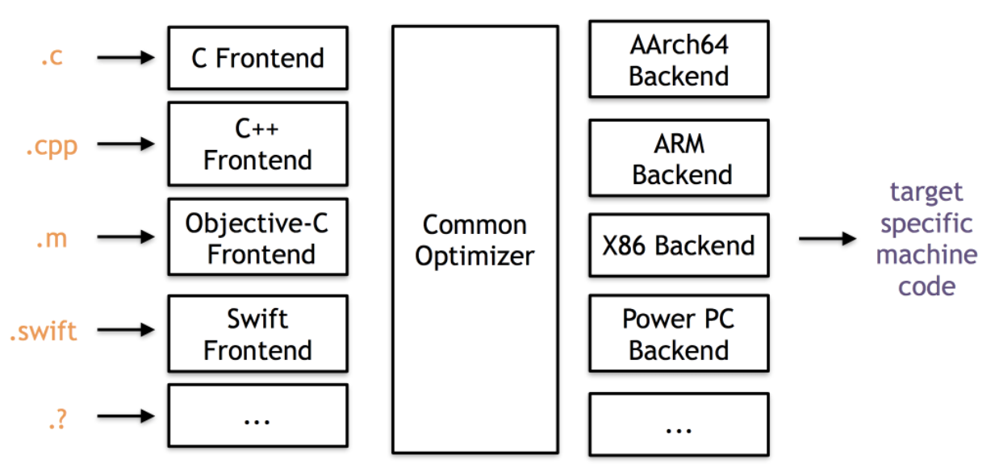

## 必备工具

clang ,LLVM 源码


## LLVM 架构原理

  前面第五章已经提到了LLVM 的架构,主要分为三部分:前端,优化器和后端.




## LLVM 前端

  LLVM 前端的作用是把指定的语言序列化转换为LLVM IR (LLVM 中间语言).我们用LLVM 官方例子来做示例:

```txt

# Compute the x'th fibonacci number.
def fib(x)
  if x < 3 then
    1
  else
    fib(x-1)+fib(x-2)

# This expression will compute the 40th number.
fib(40)

```

  这是一段类似Python 语法的代码,那么首先就要把这段代码做词法分析:

```c++

enum Token {    // 语法Token 标志
  tok_eof = -1,

  // commands
  tok_def = -2,
  tok_extern = -3,

  // primary
  tok_identifier = -4,
  tok_number = -5
};

static std::string IdentifierStr; // Filled in if tok_identifier
static double NumVal;             // Filled in if tok_number

static int gettok() {  //  解析语法token 
  static int LastChar = ' ';

  // Skip any whitespace.
  while (isspace(LastChar))  //  忽略空格
    LastChar = getchar();

  if (isalpha(LastChar)) { // identifier: [a-zA-Z][a-zA-Z0-9]*  , 遇到字符串
    IdentifierStr = LastChar;
    while (isalnum((LastChar = getchar())))
      IdentifierStr += LastChar;   //  拼接字符串

    if (IdentifierStr == "def")    //  如果当前这个标识符是def => def asd() :
      return tok_def;              //  返回tok_def 标志
    if (IdentifierStr == "extern") //  如果是extern => extern ???
      return tok_extern;
    return tok_identifier;         //  如果不是关键字def 和extern 的话,那就识别为字符串
  }

  if (isdigit(LastChar) || LastChar == '.') {  // Number: [0-9.]+  ,如果是数字,组合示例(3,4.)
    std::string NumStr;
    do {
      NumStr += LastChar;
      LastChar = getchar();
    } while (isdigit(LastChar) || LastChar == '.');

    NumVal = strtod(NumStr.c_str(), nullptr);  //  字符串转浮点数
    return tok_number;
  }

  if (LastChar == '#') {  //  这是注释..
    // Comment until end of line.
    do
      LastChar = getchar();
    while (LastChar != EOF && LastChar != '\n' && LastChar != '\r');

    if (LastChar != EOF)
      return gettok();
  }

  // Check for end of file.  Don't eat the EOF.
  if (LastChar == EOF)  //  文件结束
    return tok_eof;

  // Otherwise, just return the character as its ascii value.
  int ThisChar = LastChar;
  LastChar = getchar();
  return ThisChar;
}

```

  `gettok()` 函数主要是对代码不断进行词法分析,我们还需要一个函数来调用它构造抽象语法树:

```c++

static int CurTok;
static int getNextToken() { return CurTok = gettok(); }


static void HandleDefinition() {  //  处理声明函数的回调函数
  if (ParseDefinition()) {
    fprintf(stderr, "Parsed a function definition.\n");
  } else {
    // Skip token for error recovery.
    getNextToken();
  }
}

static void HandleExtern() {  //  处理引用外部函数的回调函数
  if (ParseExtern()) {
    fprintf(stderr, "Parsed an extern\n");
  } else {
    // Skip token for error recovery.
    getNextToken();
  }
}

static void HandleTopLevelExpression() {  //  处理赋值表达式的回调函数
  // Evaluate a top-level expression into an anonymous function.
  if (ParseTopLevelExpr()) {
    fprintf(stderr, "Parsed a top-level expr\n");
  } else {
    // Skip token for error recovery.
    getNextToken();
  }
}

/// top ::= definition | external | expression | ';'
static void MainLoop() {  //  解析代码转换AST 函数
  while (true) {
    fprintf(stderr, "ready> ");
    switch (CurTok) {
    case tok_eof:
      return;
    case ';': // ignore top-level semicolons.
      getNextToken();
      break;
    case tok_def:
      HandleDefinition();
      break;
    case tok_extern:
      HandleExtern();
      break;
    default:
      HandleTopLevelExpression();
      break;
    }
  }
}

```

  `HandleDefinition()` 里面还调用了`ParseDefinition()` 函数,这是进一步解析函数结构的代码:

```c++

/// ExprAST - Base class for all expression nodes.
class ExprAST {  //  基础表达式
public:
  virtual ~ExprAST() = default;
};

/// PrototypeAST - This class represents the "prototype" for a function,
/// which captures its name, and its argument names (thus implicitly the number
/// of arguments the function takes).
class PrototypeAST {  //  函数参数AST
  std::string Name;
  std::vector<std::string> Args;

public:
  PrototypeAST(const std::string &Name, std::vector<std::string> Args)
      : Name(Name), Args(std::move(Args)) {}

  const std::string &getName() const { return Name; }
};

/// FunctionAST - This class represents a function definition itself.
class FunctionAST {  //  函数AST
  std::unique_ptr<PrototypeAST> Proto;
  std::unique_ptr<ExprAST> Body;

public:
  FunctionAST(std::unique_ptr<PrototypeAST> Proto,
              std::unique_ptr<ExprAST> Body)
      : Proto(std::move(Proto)), Body(std::move(Body)) {}
};

/// prototype
///   ::= id '(' id* ')'
static std::unique_ptr<PrototypeAST> ParsePrototype() {
  if (CurTok != tok_identifier)
    return LogErrorP("Expected function name in prototype");

  std::string FnName = IdentifierStr;  //  解析出函数名
  getNextToken();

  if (CurTok != '(')
    return LogErrorP("Expected '(' in prototype");

  std::vector<std::string> ArgNames;
  while (getNextToken() == tok_identifier)  //  解析函数参数列表
    ArgNames.push_back(IdentifierStr);
  if (CurTok != ')')
    return LogErrorP("Expected ')' in prototype");

  // success.
  getNextToken(); // eat ')'.

  return llvm::make_unique<PrototypeAST>(FnName, std::move(ArgNames));
}

/// definition ::= 'def' prototype expression
static std::unique_ptr<FunctionAST> ParseDefinition() {
  getNextToken(); // eat def.
  auto Proto = ParsePrototype();  //  解析函数声明部分:函数名和参数
  if (!Proto)
    return nullptr;

  if (auto E = ParseExpression())  //  解析函数代码
    return llvm::make_unique<FunctionAST>(std::move(Proto), std::move(E));
  return nullptr;
}

```

  `ParseDefinition()` 函数通过不断的词法分析解析出抽象语法树之后,接下来就是对语法树进行LLVM IR 构建.LLVM IR 贯穿了整个LLVM 编译和优化周期,是LLVM 中重要的概念之一.我们深入介绍LLVM IR 的相关知识.


## LLVM IR 简介

  基于上面的代码,继续修改如下:

```c++

/// PrototypeAST - This class represents the "prototype" for a function,
/// which captures its name, and its argument names (thus implicitly the number
/// of arguments the function takes).
class PrototypeAST {
  std::string Name;
  std::vector<std::string> Args;

public:
  PrototypeAST(const std::string &Name, std::vector<std::string> Args)
      : Name(Name), Args(std::move(Args)) {}

  Function *codegen();
  const std::string &getName() const { return Name; }
};

/// FunctionAST - This class represents a function definition itself.
class FunctionAST {
  std::unique_ptr<PrototypeAST> Proto;
  std::unique_ptr<ExprAST> Body;

public:
  FunctionAST(std::unique_ptr<PrototypeAST> Proto,
              std::unique_ptr<ExprAST> Body)
      : Proto(std::move(Proto)), Body(std::move(Body)) {}

  Function *codegen();
};

Function *PrototypeAST::codegen() {
  // Make the function type:  double(double,double) etc.
  std::vector<Type *> Doubles(Args.size(), Type::getDoubleTy(TheContext));  //  创建函数参数
  FunctionType *FT =
      FunctionType::get(Type::getDoubleTy(TheContext), Doubles, false);  //  创建LLVM 函数类型

  Function *F =
      Function::Create(FT, Function::ExternalLinkage, Name, TheModule.get());  //  创建LLVM 函数

  // Set names for all arguments.
  unsigned Idx = 0;
  for (auto &Arg : F->args())  //  设置参数名字
    Arg.setName(Args[Idx++]);

  return F;
}

Function *FunctionAST::codegen() {
  // First, check for an existing function from a previous 'extern' declaration.
  Function *TheFunction = TheModule->getFunction(Proto->getName());  //  获取当前LLVM 环境中是否有同名的函数

  if (!TheFunction)
    TheFunction = Proto->codegen();  //  如果没有同名函数,那就调用PrototypeAST::codegen() 生成函数声明

  if (!TheFunction)  //  如果生成失败了..
    return nullptr;

  // Create a new basic block to start insertion into.
  BasicBlock *BB = BasicBlock::Create(TheContext, "entry", TheFunction);  //  创建代码块
  Builder.SetInsertPoint(BB);  //  Builder 是LLVM IRBuilder<> ,用于生成LLVM IR 代码,这是设置LLVM IR 生成设置到当前BasicBlock ..

  // Record the function arguments in the NamedValues map.
  NamedValues.clear();
  for (auto &Arg : TheFunction->args())  //  收集函数参数名字
    NamedValues[Arg.getName()] = &Arg;

  if (Value *RetVal = Body->codegen()) {  //  函数代码生成
    // Finish off the function.
    Builder.CreateRet(RetVal);  //  为函数返回创建RET 指令

    // Validate the generated code, checking for consistency.
    verifyFunction(*TheFunction);  //  让LLVM 验证生成的代码

    return TheFunction;
  }

  // Error reading body, remove function.
  TheFunction->eraseFromParent();
  return nullptr;
}

```


```c++

/// NumberExprAST - Expression class for numeric literals like "1.0".
class NumberExprAST : public ExprAST {
  double Val;

public:
  NumberExprAST(double Val) : Val(Val) {}

  Value *codegen() override;
};

/// VariableExprAST - Expression class for referencing a variable, like "a".
class VariableExprAST : public ExprAST {
  std::string Name;

public:
  VariableExprAST(const std::string &Name) : Name(Name) {}

  Value *codegen() override;
};

```
  


## LLVM 基本命令


## 深入了解Observer-LLVM 原理


## LLVM Instrument 模块


## LLVM Analayis 模块


