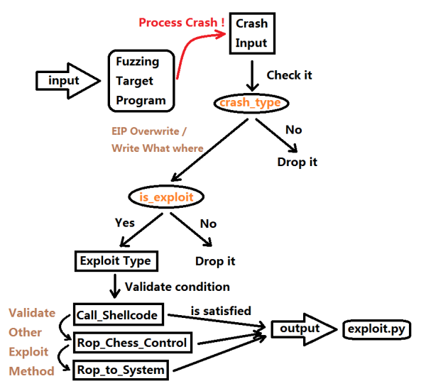

## 一  什么是Auto Exploit Generation

  Auto Exploit Generation (AEG)意为自动化利用代码生成,通常我们把得到的崩溃样本经过一系列的分析,根据崩溃点和执行环境上下文来推算该异常能否被利用和生成对应的利用代码(不是metasploit 里面的那种根据一个脚本和选择某种Shellcode 合并生成EXP 的方式).笔者把从Fuzzing 到Exploit 自动化的完整过程简述图解如下:



  整体步骤描述如下:

  1.我们通过Fuzzing 发现Crash 样本(漏洞挖掘过程)

  2.根据判断该样本触发的漏洞类型来判断是否能够执行代码(检测崩溃能否被利用)

  3.根据该漏洞类型对应的漏洞利用方式来计算是否有满足条件的解(利用求解过程)

  4.根据漏洞类型和满足求解条件的漏洞利用方法生成Exploit 代码

  在这四步骤中AEG 存在于第2-4 步,下面通过著名的AEG 实现库REX ([shellphish/rex](https://github.com/shellphish/rex/tree/master/rex/exploit/techniques))来一一分解AEG 的实现原理.


## 二  混合符号执行(Concolic Symbolic Execution)

  我们知道,符号执行不断模拟程序执行从而生成符号化的表达式,在我们需要进行约束求解的时候把这些符号化的表达式取出来进行求解.举个例子,在进行无输入的符号执行中,我们在执行到分支判断指令(TEST ,CMP 指令)时,取出指令两个操作数Op1 Op2 ,然后构建两组约束条件,分别为:1.condition;2.!(condition),示例汇编如下:

```
TEST EBX,ECX
JZ xxx
```

  那么对应的两组约束条件如下:

```
1.  EBX == ECX
2.!(EBX == ECX)
```

  在传统的符号执行中,到这一步我们是获取EBX 和ECX 中储存的符号表达式来构建约束条件

```
MOV EBX,0x65
XOR EBX,0x38
MOV ECX,Byte ptr [EBP - 0xC] ; 注意:假设EBP - 0xC 是可控的局部变量,大小为1字节
TEST EBX,ECX
JZ xxx
```

  我们把上述的示例代码符号化如下:

```
初始化全部内容为-1
EAX=-1 EBX=-1 ECX=-1 EBP=-1
----
MOV EBX,0x65
EAX=-1 EBX=0x65 ECX=-1 EBP=-1
----
XOR EBX,0x38
EAX=-1 EBX=xor(0x65,0x38) ECX=-1 EBP=-1
----
MOV ECX,Byte ptr [EBP - 0xC]
EAX=-1 EBX=xor(0x65,0x38) ECX=[EBP - 0xC] EBP=-1
----
TEST EBX,ECX
EAX=-1 EBX=xor(0x65,0x38) ECX=[EBP - 0xC] EBP=-1
```

  最后组装表达式

```
Condition Express:EBX == ECX
Condition Express:xor(0x65,0x38) == [EBP - 0xC]
```

  因为前面假定[EBP - 0xC] 为用户可控的内容,那么我们能够使用z3 求解它的值,代码如下:

```
import z3

user_control_value = z3.Int('user_control_value')
solver = z3.Solver()

solver.add(0x65 ^ 0x38 == user_control_value)
solver.check()

print(solver.model())  #  输出结果值为:[user_control_value = 93]
```

  以上就是符号执行的基本原理.混合符号执行的原理与传统符号执行不同的一点在于,它可以允许用户使用指定的数据传递入应用程序中执行,那么就不需要对于一些上下文不明确的内容进行猜测,而是直接使用已知的数据来构造约束条件和执行分支.对于前面的示例,我们假设用户输入了字符'Z',那么执行到TEST 汇编时构建的约束内容如下:

```
TEST EBX,ECX
EAX=-1 EBX=xor(0x65,0x38) ECX=0x5A EBP=-1

Condition Express:EBX == ECX
Condition Express:xor(0x65,0x38) == 0x5A => 0x5D == 0x5A => False
```


## 三  REX 加载程序和样本的过程

  了解这些符号执行的原理之后,接下来就深入研究REX 框架的原理.REX 需要用户使用指定的程序和崩溃样本来进行分析,它实际上是使用了Angr 框架把样本加载进去执行程序一直运行直到崩溃,然后在崩溃点处分析相关信息,判断该崩溃是否为漏洞.REX 的加载代码如下:

```python
class Crash :

    def __init__(self, target ,...) :
        ....

        #  初始化Angr 对象
        dsb = archr.arsenal.DataScoutBow(self.target)
        self.angr_project_bow = archr.arsenal.angrProjectBow(self.target, dsb)

        ...

        if not traced:
            # Begin tracing!
            self._preconstraining_input_data = None
            self._has_preconstrained = False
            self._trace(pov_file=pov_file,  #  开始跟踪执行
                        format_infos=format_infos,
                        )
        ...
        self._triage_crash()  #  分析崩溃

    def _trace(self, pov_file=None, format_infos=None):
        ...

        simgr = self.project.factory.simulation_manager(  #  获取状态上下文对象
            self.initial_state,
            save_unsat=False,
            hierarchy=False,
            save_unconstrained=r.crashed
        )

        simgr.run()  #  开始执行
```

  等待_trace() 函数执行完成之后,程序已经执行到了崩溃点,接下来REX 就是对崩溃点进行可利用分析


## 四  检测漏洞可利用的方法

  在二进制下检测漏洞是否是有效能被利用的方法,我们可以直接根据在程序崩溃时EIP/EBP 的值是否能可控来确认这个是否为有效的可被利用的漏洞.REX 这么做检测是有原因的,先来阅读这个示例:

```assembly
.text:4D525869 read_input      proc near               ; CODE XREF: main+28↓p
.text:4D525869
.text:4D525869 input_buffer    = byte ptr -2Bh   ;  input_buffer 大小为0x2B
.text:4D525869
.text:4D525869 ; __unwind {
.text:4D525869                 push    ebp
.text:4D52586A                 mov     ebp, esp
.text:4D52586C                 sub     esp, 38h  ;  栈空间在这里分配
.text:4D52586F                 sub     esp, 8
.text:4D525872                 lea     eax, [ebp+input_buffer]  
.text:4D525875                 push    eax
.text:4D525876                 push    offset format   ; "%s"
.text:4D52587B                 call    ___isoc99_scanf ; 注意scanf() 的输入长度是没有限制的
.text:4D525880                 add     esp, 10h
.text:4D525883                 nop
.text:4D525884                 leave
.text:4D525885                 retn
```

  示例代码中演示的是一个栈溢出的例子.scanf() 函数是输入点,输入的长度没有限制,但是这个函数的栈大小为0x40 ,那么当程序执行到RETN 指令时,会有两种情况:1.如果栈溢出没有产生,那么RETN 就是跳转到一个已知的程序地址;2.如果栈溢出产生,那么RETN 就是跳转到一个可控的地址,Angr 会把这条路径标记为unconstrained 状态(关于Angr 的路径状态意义请参考链接[angr学习(二) - fancy鑫 - 博客园](https://www.cnblogs.com/fancystar/p/7863192.html)的结尾部分).Angr 库在执行的过程中会自行分析路径的状态,部分实现代码如下:

```python
    def add_successor(self, state, target, guard, jumpkind, add_guard=True, exit_stmt_idx=None, exit_ins_addr=None,
                      source=None):
        #  ..
        state.scratch.target = state._inspect_getattr("exit_target", target)
        #  ..

    def _categorize_successor(self, state):
        self.all_successors.append(state)
        target = state.scratch.target  #  接下来要跳转的地址

        #  ..
        if o.LAZY_SOLVES not in state.options and not state.satisfiable():
            self.unsat_successors.append(state)  #  无法求解的路径
        elif o.NO_SYMBOLIC_JUMP_RESOLUTION in state.options and state.solver.symbolic(target):
            # 如果target 要跳转到一个不确定的地址时
            self.unconstrained_successors.append(state)  #  可控的路径
        elif not state.solver.symbolic(target) and not state.history.jumpkind.startswith("Ijk_Sys"):
            # 如果target 要跳转到一个确定的地址而且不是syscall 时
            self.successors.append(state)
            self.flat_successors.append(state)
        #  ..
```

  了解Angr 库的相关原理后,我们要利用Angr 库来检测栈溢出的代码如下:

```python
def main(argv):
  path_to_binary = argv[1]
  project = angr.Project(path_to_binary)  #  初始化Angr 分析对象
  initial_state = project.factory.entry_state()  #  获取一个新的状态上下文
  simulation = project.factory.simgr(  #  创建一个执行模拟器
    initial_state,
    save_unconstrained=True,
    stashes={
      'active' : [initial_state],
      'unconstrained' : [],
      'found' : [],
      'not_needed' : []
    }
  )

  class ReplacementScanf(angr.SimProcedure):  #  声明自定义scanf() 函数的实现
    def run(self, format_string, input_buffer_address):
      input_buffer = claripy.BVS('input_buffer', 64 * 8)  #  设置一个较大的input_buffer

      for char in input_buffer.chop(bits=8):  #  为scanf() 的输入设置约束
        self.state.add_constraints(char >= '0', char <= 'z')

      self.state.memory.store(input_buffer_address, input_buffer, endness=project.arch.memory_endness)  #  保存到特定地址

      self.state.globals['solution'] = input_buffer

  scanf_symbol = '__isoc99_scanf'
  project.hook_symbol(scanf_symbol, ReplacementScanf())  #  对scanf() 做Hook

  while (simulation.active or simulation.unconstrained) and (not simulation.found):  #  一直执行程序直到遇到可控的EIP 路径
    for unconstrained_state in simulation.unconstrained:
      def should_move(s):
        return s is unconstrained_state
      
      simulation.move('unconstrained', 'found', filter_func=should_move)  #  保存该路径

    simulation.step()  #  继续执行

  if simulation.found:  #  找到存在可控EIP 的路径
    solution_state = simulation.found[0]

    solution_state.add_constraints(solution_state.regs.eip == 0x4D525849)  #  判断EIP 地址是否能被可控到某个特定地址

    solution = solution_state.se.eval(solution_state.globals['solution'],cast_to = bytes)  #  生成Payload

    print(solution)  #  输出测试Payload
```

  理解了这个简单的分析程序之后,我们继续回来研究REX 的可利用漏洞检测原理.从前面的REX 源码分析中,我们看到Crash._init_() 函数最后执行到_triage_crash() 进行检测,详细的源码分析如下:

```python
def _triage_crash(self):
    ip = self.state.regs.ip  #  EIP 寄存器
    bp = self.state.regs.bp  #  EBP 寄存器

    if self.state.solver.symbolic(ip):  #  判断EIP 寄存器中是否保存着可控值
        if self._symbolic_control(ip) >= self.state.arch.bits:  #  判断EIP 寄存器可控的大小
            l.info("detected ip overwrite vulnerability")
            self.crash_types.append(Vulnerability.IP_OVERWRITE)  #  完全可控
        else:
            l.info("detected partial ip overwrite vulnerability")
            self.crash_types.append(Vulnerability.PARTIAL_IP_OVERWRITE)  #  部分可控

        return

    if self.state.solver.symbolic(bp):  #  判断EIP 寄存器中是否保存着可控值
        # how much control of bp do we have
        if self._symbolic_control(bp) >= self.state.arch.bits:
            l.info("detected bp overwrite vulnerability")
            self.crash_types.append(Vulnerability.BP_OVERWRITE)
        else:
            l.info("detected partial bp overwrite vulnerability")
            self.crash_types.append(Vulnerability.PARTIAL_BP_OVERWRITE)

        return

    symbolic_actions = [ ]
    if self._t is not None and self._t.last_state is not None:
        recent_actions = reversed(self._t.last_state.history.recent_actions)
        state = self._t.last_state
        # TODO: this is a dead assignment! what was this supposed to be?
    else:
        recent_actions = reversed(self.state.history.actions)
        state = self.state
    for a in recent_actions:
        if a.type == 'mem':
            if self.state.solver.symbolic(a.addr.ast):
                symbolic_actions.append(a)

    for sym_action in symbolic_actions:
        if sym_action.action == "write":  #  写操作
            if self.state.solver.symbolic(sym_action.data):
                l.info("detected write-what-where vulnerability")
                self.crash_types.append(Vulnerability.WRITE_WHAT_WHERE)  #  任意地址写任意内容
            else:
                l.info("detected write-x-where vulnerability")
                self.crash_types.append(Vulnerability.WRITE_X_WHERE)  #  任意地址写固定内容

            self.violating_action = sym_action
            break

        if sym_action.action == "read":  #  读操作
            # special vulnerability type, if this is detected we can explore the crash further
            l.info("detected arbitrary-read vulnerability")
            self.crash_types.append(Vulnerability.ARBITRARY_READ)  #  任意地址读

            self.violating_action = sym_action
            break
```

  Crash._init_() 函数判断崩溃点的各种漏洞类型之后,那么接下来我们就是通过Crash.exploitable() 函数来检验崩溃点的漏洞是否能被利用.虽然程序崩溃的原因有很多种,但是只有部分类型的崩溃才可以被利用,REX 中关于二进制程序的崩溃分类如下:

```python
class Vulnerability(object):
    IP_OVERWRITE              = "ip_overwrite"
    PARTIAL_IP_OVERWRITE      = "partial_ip_overwrite"
    UNCONTROLLED_IP_OVERWRITE = "uncontrolled_ip_overwrite"
    BP_OVERWRITE              = "bp_overwrite"
    PARTIAL_BP_OVERWRITE      = "partial_bp_overwrite"
    WRITE_WHAT_WHERE          = "write_what_where"
    WRITE_X_WHERE             = "write_x_where"
    UNCONTROLLED_WRITE        = "uncontrolled_write" # a write where the destination address is uncontrolled
    ARBITRARY_READ            = "arbitrary_read"
    NULL_DEREFERENCE          = "null_dereference"
    ARBITRARY_TRANSMIT        = "arbitrary_transmit" # transmit where the buf argument is completely controlled
    ARBITRARY_RECEIVE         = "arbitrary_receive" # receive where the buf argument is completel controlled
```

  Crash._init_() 执行完程序分析之后,保存崩溃类型信息,其实Crash.exploitable() 实际上就是通过对Crash._init_() 的分析结果进行判断,判断崩溃类型是否为:1.完全/部分EIP 控制;2.完全/部分EBP 控制;3.任意地址任意数据写和任意地址非任意数据写.Crash.exploitable() 代码如下:

```python
def exploitable(self):
    exploitables = [Vulnerability.IP_OVERWRITE, Vulnerability.PARTIAL_IP_OVERWRITE, Vulnerability.BP_OVERWRITE,
            Vulnerability.PARTIAL_BP_OVERWRITE, Vulnerability.WRITE_WHAT_WHERE, Vulnerability.WRITE_X_WHERE]  #  能被利用的漏洞类型

    return self.one_of(exploitables)  #  判断self.crash_types 是否是这些类型中的一种

def one_of(self, crash_types):
    if not isinstance(crash_types, (list, tuple)):
        crash_types = [crash_types]

    return bool(len(set(self.crash_types).intersection(set(crash_types))))
```

  如果Crash.exploitable() 返回True ,那就意味着这是可以被利用的漏洞类型,接下来就是对漏洞利用的满足条件进行约束求解.


## 五  根据不同类型的漏洞方法进行利用检测原理

  要知道一个漏洞能否改写EIP 到指定内存成功利用ShellCode ,那么就需要满足几个条件:

  1.能够控制EIP 执行地址到指定内存

  2.指定内存能否容纳ShellCode 

  3.指定内存允许代码执行权限

  条件一是整个环境中最重要的一环,而且要根据不同的漏洞利用方式来做出不同的约束求解处理.我们以经典的栈溢出来讨论这个问题,需要满足的条件包括:1.是否存在已知的ROP Gadget 和对应的位置在哪里,是否需要在Payload 中插入ROP Gadget ;2.EIP 的值能否被控制到Gadget 的位置;3.指定内存能否满足填写自定义ShellCode 的条件.我们详细分析REX 的CallJmpSPShellcode (栈溢出JSP ESP 利用方法)的求解原理:

```python
def apply(self, **kwargs):
    #  判断崩溃的漏洞类型不是完全/部分EIP 控制的话
    if not self.crash.one_of([Vulnerability.IP_OVERWRITE, Vulnerability.PARTIAL_IP_OVERWRITE]):
        raise CannotExploit("[%s] cannot control ip" % self.name)

    #  如果栈内存没有执行权限就的话
    if not self.crash.project.loader.main_object.execstack:
        raise CannotExploit("[%s] stack is not executable" % self.name)

    #  获取不同平台的JMPSP 机器码
    try:
        jmpsp_stub = self.shellcode.get_shellcode('jmpsp')
    except NoSuchShellcode as e:
        raise CannotExploit("[%s] %s" % (self.name, e))
#  ...
```

  关于jmpsp_stub 的Gadget 代码,我们可以在rex/exploit/shellcodes/allarch_jmpsp.py 文件下找到,在此只展示X86 平台的Jmp ESP Gadget .

```python
class X86JmpSP(Shellcode):
    os = ["cgc", "unix"]
    arches = ["X86"]
    name = "jmpsp"
    asm = "jmp esp;"
    code = b"\xff\xe4"
```

  获取完JMP ESP Gadget 之后,CallJmpSPShellcode.apply() 函数接下来就判断Gadget 能否被写进内存中.

```python
#  apply() 函数
    jmpsp_addr, jmpsp_constraint = self._write_global_data(jmpsp_stub)  #  判断JMP ESP Gadget 代码能否被写到内存中

    if jmpsp_addr is None:  #  如果不能写JMP ESP Gadget
        try:
            jmpsp_addr, jmpsp_constraint = self._read_in_global_data(jmpsp_stub)  #  搜索有没有满足的Gadget ,构造ROP 利用链
        except CannotExploit as e:
            raise CannotExploit("[%s] cannot call read, %s" % (self.name, e))
        if jmpsp_addr is None:
            raise CannotExploit("[%s] cannot write in 'jmp sp'" % self.name)

    #  添加约束
    self.crash.state.add_constraints(jmpsp_constraint)  #  对约束进行求解
```

  _write_global_data() 函数主要是对能够被控制的内存进行约束求解,目的在于判断我们可以控制的内存中能否插入这个Gadget .

```python
def _write_some_data(self, data, control):
    #  遍历用户可控的内存列表
    for base in control:
        for addr in range(base, base+control[base] - len(data) + 1):  #  不断递归内存地址
            constraint = self.crash.state.memory.load(addr, len(data)) == data  #  到这一步是为了判断内存的内容是否可控为指定的值

            if self.crash.state.solver.satisfiable(extra_constraints=(constraint,)):  #  判断约束是否有解
                data_str_addr = addr
                data_str_constraint = constraint

                return data_str_addr, data_str_constraint  #  如果对于constraint 这个解有满足的条件,那么就返回地址和这个约束条件

    return None, None

def _write_global_data(self, data):
    return self._write_some_data(data, self.crash.memory_control())  #  self.crash.memory_control() 指的是用户可控制的内存集合
```

  CallJmpSPShellcode.apply() 函数的最后一部分就是1.求解EIP 能否被可控到特定地址;2.ESP 中指定的内存能否写入ShellCode .其实就是划分成两个约束条件:

  1.self.crash.state.ip == jmpsp_addr  (约束条件1:EIP 地址可控)

  2.memory.load(self.crash.state.regs.sp,len(shellcode)//8) == BVV(self.shellcode.get_default())  (约束条件2:ShellCode 能否保存到RET_ADDR 后面的内存中)

  回顾CallJmpSPShellcode.apply() 最后一部分的代码,整体思路也就清晰明了了.

```python
#  apply() 函数
    # add the constraint that the ip must point at the 'jmp sp' stub
    self.crash.state.add_constraints(self.crash.state.ip == jmpsp_addr)

    # add the constraint that our shellcode must exist at sp
    shellcode = self.crash.state.solver.BVV(self.shellcode.get_default())
    stack_mem = self.crash.state.memory.load(self.crash.state.regs.sp, len(shellcode) // 8)
    self.crash.state.add_constraints(stack_mem == shellcode)

    if not self.crash.state.satisfiable():  #  对约束进行是否可以满足进行求解
        raise CannotExploit("[%s] generated exploit is not satisfiable" % self.name)

    return Exploit(self.crash, bypasses_nx=False, bypasses_aslr=True)  #  生成Exploit ..
```


## 六  总结

  在AEG 的范畴中,最重要的一点是要找到能够把漏洞原理和利用方式转化为数学上可以验证的方法.我们回顾CallJmpSPShellcode.apple() 的实现,检测栈溢出的漏洞最后归根结底是对EIP 和指定内存进行约束求解的过程.如果有满足这些条件的解,那么我们能肯定这个漏洞的利用方法.我们总结一下栈溢出Jmp ESP 的利用方法,整体的约束条件如下:


  行文仓促,应有疏漏,如有不足,恳请指出.